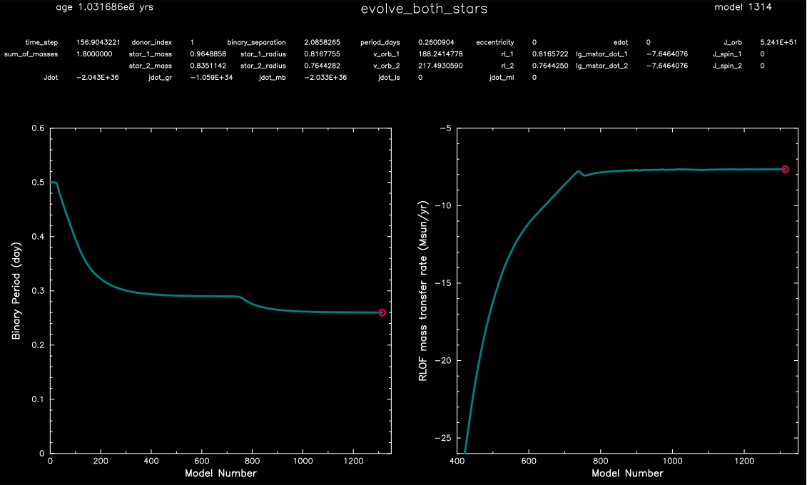
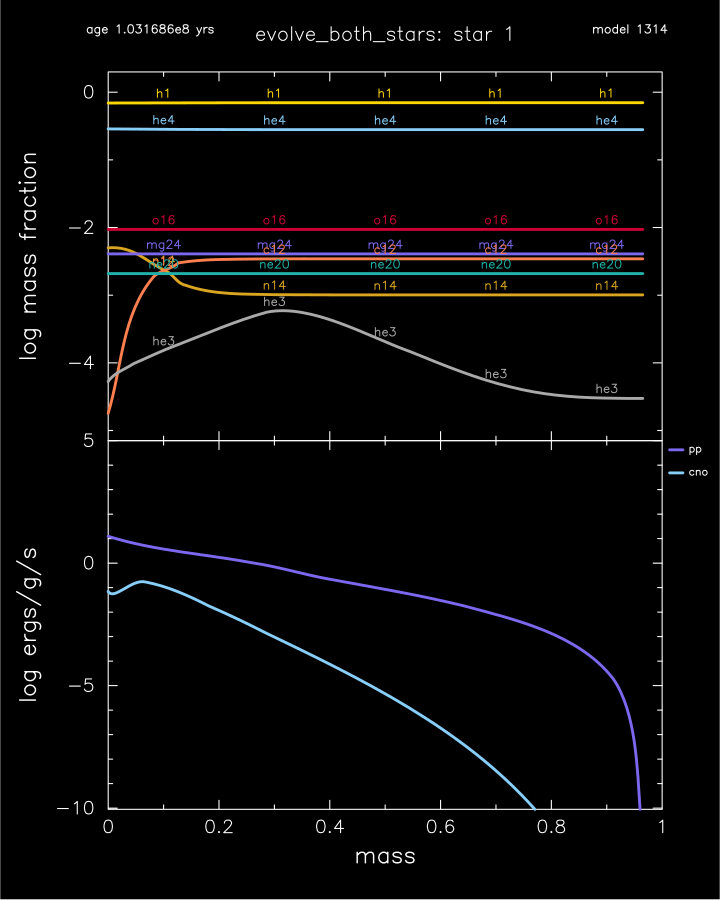
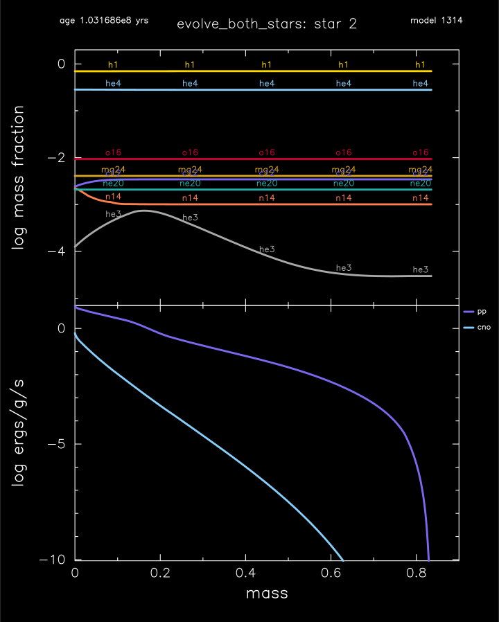

.. _evolve_both_stars:

*****************
evolve_both_stars
*****************

This test case checks the evolution of two stars simultaneously including mass transfer.

This test case has 1 part. Click to see a larger version of a plot.

* Part 1 (``inlist_project``) loads a 1 Msun and a 0.8 Msun zero-age main sequence models. The binary system has an initial period of 0.5 day, and is evolved until the Roche Lobe overflow indicator (R - Rlobe)/Rlobe  is greater than the default 0.0 value of ``accretor_overflow_terminate``:

|br|
Binary period Roche Lobe OverFlow mass transfer:

|br|
Abundance and power generated by star 1:

|br|
Abundance and power generated by star 12:

|br|
pgstar commands used for the binary and star1 plots above:

.. code-block:: console

 &pgstar

  file_white_on_black_flag = .true. ! white_on_black flags -- true means white foreground color on black background
  !file_device = 'png'            ! png
  !file_extension = 'png'

  file_device = 'vcps'          ! postscript
  file_extension = 'ps'

  pgstar_interval = 1

  pgstar_left_yaxis_label_disp = 3.0

  Text_Summary1_win_flag = .false.
  Text_Summary1_win_width = 10
  Text_Summary1_win_aspect_ratio = 0.15

  Text_Summary1_xleft = 0.01
  Text_Summary1_xright = 0.99
  Text_Summary1_ybot = 0.0
  Text_Summary1_ytop = 1.0
  Text_Summary1_txt_scale = 1.0
  Text_Summary1_title = ''

  Text_Summary1_num_rows = 4 ! <= 20
  Text_Summary1_num_cols = 8 ! <= 20
  Text_Summary1_name(:,:) = ''

  Text_Summary1_name(1,1) = 'time_step'
  Text_Summary1_name(1,2) = 'donor_index'
  Text_Summary1_name(1,3) = 'binary_separation'
  Text_Summary1_name(1,4) = 'period_days'
  Text_Summary1_name(1,5) = 'eccentricity'
  Text_Summary1_name(1,6) = 'edot'
  Text_Summary1_name(1,7) = 'J_orb'
  Text_Summary1_name(1,8) = ''

  Text_Summary1_name(2,1) = 'sum_of_masses'
  Text_Summary1_name(2,2) = 'star_1_mass'
  Text_Summary1_name(2,3) = 'star_1_radius'
  Text_Summary1_name(2,4) = 'v_orb_1'
  Text_Summary1_name(2,5) = 'rl_1'
  Text_Summary1_name(2,6) = 'lg_mstar_dot_1'
  Text_Summary1_name(2,7) = 'J_spin_1'
  Text_Summary1_name(2,8) = ''

  Text_Summary1_name(3,1) = ''
  Text_Summary1_name(3,2) = 'star_2_mass'
  Text_Summary1_name(3,3) = 'star_2_radius'
  Text_Summary1_name(3,4) = 'v_orb_2'
  Text_Summary1_name(3,5) = 'rl_2'
  Text_Summary1_name(3,6) = 'lg_mstar_dot_2'
  Text_Summary1_name(3,7) = 'J_spin_2'
  Text_Summary1_name(3,8) = ''

  Text_Summary1_name(4,1) = 'Jdot'
  Text_Summary1_name(4,2) = 'jdot_gr'
  Text_Summary1_name(4,3) = 'jdot_mb' 
  Text_Summary1_name(4,4) = 'jdot_ls'
  Text_Summary1_name(4,5) = 'jdot_ml'
  Text_Summary1_name(4,6) = '' 
  Text_Summary1_name(4,7) = '' 
  Text_Summary1_name(4,8) = '' 

  History_Track1_win_flag = .false.
  History_Track1_win_width = 12
  History_Track1_win_aspect_ratio = 0.75
  History_Track1_txt_scale = 0.8
  History_Track1_title = ' '

  History_Track1_xname = 'model_number'
  History_Track1_yname = 'period_days'
  History_Track1_xaxis_label = 'Model Number'
  History_Track1_yaxis_label = 'Binary Period (day)'
  History_Track1_reverse_xaxis = .false.
  History_Track1_reverse_yaxis = .false.

  History_Track1_xmin = 0.0
  History_Track1_xmax = 1350
  History_Track1_ymin = 0.0
  History_Track1_ymax = 0.6

  History_Track1_file_flag = .true.
  History_Track1_file_dir = 'pgstar_out'
  History_Track1_file_prefix = 'track1_'
  History_Track1_file_interval = 10000
  History_Track1_file_width = -1
  History_Track1_file_aspect_ratio = -1

  History_Track2_win_flag = .false.
  History_Track2_win_width = 12
  History_Track2_win_aspect_ratio = 0.75
  History_Track2_txt_scale = 0.8
  History_Track2_title = ' '

  History_Track2_xname = 'model_number'
  History_Track2_yname = 'lg_mtransfer_rate '
  History_Track2_xaxis_label = 'Model Number'
  History_Track2_yaxis_label = 'RLOF mass transfer rate (Msun/yr)'
  History_Track2_reverse_xaxis = .false.
  History_Track2_reverse_yaxis = .false.

  History_Track2_xmin = 400.0
  History_Track2_xmax = 1350.0
  History_Track2_ymin = -26.0
  History_Track2_ymax = -5.0

  History_Track2_file_flag = .true.
  History_Track2_file_dir = 'pgstar_out'
  History_Track2_file_prefix = 'track2_'
  History_Track2_file_interval = 10000
  History_Track2_file_width = -1
  History_Track2_file_aspect_ratio = -1

   Profile_Panels2_win_flag = .true.
   Profile_Panels2_win_width = 10
   Profile_Panels2_title = 'evolve_both_stars: star 1'

   Profile_Panels2_xaxis_name = 'mass'
   Profile_Panels2_xaxis_reversed = .false.
   Profile_Panels2_xmin = 0.0
   Profile_Panels2_xmax = 1.0
   Profile_Panels2_show_mix_regions_on_xaxis = .false.

   Profile_Panels2_xright = 0.92
   Profile_Panels2_ytop = 0.92

   num_abundance_line_labels = 5
   Abundance_legend_max_cnt = 0

   Profile_Panels2_yaxis_name(2) = 'Power'
   Profile_Panels2_ymin(2) = -10.0
   Profile_Panels2_ymax(2) = 5.0

   Profile_Panels2_file_flag = .true.
   Profile_Panels2_file_dir = 'pgstar_out'
   Profile_Panels2_file_prefix = 'profile_s1_'
   Profile_Panels2_file_interval = 10000
   Profile_Panels2_file_width = -1
   Profile_Panels2_file_aspect_ratio = -1

   Grid1_win_flag = .true.
   Grid1_win_width = 16
   Grid1_win_aspect_ratio = 0.6

   Grid1_title = 'evolve_both_stars'
   Grid1_txt_scale_factor(1) = 1.0

   Grid1_num_cols = 2 ! divide plotting region into this many equal width cols
   Grid1_num_rows = 2 ! divide plotting region into this many equal height rows
   Grid1_num_plots = 3 ! <= 10

   Grid1_plot_name(1) = 'Text_Summary1'
   Grid1_plot_row(1) = 1           ! number from 1 at top
   Grid1_plot_rowspan(1) = 1       ! plot spans this number of rows
   Grid1_plot_col(1) =  1          ! number from 1 at left
   Grid1_plot_colspan(1) = 2       ! plot spans this number of columns

   Grid1_plot_pad_left(1) = -0.10    ! fraction of full window width for padding on left
   Grid1_plot_pad_right(1) = -0.18   ! fraction of full window width for padding on right
   Grid1_plot_pad_top(1) = -0.00     ! fraction of full window height for padding at top
   Grid1_plot_pad_bot(1) = 0.32     ! fraction of full window height for padding at bottom
   Grid1_txt_scale_factor(1) = 0.70 ! multiply txt_scale for subplot by this

   Grid1_plot_name(2) = 'History_Track1'
   Grid1_plot_row(2) = 2           ! number from 1 at top
   Grid1_plot_rowspan(2) = 1       ! plot spans this number of rows
   Grid1_plot_col(2) =  1          ! number from 1 at left
   Grid1_plot_colspan(2) = 1       ! plot spans this number of columns

   Grid1_plot_pad_left(2) = -0.04    ! fraction of full window width for padding on left
   Grid1_plot_pad_right(2) = 0.04   ! fraction of full window width for padding on right
   Grid1_plot_pad_top(2) = -0.24     ! fraction of full window height for padding at top
   Grid1_plot_pad_bot(2) = 0.00     ! fraction of full window height for padding at bottom
   Grid1_txt_scale_factor(2) = 0.7 ! multiply txt_scale for subplot by this

   Grid1_plot_name(3) = 'History_Track2'
   Grid1_plot_row(3) = 2           ! number from 1 at top
   Grid1_plot_rowspan(3) = 1       ! plot spans this number of rows
   Grid1_plot_col(3) =  2          ! number from 1 at left
   Grid1_plot_colspan(3) = 1       ! plot spans this number of columns

   Grid1_plot_pad_left(3) = 0.04    ! fraction of full window width for padding on left
   Grid1_plot_pad_right(3) = -0.04   ! fraction of full window width for padding on right
   Grid1_plot_pad_top(3) = -0.24     ! fraction of full window height for padding at top
   Grid1_plot_pad_bot(3) = 0.00     ! fraction of full window height for padding at bottom
   Grid1_txt_scale_factor(3) = 0.7 ! multiply txt_scale for subplot by this

  Grid1_file_flag = .true.
  Grid1_file_dir = 'pgstar_out'
  Grid1_file_prefix = 'grid_'
  Grid1_file_interval = 10000
  Grid1_file_width = -1      
  Grid1_file_aspect_ratio = -1 

 / ! end of pgstar namelist

|br|
pgstar commands used for the star2 plot above:

.. code-block:: console

 &pgstar

  file_white_on_black_flag = .true. ! white_on_black flags -- true means white foreground color on black background
  !file_device = 'png'            ! png
  !file_extension = 'png'

  file_device = 'vcps'          ! postscript
  file_extension = 'ps'

  pgstar_interval = 1

   Profile_Panels2_win_flag = .true.
   Profile_Panels2_win_width = 10
   Profile_Panels2_title = 'evolve_both_stars: star 2'

   Profile_Panels2_xaxis_name = 'mass'
   Profile_Panels2_xaxis_reversed = .false.
   Profile_Panels2_xmin = 0.0
   Profile_Panels2_xmax = 0.9
   Profile_Panels2_show_mix_regions_on_xaxis = .false.

   Profile_Panels2_xright = 0.92
   Profile_Panels2_ytop = 0.92

   num_abundance_line_labels = 5
   Abundance_legend_max_cnt = 0

   Profile_Panels2_yaxis_name(2) = 'Power'
   Profile_Panels2_ymin(2) = -10.0
   Profile_Panels2_ymax(2) = 1.0

   Profile_Panels2_file_flag = .true.
   Profile_Panels2_file_dir = 'pgstar_out'
   Profile_Panels2_file_prefix = 'profile_s2_'
   Profile_Panels2_file_interval = 10000
   Profile_Panels2_file_width = -1
   Profile_Panels2_file_aspect_ratio = -1

 / ! end of pgstar namelist

Last-Updated: 11Jul2021 (MESA 094ff71) by fxt.

.. # define a hard line break for HTML
.. |br| raw:: html

       
