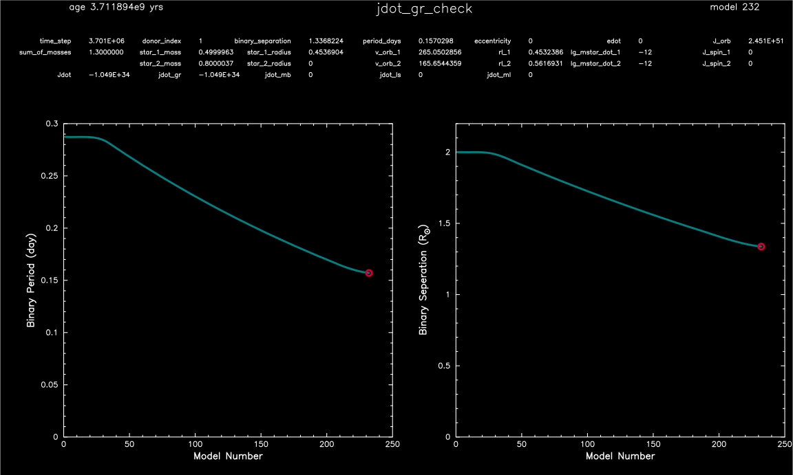

.. _jdot_gr_check:

*************
jdot_gr_check
*************

This test case verifies that the orbital evolution due to GW emission follows the 
analytical result of `Peters (1964) <https://ui.adsabs.harvard.edu/abs/1964PhRv..136.1224P>`_.

This test case has 1 part. Click to see a larger version of a plot.

* Part 1 (``inlist_project``) loads a 0.5 Msun zero-age main sequence model and a 0.8 Msun point mass. The binary system is given an initial seperation of 2.0 Rsun, and is evolved until the onset of Roche Lobe overflow.  Along the way, the ``run_binary_extras.f90`` calculates the deviation from the analytical result of `Peters (1964) <https://ui.adsabs.harvard.edu/abs/1964PhRv..136.1224P>`_.

.. code-block:: console

 bin     231   1.300000   1.338152   0.157264  0.000E+00   1.600000          2          1  0.000E+00   1.000000  2.452E+51 -1.045E+34  0.000E+00
    6.570598   0.500000   0.453686   0.000000  0.000E+00 264.917399   0.453691 -9.939E-06  0.000E+00  1.000E+99  0.000E+00 -1.045E+34  0.000E+00
  3.7082E+09   0.800000   0.000000   0.000000 -5.669E+47 165.573375   0.562250 -1.000E+00  0.000E+00  0.000E+00  0.000E+00  0.000E+00          1

  error in separation  -3.4603578910942755E-003
  terminate due to beginning of RLO

|br|
Binary period and seperation history:

|br|
pgstar commands used for the plot above:

.. code-block:: console

 &pgstar

  file_white_on_black_flag = .true. ! white_on_black flags -- true means white foreground color on black background
  !file_device = 'png'            ! png
  !file_extension = 'png'

  file_device = 'vcps'          ! postscript
  file_extension = 'ps'

  pgstar_interval = 1

 pgstar_left_yaxis_label_disp = 3.0

 Text_Summary1_win_flag = .false.
 Text_Summary1_win_width = 10
 Text_Summary1_win_aspect_ratio = 0.15

 Text_Summary1_xleft = 0.01
 Text_Summary1_xright = 0.99
 Text_Summary1_ybot = 0.0
 Text_Summary1_ytop = 1.0
 Text_Summary1_txt_scale = 1.0
 Text_Summary1_title = ''

 Text_Summary1_num_rows = 4 ! <= 20
 Text_Summary1_num_cols = 8 ! <= 20
 Text_Summary1_name(:,:) = ''

 Text_Summary1_name(1,1) = 'time_step'
 Text_Summary1_name(1,2) = 'donor_index'
 Text_Summary1_name(1,3) = 'binary_separation'
 Text_Summary1_name(1,4) = 'period_days'
 Text_Summary1_name(1,5) = 'eccentricity'
 Text_Summary1_name(1,6) = 'edot'
 Text_Summary1_name(1,7) = 'J_orb'
 Text_Summary1_name(1,8) = ''

 Text_Summary1_name(2,1) = 'sum_of_masses'
 Text_Summary1_name(2,2) = 'star_1_mass'
 Text_Summary1_name(2,3) = 'star_1_radius'
 Text_Summary1_name(2,4) = 'v_orb_1'
 Text_Summary1_name(2,5) = 'rl_1'
 Text_Summary1_name(2,6) = 'lg_mstar_dot_1'
 Text_Summary1_name(2,7) = 'J_spin_1'
 Text_Summary1_name(2,8) = ''

 Text_Summary1_name(3,1) = ''
 Text_Summary1_name(3,2) = 'star_2_mass'
 Text_Summary1_name(3,3) = 'star_2_radius'
 Text_Summary1_name(3,4) = 'v_orb_2'
 Text_Summary1_name(3,5) = 'rl_2'
 Text_Summary1_name(3,6) = 'lg_mstar_dot_2'
 Text_Summary1_name(3,7) = 'J_spin_2'
 Text_Summary1_name(3,8) = ''

 Text_Summary1_name(4,1) = 'Jdot'
 Text_Summary1_name(4,2) = 'jdot_gr'
 Text_Summary1_name(4,3) = 'jdot_mb'
 Text_Summary1_name(4,4) = 'jdot_ls'
 Text_Summary1_name(4,5) = 'jdot_ml'
 Text_Summary1_name(4,6) = ''
 Text_Summary1_name(4,7) = ''
 Text_Summary1_name(4,8) = ''

 History_Track1_win_flag = .false.
 History_Track1_win_width = 12
 History_Track1_win_aspect_ratio = 0.75
 History_Track1_txt_scale = 0.8
 History_Track1_title = ' '

 History_Track1_xname = 'model_number'
 History_Track1_yname = 'period_days'
 History_Track1_xaxis_label = 'Model Number'
 History_Track1_yaxis_label = 'Binary Period (day)'
 History_Track1_reverse_xaxis = .false.
 History_Track1_reverse_yaxis = .false.

 History_Track1_xmin = 0.0
 History_Track1_xmax = 900.0
 History_Track1_ymin = 0.3
 History_Track1_ymax = 0.36

 History_Track1_file_flag = .false.
 History_Track1_file_dir = 'pgstar_out'
 History_Track1_file_prefix = 'track1_s1_'
 History_Track1_file_interval = 10000
 History_Track1_file_width = -1
 History_Track1_file_aspect_ratio = -1

 History_Track2_win_flag = .false.
 History_Track2_win_width = 12
 History_Track2_win_aspect_ratio = 0.75
 History_Track2_txt_scale = 0.8
 History_Track2_title = ''

 History_Track2_xname = 'model_number'
 History_Track2_yname = 'binary_separation'
 History_Track2_xaxis_label = 'Model Number'
 History_Track2_yaxis_label = 'Binary Seperation (R\d\(2281)\u)'
 History_Track2_reverse_xaxis = .false.
 History_Track2_reverse_yaxis = .false.

 History_Track2_xmin = 0.0
 History_Track2_xmax = 900
 History_Track2_ymin = 2.0
 History_Track2_ymax = 3.0

 History_Track2_file_flag = .false.
 History_Track2_file_dir = 'pgstar_out'
 History_Track2_file_prefix = 'track2_s1_'
 History_Track2_file_interval = 10000
 History_Track2_file_width = -1
 History_Track2_file_aspect_ratio = -1

  Grid1_win_flag = .true.
  Grid1_win_width = 16
  Grid1_win_aspect_ratio = 0.6

  Grid1_title = 'jdot_gr_check'
  Grid1_txt_scale_factor(1) = 1.0

  Grid1_num_cols = 2 ! divide plotting region into this many equal width cols
  Grid1_num_rows = 2 ! divide plotting region into this many equal height rows
  Grid1_num_plots = 3 ! <= 10

  Grid1_plot_name(1) = 'Text_Summary1'
  Grid1_plot_row(1) = 1           ! number from 1 at top
  Grid1_plot_rowspan(1) = 1       ! plot spans this number of rows
  Grid1_plot_col(1) =  1          ! number from 1 at left
  Grid1_plot_colspan(1) = 2       ! plot spans this number of columns

  Grid1_plot_pad_left(1) = -0.10    ! fraction of full window width for padding on left
  Grid1_plot_pad_right(1) = -0.18   ! fraction of full window width for padding on right
  Grid1_plot_pad_top(1) = -0.00     ! fraction of full window height for padding at top
  Grid1_plot_pad_bot(1) = 0.32     ! fraction of full window height for padding at bottom
  Grid1_txt_scale_factor(1) = 0.70 ! multiply txt_scale for subplot by this

  Grid1_plot_name(2) = 'History_Track1'
  Grid1_plot_row(2) = 2           ! number from 1 at top
  Grid1_plot_rowspan(2) = 1       ! plot spans this number of rows
  Grid1_plot_col(2) =  1          ! number from 1 at left
  Grid1_plot_colspan(2) = 1       ! plot spans this number of columns

  Grid1_plot_pad_left(2) = -0.04    ! fraction of full window width for padding on left
  Grid1_plot_pad_right(2) = 0.04   ! fraction of full window width for padding on right
  Grid1_plot_pad_top(2) = -0.24     ! fraction of full window height for padding at top
  Grid1_plot_pad_bot(2) = 0.00     ! fraction of full window height for padding at bottom
  Grid1_txt_scale_factor(2) = 0.7 ! multiply txt_scale for subplot by this

  Grid1_plot_name(3) = 'History_Track2'
  Grid1_plot_row(3) = 2           ! number from 1 at top
  Grid1_plot_rowspan(3) = 1       ! plot spans this number of rows
  Grid1_plot_col(3) =  2          ! number from 1 at left
  Grid1_plot_colspan(3) = 1       ! plot spans this number of columns

  Grid1_plot_pad_left(3) = 0.04    ! fraction of full window width for padding on left
  Grid1_plot_pad_right(3) = -0.04   ! fraction of full window width for padding on right
  Grid1_plot_pad_top(3) = -0.24     ! fraction of full window height for padding at top
  Grid1_plot_pad_bot(3) = 0.00     ! fraction of full window height for padding at bottom
  Grid1_txt_scale_factor(3) = 0.7 ! multiply txt_scale for subplot by this

 Grid1_file_flag = .true.
 Grid1_file_dir = 'pgstar_out'
 Grid1_file_prefix = 'grid_'
 Grid1_file_interval = 10000
 Grid1_file_width = -1
 Grid1_file_aspect_ratio = -1         
 / ! end of pgstar namelist

Last-Updated: 12Jul2021 (MESA 094ff71) by fxt.

.. # define a hard line break for HTML
.. |br| raw:: html

       
