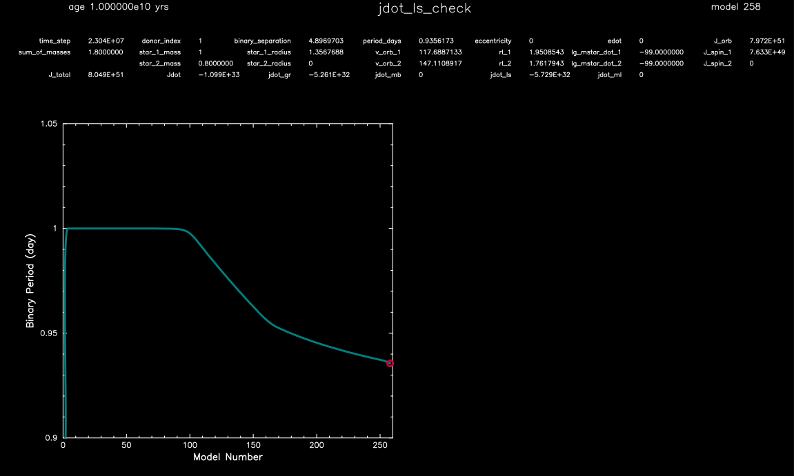

.. _jdot_ls_check:

*************
jdot_ls_check
*************

This test case verifies that models with tidal evolution conserve angular momentum.

This test case has 1 part. Click to see a larger version of a plot.

* Part 1 (``inlist_project``) loads a 1.0 Msun zero-age main sequence model and a 0.8 Msun point mass. The binary system is given an initial period of 1 day, and is evolved for 10 billion year:

|br|
pgstar commands used for the plot above:

.. code-block:: console

 &pgstar

  file_white_on_black_flag = .true. ! white_on_black flags -- true means white foreground color on black background
  !file_device = 'png'            ! png
  !file_extension = 'png'

  file_device = 'vcps'          ! postscript
  file_extension = 'ps'

  pgstar_interval = 1

 pgstar_left_yaxis_label_disp = 3.0

 Text_Summary_win_flag(1) = .false.
 Text_Summary_win_width(1) = 10
 Text_Summary_win_aspect_ratio(1) = 0.15

 Text_Summary_xleft(1) = 0.01
 Text_Summary_xright(1) = 0.99
 Text_Summary_ybot(1) = 0.0
 Text_Summary_ytop(1) = 1.0
 Text_Summary_txt_scale(1) = 1.0
 Text_Summary_title(1) = ''

 Text_Summary_num_rows(1) = 4 ! <= 20
 Text_Summary_num_cols(1) = 8 ! <= 20
 Text_Summary_name(1, :, :) = ''

 Text_Summary_name(1, 1, 1) = 'time_step'
 Text_Summary_name(1, 1, 2) = 'donor_index'
 Text_Summary_name(1, 1, 3) = 'binary_separation'
 Text_Summary_name(1, 1, 4) = 'period_days'
 Text_Summary_name(1, 1, 5) = 'eccentricity'
 Text_Summary_name(1, 1, 6) = 'edot'
 Text_Summary_name(1, 1, 7) = 'J_orb'
 Text_Summary_name(1, 1, 8) = ''

 Text_Summary_name(1, 2, 1) = 'sum_of_masses'
 Text_Summary_name(1, 2, 2) = 'star_1_mass'
 Text_Summary_name(1, 2, 3) = 'star_1_radius'
 Text_Summary_name(1, 2, 4) = 'v_orb_1'
 Text_Summary_name(1, 2, 5) = 'rl_1'
 Text_Summary_name(1, 2, 6) = 'lg_mstar_dot_1'
 Text_Summary_name(1, 2, 7) = 'J_spin_1'
 Text_Summary_name(1, 2, 8) = ''

 Text_Summary_name(1, 3, 1) = ''
 Text_Summary_name(1, 3, 2) = 'star_2_mass'
 Text_Summary_name(1, 3, 3) = 'star_2_radius'
 Text_Summary_name(1, 3, 4) = 'v_orb_2'
 Text_Summary_name(1, 3, 5) = 'rl_2'
 Text_Summary_name(1, 3, 6) = 'lg_mstar_dot_2'
 Text_Summary_name(1, 3, 7) = 'J_spin_2'
 Text_Summary_name(1, 3, 8) = ''

 Text_Summary_name(1, 4, 1) = 'J_total'
 Text_Summary_name(1, 4, 2) = 'Jdot'
 Text_Summary_name(1, 4, 3) = 'jdot_gr'
 Text_Summary_name(1, 4, 4) = 'jdot_mb'
 Text_Summary_name(1, 4, 5) = 'jdot_ls'
 Text_Summary_name(1, 4, 6) = 'jdot_ml'
 Text_Summary_name(1, 4, 7) = ''
 Text_Summary_name(1, 4, 8) = ''

 History_Track_win_flag(1) = .false.
 History_Track_win_width(1) = 12
 History_Track_win_aspect_ratio(1) = 0.75
 History_Track_txt_scale(1) = 0.8
 History_Track_title(1) = ' '

 History_Track_xname(1) = 'model_number'
 History_Track_yname(1) = 'period_days'
 History_Track_xaxis_label(1) = 'Model Number'
 History_Track_yaxis_label(1) = 'Binary Period (day)'
 History_Track_reverse_xaxis(1) = .false.
 History_Track_reverse_yaxis(1) = .false.

 History_Track_xmin(1) = 0.0
 History_Track_xmax(1) = 260.0
 History_Track_ymin(1) = 0.9
 History_Track_ymax(1) = 1.05

 History_Track_file_flag(1) = .false.
 History_Track_file_dir(1) = 'pgstar_out'
 History_Track_file_prefix(1) = 'track1_s1_'
 History_Track_file_interval(1) = 10000
 History_Track_file_width(1) = -1
 History_Track_file_aspect_ratio(1) = -1

 History_Track_win_flag(2) = .false.
 History_Track_win_width(2) = 12
 History_Track_win_aspect_ratio(2) = 0.75
 History_Track_txt_scale(2) = 0.8
 History_Track_title(2) = ''

 History_Track_xname(2) = 'model_number'
 History_Track_yname(2) = 'J_total'
 History_Track_xaxis_label(2) = 'Model Number'
 History_Track_yaxis_label(2) = 'Total Angular Momentum (g cm\u2 s\u-\u1)'
 History_Track_reverse_xaxis(2) = .false.
 History_Track_reverse_yaxis(2) = .false.

 History_Track_xmin(2) = 0.0
 History_Track_xmax(2) = 250.0
 History_Track_ymin(2) = 1e50
 History_Track_ymax(2) = 1e52

 History_Track_file_flag(2) = .false.
 History_Track_file_dir(2) = 'pgstar_out'
 History_Track_file_prefix(2) = 'track2_s1_'
 History_Track_file_interval(2) = 10000
 History_Track_file_width(2) = -1
 History_Track_file_aspect_ratio(2) = -1

  Grid_win_flag(1) = .true.
  Grid_win_width(1) = 16
  Grid_win_aspect_ratio(1) = 0.6

  Grid_title(1) = 'jdot_ls_check'
  Grid_txt_scale_factor(1, 1) = 1.0

  Grid_num_cols(1) = 2 ! divide plotting region into this many equal width cols
  Grid_num_rows(1) = 2 ! divide plotting region into this many equal height rows
  Grid_num_plots(1) = 3 ! <= 10

  Grid_plot_name(1, 1) = 'Text_Summary(1)'
  Grid_plot_row(1, 1) = 1           ! number from 1 at top
  Grid_plot_rowspan(1, 1) = 1       ! plot spans this number of rows
  Grid_plot_col(1, 1) =  1          ! number from 1 at left
  Grid_plot_colspan(1, 1) = 2       ! plot spans this number of columns

  Grid_plot_pad_left(1, 1) = -0.10    ! fraction of full window width for padding on left
  Grid_plot_pad_right(1, 1) = -0.18   ! fraction of full window width for padding on right
  Grid_plot_pad_top(1, 1) = -0.00     ! fraction of full window height for padding at top
  Grid_plot_pad_bot(1, 1) = 0.32     ! fraction of full window height for padding at bottom
  Grid_txt_scale_factor(1, 1) = 0.70 ! multiply txt_scale for subplot by this

  Grid_plot_name(1, 2) = 'History_Track1'
  Grid_plot_row(1, 2) = 2           ! number from 1 at top
  Grid_plot_rowspan(1, 2) = 1       ! plot spans this number of rows
  Grid_plot_col(1, 2) =  1          ! number from 1 at left
  Grid_plot_colspan(1, 2) = 1       ! plot spans this number of columns

  Grid_plot_pad_left(1, 2) = -0.04    ! fraction of full window width for padding on left
  Grid_plot_pad_right(1, 2) = 0.04   ! fraction of full window width for padding on right
  Grid_plot_pad_top(1, 2) = -0.24     ! fraction of full window height for padding at top
  Grid_plot_pad_bot(1, 2) = 0.00     ! fraction of full window height for padding at bottom
  Grid_txt_scale_factor(1, 2) = 0.7 ! multiply txt_scale for subplot by this

 !Grid_plot_name(1, 3) = 'History_Track2'
  Grid_plot_name(1, 3) = ' '
  Grid_plot_row(1, 3) = 2           ! number from 1 at top
  Grid_plot_rowspan(1, 3) = 1       ! plot spans this number of rows
  Grid_plot_col(1, 3) =  2          ! number from 1 at left
  Grid_plot_colspan(1, 3) = 1       ! plot spans this number of columns

  Grid_plot_pad_left(1, 3) = 0.04    ! fraction of full window width for padding on left
  Grid_plot_pad_right(1, 3) = -0.04   ! fraction of full window width for padding on right
  Grid_plot_pad_top(1, 3) = -0.24     ! fraction of full window height for padding at top
  Grid_plot_pad_bot(1, 3) = 0.00     ! fraction of full window height for padding at bottom
  Grid_txt_scale_factor(1, 3) = 0.7 ! multiply txt_scale for subplot by this

 Grid_file_flag(1) = .true.
 Grid_file_dir(1) = 'pgstar_out'
 Grid_file_prefix(1) = 'grid_'
 Grid_file_interval(1) = 10000
 Grid_file_width(1) = -1
 Grid_file_aspect_ratio(1) = -1

 / ! end of pgstar namelist

Last-Updated: 15Jul2021 (MESA 094ff71) by fxt.

.. # define a hard line break for HTML
.. |br| raw:: html

       
