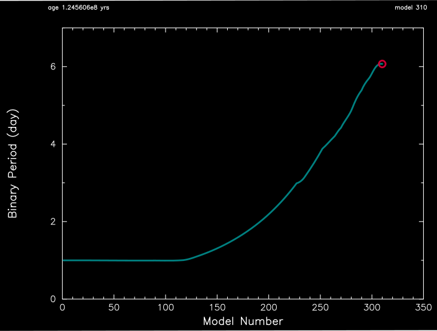
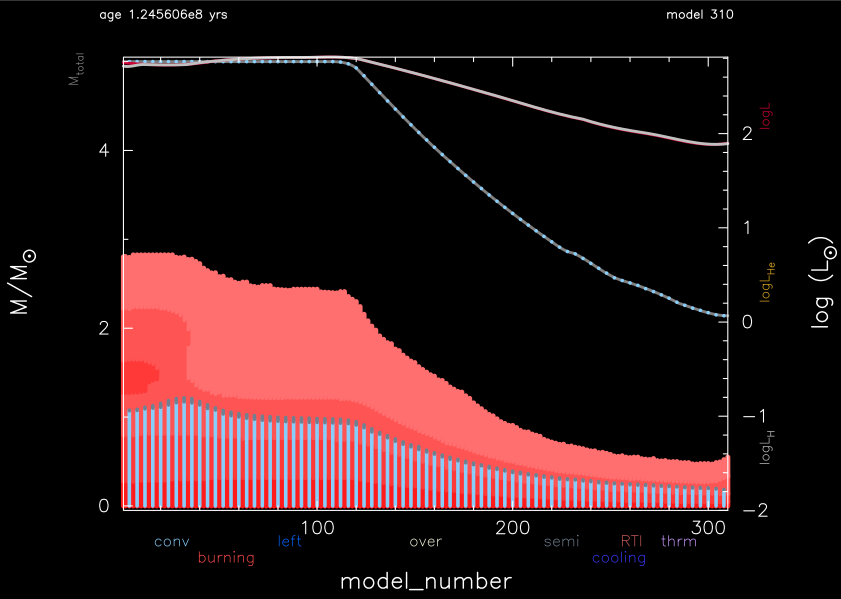

.. _star_plus_point_mass:

********************
star_plus_point_mass
********************

This test case checks the evolution of one star plus a point mass, including mass transfer to the point mass.

This test case has 1 part. Click to see a larger version of a plot.

* Part 1 (``inlist_project``) loads a pre-built 5 Msun zero-age main sequence model as the donor and a 10 Msun point mass as the companion. The binary system has an initial period of 1 day, and is evolved until the central hydrogen mass fraction of the donor drops below 0.2.

|br|
Binary period versus model number:

|br|
Binary seperation versus model number:

.. image:: ../../../binary/test_suite/star_plus_point_mass/docs/track2_000310.svg
   :width: 100%

|br|
Kippenhang diagram of the mass losing donar:

|br|
pgstar commands used for the plots above:

.. code-block:: console

 &pgstar

  file_white_on_black_flag = .true. ! white_on_black flags -- true means white foreground color on black background
  !file_device = 'png'            ! png
  !file_extension = 'png'

  file_device = 'vcps'          ! postscript
  file_extension = 'ps'

  pgstar_interval = 1

  pgstar_left_yaxis_label_disp = 4.0

  History_Track1_win_flag = .true.
  History_Track1_win_width = 12
  History_Track1_win_aspect_ratio = 0.75
  History_Track1_txt_scale = 0.8
  History_Track1_title = ' '

  History_Track1_xname = 'model_number'
  History_Track1_yname = 'period_days'
  History_Track1_xaxis_label = 'Model Number'
  History_Track1_yaxis_label = 'Binary Period (day)'
  History_Track1_reverse_xaxis = .false.
  History_Track1_reverse_yaxis = .false.

  History_Track1_xmin = 0.0
  History_Track1_xmax = 350
  History_Track1_ymin = 0.0
  History_Track1_ymax = 7.0

  History_Track1_file_flag = .true.
  History_Track1_file_dir = 'pgstar_out'
  History_Track1_file_prefix = 'track1_'
  History_Track1_file_interval = 100
  History_Track1_file_width = -1
  History_Track1_file_aspect_ratio = -1

  History_Track2_win_flag = .true.
  History_Track2_win_width = 12
  History_Track2_win_aspect_ratio = 0.75
  History_Track2_txt_scale = 0.8
  History_Track2_title = ' '

  History_Track2_xname = 'model_number'
  History_Track2_yname = 'binary_separation'
  History_Track2_xaxis_label = 'Model Number'
  History_Track2_yaxis_label = 'Binary Seperation (R\d\(2281)\u)'
  History_Track2_reverse_xaxis = .false.
  History_Track2_reverse_yaxis = .false.

  History_Track2_xmin = 0.0
  History_Track2_xmax = 350
  History_Track2_ymin = 0.0
  History_Track2_ymax = 40.0

  History_Track2_file_flag = .true.
  History_Track2_file_dir = 'pgstar_out'
  History_Track2_file_prefix = 'track2_'
  History_Track2_file_interval = 100
  History_Track2_file_width = -1
  History_Track2_file_aspect_ratio = -1
         

  Kipp_win_flag = .true.
  Kipp_win_width = 12
  Kipp_win_aspect_ratio = 0.75
  Kipp_txt_scale = 1.0
  Kipp_title = ' '

  Kipp_mass_max = 5.0
  Kipp_mass_min = 0
  Kipp_xmax = -101d0
  Kipp_xmin = 0

  Kipp_show_mixing = .true.
  Kipp_show_burn = .true.
  Kipp_show_luminosities = .true.
  Kipp_show_mass_boundaries = .false.

  Kipp_file_flag = .true.
  Kipp_file_dir = 'pgstar_out'
  Kipp_file_prefix = 'kipp_'
  Kipp_file_interval = 100
  Kipp_file_width = -1
  Kipp_file_aspect_ratio = -1

 / ! end of pgstar namelist

Last-Updated: 10Jul2021 (MESA 094ff71) by fxt.

.. # define a hard line break for HTML
.. |br| raw:: html

       
