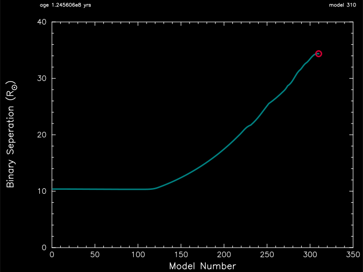

.. _star_plus_point_mass:

********************
star_plus_point_mass
********************

This test case checks the evolution of one star plus a point mass, including mass transfer to the point mass.

This test case has 1 part. Click to see a larger version of a plot.

* Part 1 (``inlist_project``) loads a pre-built 5 Msun zero-age main sequence model as the donor and a 10 Msun point mass as the companion. The binary system has an initial period of 1 day, and is evolved until the central hydrogen mass fraction of the donor drops below 1e-2. Compare the evolutions bewlow with those in :ref:`star_plus_point_mass_explicit_mdot`.

|br|
Binary period versus model number:

|br|
Binary seperation versus model number:

|br|
Kippenhang diagram of the mass losing donar:

.. image:: ../../../binary/test_suite/star_plus_point_mass/docs/kipp_000310.svg
   :width: 100%

|br|
pgstar commands used for the plots above:

.. code-block:: console

 &pgstar

  file_white_on_black_flag = .true. ! white_on_black flags -- true means white foreground color on black background
  !file_device = 'png'            ! png
  !file_extension = 'png'

  file_device = 'vcps'          ! postscript
  file_extension = 'ps'

  pgstar_interval = 1

  pgstar_left_yaxis_label_disp = 4.0

  History_Track_win_flag(1) = .true.
  History_Track_win_width(1) = 12
  History_Track_win_aspect_ratio(1) = 0.75
  History_Track_txt_scale(1) = 0.8
  History_Track_title(1) = ' '

  History_Track_xname(1) = 'model_number'
  History_Track_yname(1) = 'period_days'
  History_Track_xaxis_label(1) = 'Model Number'
  History_Track_yaxis_label(1) = 'Binary Period (day)'
  History_Track_reverse_xaxis(1) = .false.
  History_Track_reverse_yaxis(1) = .false.

  History_Track_xmin(1) = 0.0
  History_Track_xmax(1) = 350
  History_Track_ymin(1) = 0.0
  History_Track_ymax(1) = 7.0

  History_Track_file_flag(1) = .true.
  History_Track_file_dir(1) = 'pgstar_out'
  History_Track_file_prefix(1) = 'track1_'
  History_Track_file_interval(1) = 100
  History_Track_file_width(1) = -1
  History_Track_file_aspect_ratio(1) = -1

  History_Track_win_flag(2) = .true.
  History_Track_win_width(2) = 12
  History_Track_win_aspect_ratio(2) = 0.75
  History_Track_txt_scale(2) = 0.8
  History_Track_title(2) = ' '

  History_Track_xname(2) = 'model_number'
  History_Track_yname(2) = 'binary_separation'
  History_Track_xaxis_label(2) = 'Model Number'
  History_Track_yaxis_label(2) = 'Binary Seperation (R\d\(2281)\u)'
  History_Track_reverse_xaxis(2) = .false.
  History_Track_reverse_yaxis(2) = .false.

  History_Track_xmin(2) = 0.0
  History_Track_xmax(2) = 350
  History_Track_ymin(2) = 0.0
  History_Track_ymax(2) = 40.0

  History_Track_file_flag(2) = .true.
  History_Track_file_dir(2) = 'pgstar_out'
  History_Track_file_prefix(2) = 'track2_'
  History_Track_file_interval(2) = 100
  History_Track_file_width(2) = -1
  History_Track_file_aspect_ratio(2) = -1
         

  Kipp_win_flag = .true.
  Kipp_win_width = 12
  Kipp_win_aspect_ratio = 0.75
  Kipp_txt_scale = 1.0
  Kipp_title = ' '

  Kipp_mass_max = 5.0
  Kipp_mass_min = 0
  Kipp_xmax = -101d0
  Kipp_xmin = 0

  Kipp_show_mixing = .true.
  Kipp_show_burn = .true.
  Kipp_show_luminosities = .true.
  Kipp_show_mass_boundaries = .false.

  Kipp_file_flag = .true.
  Kipp_file_dir = 'pgstar_out'
  Kipp_file_prefix = 'kipp_'
  Kipp_file_interval = 100
  Kipp_file_width = -1
  Kipp_file_aspect_ratio = -1

 / ! end of pgstar namelist

Last-Updated: 10Jul2021 (MESA 094ff71) by fxt.

.. # define a hard line break for HTML
.. |br| raw:: html

       
