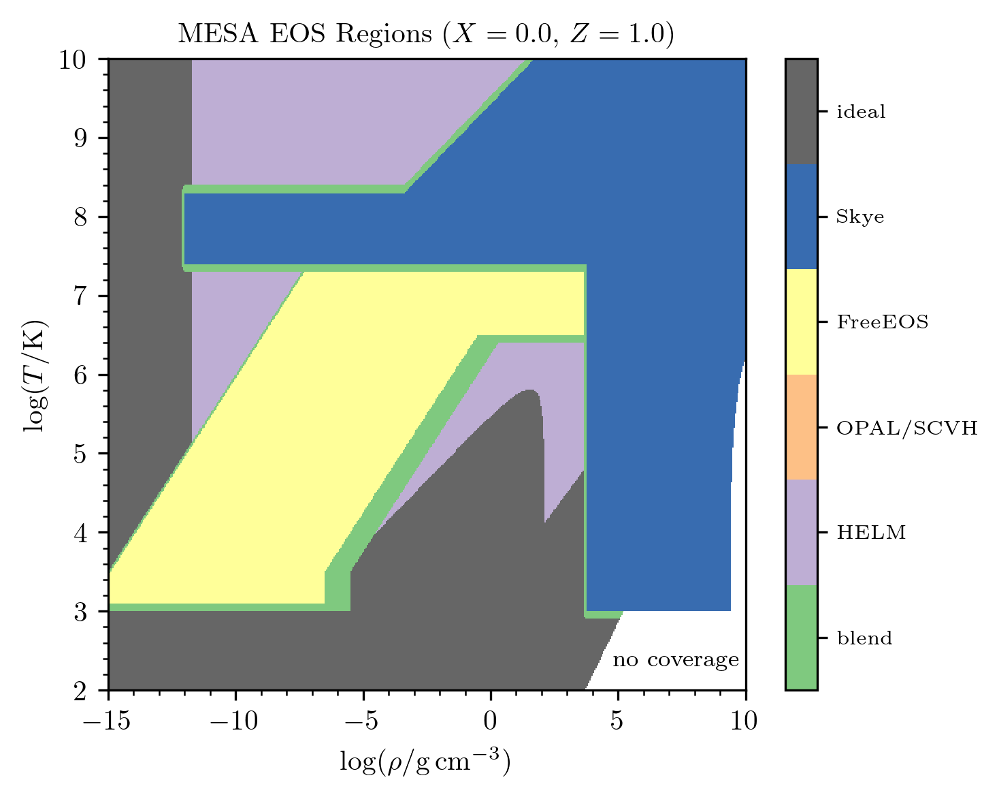

======================
Overview of eos module
======================

The equation of state (EOS) is delivered by the ``eos`` module.  The
MESA EOS combines different input sources in order to cover the wide
range of conditions encountered during stellar evolution.  The most
important EOS controls are those that select which input sources to
use and control the location and properties of the transitions between
different input sources.

There remain challenges to providing a broad coverage EOS given the
current need to combine multiple sources, some of which may not
provide the necessary thermodynamic information and which may not
agree in their region of overlap.

The EOS primarily works with density, :math:`\rho`, and temperature,
:math:`T`, as independent variables. These are the natural variables
in a Helmholtz free energy formulation of the thermodynamics. The
composition-dependence of the EOS is accounted for in different ways
in different input sources.  However, the metallicity, :math:`Z`, is
the relevant composition parameter for setting the transition between
different input sources.

The EOS blend occurs via a sequence of levels.  Each level,
corresponding to a single component EOS, determines the fraction,
:math:`f`, of the final result that component provides at the
specified conditions.  If :math:`f = 0`, the result of the next level
is evaluated and returned.  If :math:`f = 1`, the result of the EOS
component corresponding to the current level is returned.  Otherwise,
both results are evaluated, blended, and returned.  Smooth blends are
assured via the smoothness of the functions that define the component
fractions.

This approach means that that EOS components have an order of
precedence:

    (CMS) > Skye > PC > FreeEOS > OPAL/SCVH > HELM.

EOS components in parentheses are experimental and off by default.

   The :math:`\rho-T` coverage of the EOS for a solar-like composition.
   See below for descriptions of each EOS component.

   The :math:`\rho-T` coverage of the EOS for a metal-dominated composition.
   See below for descriptions of each EOS component.

EOS Quantities
==============

A call to the equation of state returns a structure with the following
quantities.  See ``eos/public/eos_def.f90`` for more information.

.. list-table:: Quantities returned by the EOS routines
   :widths: 15 15 15
   :header-rows: 1

   * - Quantity
     - Description
     - Units
   * - :math:`P_{\rm gas}`
     - gas pressure
     - :math:`{\rm ergs \ cm^{-3}}`
   * - :math:`E`
     - specific internal energy
     - :math:`{\rm ergs \ g^{-1}}`
   * - :math:`S`
     - specific entropy
     - :math:`{\rm ergs \ g^{-1}  \ K^{-1}}`
   * - :math:`\mu`
     - mean molecular weight per gas particle
     - none
   * - :math:`1/\mu_e`
     - mean number of free electrons per nucleon
     - none
   * - :math:`\eta`
     - ratio of electron chemical potential to :math:`k_BT`
     - none
   * - :math:`\nabla_{\rm ad}`
     - adiabatic T gradient with pressure
     - none
   * - :math:`\chi_{\rho}`
     - :math:`\equiv d{\rm ln}P/d{\rm ln}\rho|_T`
     - none
   * - :math:`\chi_T`
     - :math:`\equiv d{\rm ln}P/d{\rm ln}T|_{\rho}`
     - none
   * - :math:`C_{\rm P}`
     - specific heat at constant pressure
     - :math:`{\rm ergs \ g^{-1}  \ K^{-1}}`
   * - :math:`C_{\rm V}`
     - specific heat at constant :math:`V\equiv 1/\rho`
     - :math:`{\rm ergs \ g^{-1}  \ K^{-1}}`
   * - :math:`dE/d\rho|_T`
     -
     - :math:`{\rm ergs \ cm^{3} \ g^{-2}}`
   * - :math:`dS/d\rho|_{T}`
     - 
     - :math:`{\rm ergs \ cm^{3} \ g^{-2}  \ K^{-1}}`
   * - :math:`dS/dT|_{\rho}`
     - 
     - :math:`{\rm ergs \ g^{-1}  \ K^{-2}}`
   * - :math:`\Gamma_1`
     - :math:`\equiv d{\rm ln}P/d{\rm ln}\rho|_S`
     - none
   * - :math:`\Gamma_3`
     - :math:`\equiv d{\rm ln}T/d{\rm ln}\rho|_S+1`
     - none

MESA also returns the temperature and density derivatives of these quantities.
       

Component EOSes
===============

OPAL/SCVH
---------

The OPAL/SCVH tables are based on the 2005 update of the OPAL EOS
tables |OPAL|. The OPAL tables assume a scaled-solar metal abundance
pattern and have composition parameterized via :math:`X` and
:math:`Z`. To extend to lower temperatures and densities, we use the
SCVH tables |SCVH|, and construct a smooth transition between these
tables in the overlapping region.  This blend occurs in a
pre-processing step and cannot be modified at runtime.  The SCVH
tables are for a H/He EOS and so only depend on :math:`X`.

FreeEOS
-------

The FreeEOS |FreeEOS| tables are based on the FreeEOS code, version 2.2.1, 
and utilize the EOS1 option suite.  FreeEOS is described as an "efficient 
free-energy minimization technique that is suitable for physical conditions 
in stellar interiors."  It provides results for arbitrary chemical composition
that are thermodynamically consistent to machine precision.  The tables assume 
a scaled-solar chemical composition and are parameterized by :math:`X` and 
:math:`Z,` with tables provided up to :math:`Z=1.` FreeEOS covers a similar 
domain to the OPAL EOS.

HELM
----

The HELM EOS |HELM| is a fully-ionized electron-ion plasma EOS that
includes the effects of electron-positron pair production.  It is
explicitly constructed from a free energy approach, guaranteeing
thermodynamic consistency.  The composition is accounted for via
:math:`\overline{{\rm A}}` (the mass-averaged atomic weight), and
:math:`\overline{\rm Z}` (the mass-averaged atomic charge).

.. note::

  HELM serves as a "backstop" EOS for MESA.  When applied at low
  temperatures, it falls back into an ideal gas mode.

PC
--

The PC EOS |PC| is a fully-ionized electron-ion plasma EOS.  It
includes a detailed treatment of Coulomb interactions and so is
preferred once the Coulomb coupling parameter becomes significant.  It
includes the phase transition associated with ion crystallization.
The composition is accounted for by including all isotopes with mass
fractions above a specified minimum.

Skye
----

The Skye EOS |Skye| is a free-energy-based EOS for fully ionized
matter.  Roughly, Skye is designed to cover conditions that were
previously covered by the combination of HELM and PC.  Skye includes
the effects of positrons, relativity, electron degeneracy, Coulomb
interactions, nonlinear mixing effects, and quantum corrections. Skye
determines the point of Coulomb crystallization in a self-consistent
manner, accounting for mixing and composition effects automatically. A
defining feature of this equation of state is that it uses analytic
free energy terms and provides thermodynamic quantities using
automatic differentiation machinery.

CMS
---

.. warning::

   This EOS is experimental.

CMS is the EOS for dense H/He mixtures of |CMS|.

.. |CMS| replace:: `Chabrier, Mazevet, & Soubiran (2019) <https://ui.adsabs.harvard.edu/abs/2019ApJ...872...51C>`__

.. |SCVH| replace:: `(Saumon, Chabrier, & van Horn 1995) <https://ui.adsabs.harvard.edu/abs/1995ApJS...99..713S>`__

.. |OPAL| replace:: `(Rogers & Nayfonov 2002) <https://ui.adsabs.harvard.edu/abs/2002ApJ...576.1064R>`__
                    
.. |HELM| replace:: `(Timmes & Swesty 2000) <https://ui.adsabs.harvard.edu/abs/2000ApJS..126..501T>`__

.. |PC| replace:: `(Potekhin & Chabrier 2010) <https://ui.adsabs.harvard.edu/abs/2010CoPP...50...82P>`__

.. |FreeEOS| replace:: `(Alan W. Irwin) <http://freeeos.sourceforge.net/>`__

.. |Skye| replace:: `(Jermyn et al. 2021) <https://ui.adsabs.harvard.edu/abs/2021ApJ...913...72J>`__
