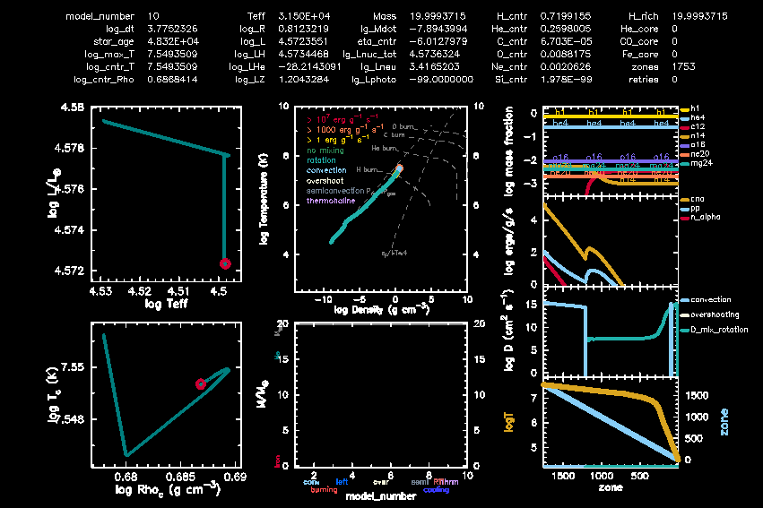

###############################################
Modules for Experiments in Stellar Astrophysics
###############################################

.. grid:: 1
    :class-container: color-cards

    .. grid-item-card:: Modules for Experiments in Stellar Astrophysics (MESA)
      :columns: 12 12 12 12
      :class-card: mesa-summary

      .. image:: assets/logo/mesa-logo.png
         :alt: MESA logo
         :width: 96px
         :align: left

      **MESA** is an advanced, open-source 1D stellar evolution code. The code is developed and maintained by a globally distributed team of researchers. MESA is written primarily in Fortran with a modular, flexible design that facilitates easy interfacing.

.. grid:: 3
   :class-container: product-offerings
   :margin: 0
   :padding: 0
   :gutter: 0

   .. grid-item-card:: Stellar Physics
      :columns: 12 6 6 4
      :class-card: sd-border-0
      :shadow: None

      MESA implements tested, peer-reviewed physics and numerical methods for modeling stellar structure and evolution across a wide range of masses and evolutionary stages.

   .. grid-item-card:: Open-source
      :columns: 12 6 6 4
      :class-card: sd-border-0
      :shadow: None

      Freely available with an active global developer and user community, documentation, and examples to help drive new scientific results.

   .. grid-item-card:: Modular
      :columns: 12 6 6 4
      :class-card: sd-border-0
      :shadow: None

      A modular Fortran codebase with configurable physics modules, user hooks, and flexible inlists that make it easy to customize problem setups.

.. grid:: 3
    :class-container: color-cards

    .. grid-item-card:: :material-regular:`rocket_launch;2em` Quickstart
      :columns: 12 6 6 4
      :link: quickstart
      :link-type: doc
      :class-card: quickstart

    .. grid-item-card:: :material-regular:`library_books;2em` Reference and Defaults
      :columns: 12 6 6 4
      :link: reference
      :link-type: doc
      :class-card: reference

    .. grid-item-card:: :material-regular:`laptop_chromebook;2em` Test Suite
      :columns: 12 6 6 4
      :link: test_suite
      :link-type: doc
      :class-card: quickstart

.. toctree::
   :maxdepth: 1
   :caption: Contents

   quickstart
   installation
   using_mesa
   modules
   reference
   test_suite
   about
   changelog
   summer_schools
   code_of_conduct
   contributing
   developing
   faq
   known_bugs
   news
