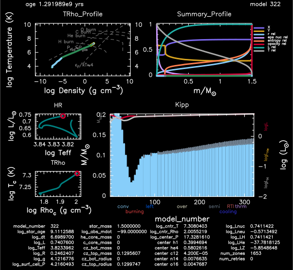

Best practices
==============

During the project
------------------

When you begin a new project you should generally use the most recent
MESA release. Unless you encounter bugs that negatively impact your
work, stick with that version throughout the project. If you’re starting
from a set of input files that were designed for an older version, we
suggest you invest some time porting it to the latest version, as if you
run into any issues this will make it much easier for the community to
assist you.

Before modifying any source code in the main MESA directory, check if
these changes cannot be applied locally in your work folder using the
:ref:`hooks provided by MESA <using_mesa/extending_mesa:Extending MESA>`. If you have a use
case that cannot be completed with the provided set of hooks, you can
always contact us to request a new one.

The MESA test suite (``star/test_suite`` and ``binary/test_suite``) is a
valuable source of examples and a good first stop when setting up a new
problem with MESA. Looking at the test suite inlists is a quick way to
familiarize yourself with the set of options relevant to your problem.
More information is available on :ref:`how to use a test suite case as a starting point for your own work directory <test_suite:Test suite>`.

You should always perform some sort of convergence study to ensure that
your results are not sensitive to the time or mass resolution of your models.
Please note, and this is very important, that MESA defaults will
generally NOT be optimal or even acceptable for your particular science cases.
It is the user’s responsibility to ensure that the MESA options and controls
they choose are appropriate for the physics they want to study.
This will usually require appropriate testing and critical analysis of the models obtained.

Throughout your project, the best way to solicit community help and
input is via a message to the ``mesa-users@lists.mesastar.org`` mailing list.


An example
----------

We will use the test suite case :ref:`semiconvection`.
Begin in the directory where you do your MESA work.

.. code-block:: console

  cp -r $MESA_DIR/star/test_suite/semiconvection .

There are four files to edit. First, modify ``make/makefile``:

.. code-block:: console

   cd semiconvection
   cd make

   Edit makefile, changing

       MESA_DIR = ../../../..

   to 

       ! MESA_DIR = ../../../..
  
   Save the file change in your editor, and

   cd ../

Second, modify the ``rn`` script:

.. code-block:: console

   Edit rn, changing

       MESA_DIR=../../.. 

   to

       # MESA_DIR=../../.. 

   and save the file change.

Third, modify the ``ck`` script:

.. code-block:: console

   Edit ck, changing

       MESA_DIR=../../..

   to

       # MESA_DIR=../../..

   and save the file change.

Fourth, modify ``inlist_semiconvection_header``:

.. code-block:: console

   Edit inlist_semiconvection_header, changing

       mesa_dir = '../../..'

   to 

      !mesa_dir = '../../..'

   and save the file change.

Now build the executable 

.. code-block:: console

   ./mk

and run the executable

.. code-block:: console

   ./rn

After a few minutes the run will terminate and you should see 

.. code-block:: console

 stop because have dropped below central lower limit for h1
     0.3994694345E+00    0.4000000000E+00

         322   7.308040   6658.804   0.741142   0.741142   1.500000   1.500000   0.399469   0.007663   0.280000  -2.316624   1653      0
    6.698970   7.308040   0.246241 -37.781812  -0.571349 -99.000000   0.000000   0.580264   0.004769   0.020000   0.076565      5
  1.2920E+09   2.005522   0.740760  -5.854865 -41.276481  -7.412372   0.000000   0.000042   0.002098   0.020266  0.000E+00        max_dt
                                rel_E_err    1.0067953870393901D-12
                        log_rel_run_E_err      -10.0905601615909450

 save LOGS/profile8.data for model 322
 save photos/x322 for model 322
  saved to final.mod
 termination code: xa_central_lower_limit

                  runtime (minutes), retries, steps        4.92         0       322


                               mixing type at 0.125 Msun    1.0000000000000000D+00    1.0000000000000000D+00    1.0000000000000000D+00
                               mixing type at 0.135 Msun    3.0000000000000000D+00    3.0000000000000000D+00    3.0000000000000000D+00
                               mixing type at 0.145 Msun    0.0000000000000000D+00    0.0000000000000000D+00    0.0000000000000000D+00
                                                    logT    7.2062697504202102D+00    7.1500000000000004D+00    7.3099999999999996D+00
                                                  logRho    1.7886843044807488D+00    1.7500000000000000D+00    1.8000000000000000D+00

 all values are within tolerances

Let's add some pgstar plots to visualize what is happening. 
There are three files to edit.
First, copy the default ``history_columns.list`` to your work directory

.. code-block:: console

   cp $MESA_DIR/star/defaults/history_columns.list .

and modify your local ``history_columns.list``

.. code-block:: console

  add

      mixing_regions 20 
      burning_regions 20

 change

      !log_center_T ! temperature
      !log_center_Rho ! density

 to

      log_center_T ! temperature
      log_center_Rho ! density

   and save the file changes.


Second, modify ``inlist_semiconvection_header``

.. code-block:: console

  change

      !read_extra_pgstar_inlist1 = .true.
      !extra_pgstar_inlist1_name = 'inlist_semiconvection'

  to
      read_extra_pgstar_inlist1 = .true.
      extra_pgstar_inlist1_name = 'inlist_semiconvection'  

   and save the file changes.


Third, modify ``inlist_semiconvection`` to change the pgstar namelist to 

.. code-block:: console

  add to the star_job namelist:

      pgstar_flag = .true.
      save_pgstar_files_when_terminate = .true.


  and to make the stopping condition more precise, add to the controls namelist:

      when_to_stop_rtol = 1e-4
      when_to_stop_atol = 1e-4

  and finally replace the pgstar namelist with

  &pgstar

      pgstar_interval = 1

      Grid4_win_flag = .true.
      Grid4_win_width = 8
      Kipp_mass_max = 0.2 ! (Msun units) negative means use default
      Kipp_show_mixing = .true.
      Kipp_show_burn = .false.
      Kipp_show_luminosities = .true.
      Kipp_show_mass_boundaries = .false.

      Grid4_file_flag = .true.
      Grid4_file_dir = 'pgstar_out'
      Grid4_file_prefix = 'grid4_'
      Grid4_file_interval = 10
      Grid4_file_width = -1
      Grid4_file_aspect_ratio = -1

  / ! end of pgstar namelist

   and save the file changes.


Now run the executable egain

.. code-block:: console

   ./rn

and you should see a pgstar window appear on your screen:




|br| |br|

Explore Physics Variations
--------------------------

Make the following changes to your ``inlist_semiconvection``:

.. code-block:: console

    change 

      max_model_number = 1000

    to 

      max_model_number = 40000

    and change

      history_interval = 10

    to

      history_interval = 1


Experiment with the reaction network 
^^^^^^^^^^^^^^^^^^^^^^^^^^^^^^^^^^^^

Change the nuclear reaction network 
``new_net_name`` = ``pp_and_cno_extras.net`` (this test suite case), ``basic.net`` (default), ``approx21.net``, and ``mesa_49.net``.

1) Are all the reported values still within their tolerances at the end of a run?
|br|
2) Are the results for the growth of the convective core mass, HR diagram, and final hydrogen profile the same? 
|br|
3) Why are the results the same or different?


.. note::

 For the 2021 MESA Summer School, each table should do all 4 reaction networks. Participants with the fastest machines should to the larger networks.
 
 It is usually useful to examine history and profile quantities.

 Change the default control namelist parameter ``log_directory = `LOGS``` to the more descriptive
 ``log_directory = `TableNN_network_name``` where NN is your table number and network_name is one of the choices above,
 for example, ``log_directory = `Table08_approx21```.

 After the runs, each table should upload their ``log_directory`` 
 to our shared Dropbox directory timmes/Experiment01.

 The TAs will plot our crowd-sourced growth of the convective core mass, HR diagram, and final hydrogen profile.

 When finished, return the chosen reaction network to the testcase value of ``pp_and_cno_extras.net``.


Experiment with the convective mixing length 
^^^^^^^^^^^^^^^^^^^^^^^^^^^^^^^^^^^^^^^^^^^^

Change the mixing length of convection 
``mixing_length_alpha`` = 1.0 to 3.0 in steps of 0.1, which will include 2.0 (default) and 1.8 (this test suite case).
Repeat answering the questions above.

.. note::

 For the 2021 MESA Summer School, each TA will be given a block of 4 values, one for each participant at their table.
 The TA will then distribute the values to the team. 

 Change the default control namelist parameter ``log_directory = `LOGS``` to the more descriptive
 ``log_directory = `TableNN_NpN``` where NN is your table number and NpN is your value,
 for example, ``log_directory = `Table03_1p8```.
 
 After a run is complete, each participant should upload a ``log_directory`` to our shared Dropbox directory timmes/Experiment02.

 The TAs will plot our crowd-sourced growth of the convective core mass, HR diagram, and final hydrogen profile.
 
 When finished, return ``mixing_length_alpha`` to the test case value of 1.8.


Experiment with the semiconvective mixing length 
^^^^^^^^^^^^^^^^^^^^^^^^^^^^^^^^^^^^^^^^^^^^^^^^

Change the scale of semiconvection mixing 
``alpha_semiconvection`` = 0.0 to 0.5 in steps of 0.02, which will include 0.0 (default) and 0.1 (this test suite case).
Repeat answering the questions above.


.. note::

 For the 2021 MESA Summer School, each TA will be given a block of 4 values, one for each participant at their table.
 The TA will then distribute the values to the team. 

 Change the default control namelist parameter ``log_directory = `LOGS``` to the more descriptive
 ``log_directory = `TableNN_NpNN``` where NN is your table number and NpNN is your value,
 for example, ``log_directory = `Table11_1p80```.
 
 After a run is complete, each participant should upload a ``log_directory`` to our shared Dropbox directory timmes/Experiment03.

 The TAs will plot our crowd-sourced growth of the convective core mass, HR diagram, and final hydrogen profile.
 
 When finished, return ``alpha_semiconvection`` to the test case value of 0.1.


Explore Numerical Convergence 
-----------------------------

Experiment with the mass resolution I
^^^^^^^^^^^^^^^^^^^^^^^^^^^^^^^^^^^^^

Change the mass resolution setting
``max_dq`` = 5.0e-2, 2.0e-2, 1.0e-2 (default), 5.0e-3, 2.0e-3, and 1.0e-3.
Repeat answering the questions above.

.. note::

 For the 2021 MESA Summer School, each TA will be given a block of 4 values, one for each participant at their table.
 The TA will then distribute the values to the team. 

 Change the default control namelist parameter ``log_directory = `LOGS``` to the more descriptive
 ``log_directory = `TableNN_NpNNN``` where NN is your table number and NpNNN is your value,
 for example, ``log_directory = `Table05_0p002```.
 
 After a run is complete, each participant should upload a ``log_directory`` to our shared Dropbox directory timmes/Experiment04.

 The TAs will plot our crowd-sourced growth of the convective core mass, HR diagram, and final hydrogen profile.
 
 When finished, return ``max_dq`` to its default value.


Experiment with the mass resolution II
^^^^^^^^^^^^^^^^^^^^^^^^^^^^^^^^^^^^^^

Change the mass resolution setting
``mesh_delta_coeff`` = 0.2 to 2.0 in steps of 0.2, which will include the default value of 1.0.
Repeat answering the questions above.

.. note::

 For the 2021 MESA Summer School, each TA will be given a block of 4 values, one for each participant at their table.
 The TA will then distribute the values to the team. 

 Change the default control namelist parameter ``log_directory = `LOGS``` to the more descriptive
 ``log_directory = `TableNN_NpNNN``` where NN is your table number and NpN is your value,
 for example, ``log_directory = `Table08_1p2```.
 
 After a run is complete, each participant should upload a ``log_directory`` to our shared Dropbox directory timmes/Experiment05.

 The TAs will plot our crowd-sourced growth of the convective core mass, HR diagram, and final hydrogen profile.
 
 When finished, return ``mesh_delta_coeff`` to its default value of 1.0.


Experiment with the temporal resolution
^^^^^^^^^^^^^^^^^^^^^^^^^^^^^^^^^^^^^^^

Change the temporal resolution setting
``max_years_for_timestep`` = 1.0e8, 5.0e7, 2.0e7, 1.0e7, 5.0e6, 2.0e6, and 1.0e6.
Repeat answering the questions above.

.. note::

 For the 2021 MESA Summer School, each TA will be given a block of 4 values, one for each participant at their table.
 The TA will then distribute the values to the team. 

 Change the default control namelist parameter ``log_directory = `LOGS``` to the more descriptive
 ``log_directory = `TableNN_NeN``` where NN is your table number and NeN is your value,
 for example, ``log_directory = `Table01_2e7```.
 
 After a run is complete, each participant should upload a ``log_directory`` to our shared Dropbox directory timmes/Experiment06.

 The TAs will plot our crowd-sourced growth of the convective core mass, HR diagram, and final hydrogen profile.
 
 When finished, return ``max_years_for_timestep`` to its default value of 0.0.


Create An Article for Publication
---------------------------------

Gather your science and write it up for publication.

.. note::

 For the 2021 MESA Summer School, each table should team-craft a 250 word maximum Research Notes abstract,
 and then upload their abstract, named ``TableNN_abstract.txt`` where NN is your table number, for example,
 ``Table10_abstract.txt``, to our shared Dropbox directory timmes/Abstracts.


In the article
--------------

You should provide a clear statement of which version of MESA was used
in the calculation. We also recommend noting which version of the MESA
SDK was used to compile MESA.

Citing MESA
^^^^^^^^^^^

You should cite all of the available MESA instrument papers at the time
of the MESA version being used, as MESA is sum of this work. Currently,
that is:

.. code-block:: latex

  Modules for Experiments in Stellar Astrophysics
  \citep[MESA][]{Paxton2011, Paxton2013, Paxton2015, Paxton2018, Paxton2019}.


MESA critically rests on the hard work of many researchers who have
generated the input microphysics data that underpins the ``eos``,
``kap``, ``net``, and ``neu`` modules. We therefore encourage users to
briefly summarize these, including appropriate citations.

.. code-block:: latex

  The MESA EOS is a blend of the OPAL \citep{Rogers2002}, SCVH
  \citep{Saumon1995}, FreeEOS \citep{Irwin2004}, HELM \citep{Timmes2000},
  PC \citep{Potekhin2010}, and Skye \citep{Jermyn2021} EOSes.
  
  Radiative opacities are primarily from OPAL \citep{Iglesias1993,
  Iglesias1996}, with low-temperature data from \citet{Ferguson2005}
  and the high-temperature, Compton-scattering dominated regime by
  \citet{Poutanen2017}.  Electron conduction opacities are from
  \citet{Cassisi2007}.
  
  Nuclear reaction rates are from JINA REACLIB \citep{Cyburt2010} plus
  additional tabulated weak reaction rates \citet{Fuller1985, Oda1994,
  Langanke2000}.  Screening is included via the prescription of \citet{Chugunov2007}.
  Thermal neutrino loss rates are from \citet{Itoh1996}.


                
Note that this only summarizes the "default" capabilities, of the
currently released version of MESA. If you are making use of other
microphysics options, employing prescriptions such as wind mass loss
rates, or using older versions of MESA, please consult the documentation
for appropriate references.

In the the MESA binary module, by default:

.. code-block:: latex

   Roche lobe radii in binary systems are computed using the fit of
   \citet{Eggleton1983}.  Mass transfer rates in Roche lobe
   overflowing binary systems are determined following the
   prescription of \citet{Ritter1988}.


A :download:`BibTex file <mesa.bib>` with these references is available.

Citing included tools
^^^^^^^^^^^^^^^^^^^^^

If you are making use of an instrument that is provided in MESA (e.g.,
ADIPLS, GYRE, RSP, or STELLA), please make sure to include citations to
the papers that describe it.

* ADIPLS ``\citep{ChristensenDalsgaard2008}``

* GYRE ``\citep{Townsend2013, Townsend2018}``

* RSP ``\citep{Smolec2008}``

* STELLA ``\citep{Blinnikov2004, Baklanov2005, Blinnikov2006}``

Citing the MESASDK
^^^^^^^^^^^^^^^^^^

The MESASDK can be cited via its Zenodo link `for
MacOS <http://doi.org/10.5281/zenodo.2669543>`__ and `for
Linux <http://doi.org/10.5281/zenodo.2669541>`__. Citations should also
contain the version of the MESASDK used, individual Zenodo DOI's are
available for each MESASDK version.

A :download:`BibTex file <tools.bib>` with these references is available.


Citing MESA Zenodo community contributions
^^^^^^^^^^^^^^^^^^^^^^^^^^^^^^^^^^^^^^^^^^

If you are making use of material that has been shared by the `MESA
Zenodo community <https://zenodo.org/communities/mesa>`__, please make
sure to include citations to the Zenodo repository that you leveraged
and the science article(s) that describe the capability.

At the end of the project
-------------------------

You should make all information needed for others to recreate your MESA
results publicly available. This includes your inlists and
run_star_extras/run_binary_extras, the MESA version and the MESA SDK
version (or compiler version for non-SDK builds), as well as any
modifications to MESA that you may have made.

We recommend using `Zenodo <http://about.zenodo.org/>`__ for this
purpose. Zenodo assigns digital object identifiers (DOIs) for each
entry, providing an immutable way to reference an upload in a
publication. The service is also backed by the CERN data infrastructure,
ensuring the safety of data and its long-term availability. As Zenodo
allows uploads of up to 50GB, this gives the possibility to not only
share the input files, but also your simulation data products.

.. warning ::

    Beware that once an entry is published in Zenodo it cannot be
    removed, but new versions can be included if amendments are
    needed. While setting up an upload in Zenodo, or testing the service,
    you can make use of the `"sandbox" <https://sandbox.zenodo.org/>`__
    first. The "sandbox" allows you to see how a final entry would look
    before submitting the real thing to the main service.

We have a created a `Zenodo
community <https://zenodo.org/communities/mesa/>`__ with which you can
associate your Zenodo uploads. The `MESA
Marketplace <http://mesastar.org>`__ will remain in use as an aggregator
portal, and we request users to inform us of new uploads so that they
are highlighted there as well.

.. note::

 For the 2021 MESA Summer School, each participant should upload their table's abstract and 
 their latest ``star_history_name`` file to a MESA Zenodo sandbox.


.. # define a hard line break for HTML
.. |br| raw:: html

      <br>
