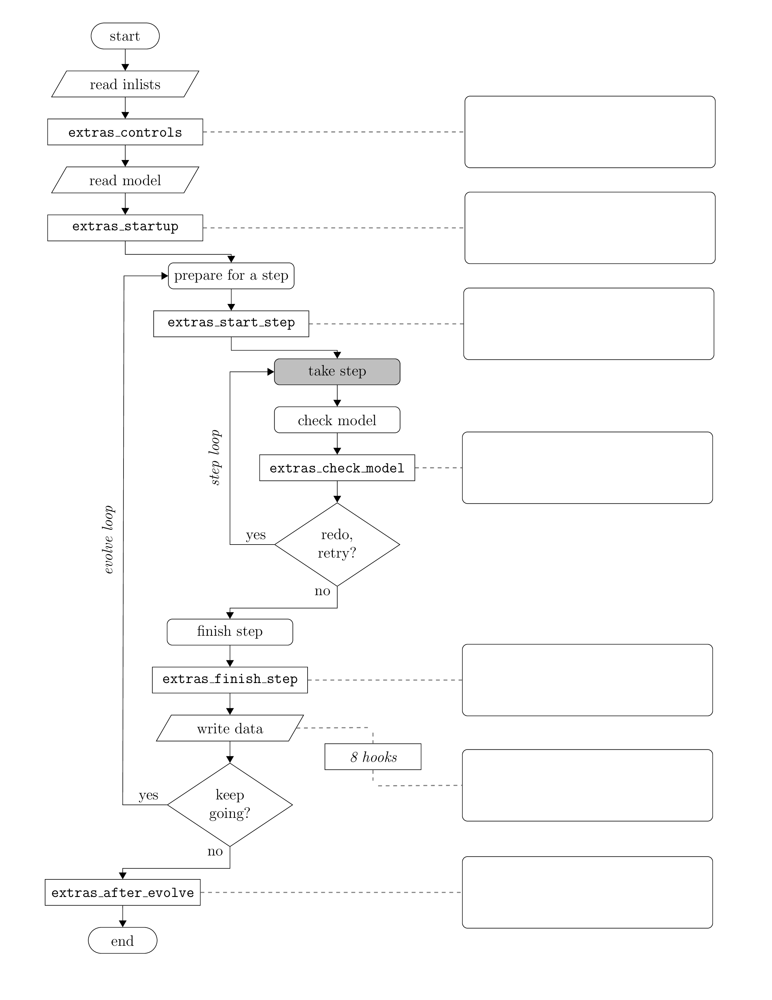

Extending MESA
==============

Sometimes MESA's many inlist options are not sufficient to tackle the
problem you're interested in solving. Extending MESA is relatively easy
and painless to do. MESA is designed such that for most uses, one should
not need to edit the core MESA code (i.e., the contents of $MESA_DIR).

MESA provides a file ``run_star_extras.f90`` that lets you provide your
own code to be executed during a calculation.  This lets you do things
that you can't do with inlists alone, like change parameters at each
step using simple routines or override many of the default physics
routines.

Someone may have already written something similar to what you want.
Check the list of `user-submitted
routines <http://cococubed.asu.edu/mesa_market/add-ons.html>`__ to see.
If you develop something new and useful, consider sharing it with the
community.

First Steps
-----------

Activate run_star_extras.f90
^^^^^^^^^^^^^^^^^^^^^^^^^^^^

The first step in making use of these capabilities is to activate them.
In the MESA work directory you made as part of the tutorial, navigate to
the src directory

::

   cd tutorial/src

and open up run_star_extras.f90 in your text editor of choice. The stock
version of run_star_extras.f90 is quite boring. It “includes” another file
which holds the default set of routines.

::

   include 'standard_run_star_extras.inc'

The routines included in this file are the ones we will want to
customize. Because we want these modifications to apply only to this
working copy of MESA, and not to MESA as a whole, we want to replace
this include statement with the contents of the included file.

Delete the aforementioned include line and insert the contents of
$MESA_DIR/include/standard_run_star_extras.inc.

Before we make any changes, we should check that the code compiles.

::

   cd ..
   ./mk

If it doesn't compile, make sure that you cleanly inserted the file and
removed the include line.

Control flow
^^^^^^^^^^^^

The different run_star_extras.f90 routines get called at different
points during MESA execution.  Here is a flowchart summarizing this.

|flowchart|

The first routine ``extras_controls`` is particularly important.  It is
the place where you tell MESA exactly which subroutines it should call
for all of the rest of its hooks.

The heart of MESA is the grey "take step" box, which contains all of
the machinery by which MESA evaluates and solves the equations of
stellar structure.

When writing Fortran code for run_star_extras.f90, here are a few
important and useful things to know.

The star_info structure
^^^^^^^^^^^^^^^^^^^^^^^

The ``star_info`` structure contains all the information about the star
that is being evolved.  By convention, the variable name ``s`` is used
throughout ``run_star_extras.f90`` to refer to this structure.  In
Fortran, the percent (%) operator is used to access the components of
the structure.  (So you can read ``s% x = 3`` in the same way that you
would read ``s.x = 3`` in C.)

The ``star_info`` structure contains the stellar model itself (i.e.,
zoning information, thermodynamic profile, composition profile).
These components are listed in the files
``$MESA_DIR/star_data/public/star_data_*.inc``, which are separated into a few
different categories documented in the ``star_data.inc`` file.  In addition, ``star_info``
contains the values for the parameters that you set in your ``controls``
inlist (i.e., ``initial_mass``, ``xa_central_lower_limit``).  Recall that
the list of controls is located in
$MESA_DIR/star/defaults/controls.defaults.

The ``s% xtra(1:30)`` array is a place to write temporary data of type ``real(dp)``
which follow the logic of a time-step and so get carried over across restarts, restored in retries, etc.

User-specified inlist controls
^^^^^^^^^^^^^^^^^^^^^^^^^^^^^^

There is one set of controls that will prove useful time and time
again when using ``run_star_extras.f90`` and that is ``x_ctrl``,
``x_integer_ctrl``, ``x_logical_ctrl``, and ``x_character_ctrl``.  
These are arrays (of length 100 by default) of double precision, 
integer, boolean, and character values.  You
can set the elements in your inlists::

  &controls
    x_ctrl(1) = 3.14
    x_ctrl(2) = 2.78
    x_integer_ctrl(1) = 42
    x_logical_ctrl(1) = .true.
    x_character_ctrl(1) = 'hello world'
  / ! end of controls inlist

and access them later on as part of the star structure (i.e., ``s%
x_ctrl(1)``, etc.).  With these controls, you can specify parameters in
your inlists instead of hard-coding them in ``run_star_extras.f90``.

Physical constants
^^^^^^^^^^^^^^^^^^

MESA defines its constants in ``$MESA_DIR/const/public/const_def.f90``.
MESA uses cgs units unless otherwise noted.  The most common non-cgs
units are solar units.  Since the ``run_star_extras`` module includes
the line ``use const_def``, you can already access these definitions.
Using the built-in constants lets you make sure you're using exactly
the same definitions as MESA.

Adding History & Profile Output
-------------------------------

This section covers the routines that are part of the "write data" box
in the above flowchart.  This contains the hooks

* ``how_many_extra_history_columns``
* ``data_for_extra_history_columns``
* ``how_many_extra_profile_columns``
* ``data_for_extra_profile_columns``

Adding new data to the history and/or profile file is as easy as
editing these functions.

Perhaps we're interested in quantifying how centrally concentrated the
nuclear energy generation is. Let's add columns to our history file
that track the Lagrangian mass and physical radius interior to which
90% of the nuclear energy generation takes place.

Let's indicate that we want to add two columns to our history file.

.. code-block:: fortran
  :emphasize-lines: 8
                
  integer function how_many_extra_history_columns(id)
     integer, intent(in) :: id
     integer :: ierr
     type (star_info), pointer :: s
     ierr = 0
     call star_ptr(id, s, ierr)
     if (ierr /= 0) return
     how_many_extra_history_columns = 2
  end function how_many_extra_history_columns

Now let's calculate the information we want to output. This subroutine
has access to the star_info pointer, so you can make use of any of the
quantities defined in star/public/star_data.inc to compute additional
information about the star. Here's a subroutine that calculates what we
want to know. There are a few “best practices” shown in this routine
that are worth remembering, so read through the code and pay attention
to the comments.

.. code-block:: fortran

  subroutine data_for_extra_history_columns(id, n, names, vals, ierr)
  
     integer, intent(in) :: id, n
     character (len=maxlen_history_column_name) :: names(n)
     real(dp) :: vals(n)
     integer, intent(out) :: ierr
     type (star_info), pointer :: s
  
     real(dp), parameter :: frac = 0.90
     integer :: i
     real(dp) :: edot, edot_partial
  
     ierr = 0
     call star_ptr(id, s, ierr)
     if (ierr /= 0) return
  
     ! calculate the total nuclear energy release rate by integrating
     ! the specific rate (eps_nuc) over the star.  using the dot_product
     ! intrinsic is a common idiom for calculating integrated quantities.
     ! note that one needs to explicitly limit the range of the arrays.
     ! NEVER assume that the array size is the same as the number of zones.
     edot = dot_product(s% dm(1:s% nz), s% eps_nuc(1:s% nz))
  
     ! the center of the star is at i = s% nz and the surface at i = 1 .
     ! so go from the center outward until 90% of the integrated eps_nuc
     ! is enclosed.  exit and then i will contain the desired cell index.
     edot_partial = 0
     do i = s% nz, 1, -1
        edot_partial = edot_partial + s% dm(i) * s% eps_nuc(i)
        if (edot_partial .ge. (frac * edot)) exit
     end do
  
     ! note: do NOT add these names to history_columns.list
     ! the history_columns.list is only for the built-in log column options.
     ! it must not include the new column names you are adding here.
  
     ! column 1
     names(1) = "m90"
     vals(1) = s% q(i) * s% star_mass  ! in solar masses
  
     ! column 2
     names(2) = "log_R90"
     vals(2) = safe_log10_cr(s% R(i) / rsol) ! in solar radii
  
     ierr = 0
  end subroutine data_for_extra_history_columns

Adding new output to the profiles, proceeds by close analogy to the
history, using the function ``how_many_extra_profile_columns`` and the
subroutine ``data_for_extra_profile_columns``.

Here I've just uncommented the stock example.

.. code-block:: fortran
  :emphasize-lines: 9, 32-35

  integer function how_many_extra_profile_columns(id)
     use star_def, only: star_info
     integer, intent(in) :: id
     integer :: ierr
     type (star_info), pointer :: s
     ierr = 0
     call star_ptr(id, s, ierr)
     if (ierr /= 0) return
     how_many_extra_profile_columns = 1
  end function how_many_extra_profile_columns
  
  
  subroutine data_for_extra_profile_columns(id, n, nz, names, vals, ierr)
     use star_def, only: star_info, maxlen_profile_column_name
     use const_def, only: dp
     integer, intent(in) :: id, n, nz
     character (len=maxlen_profile_column_name) :: names(n)
     real(dp) :: vals(nz,n)
     integer, intent(out) :: ierr
     type (star_info), pointer :: s
     integer :: k
     ierr = 0
     call star_ptr(id, s, ierr)
     if (ierr /= 0) return
  
     ! note: do NOT add the extra names to profile_columns.list
     ! the profile_columns.list is only for the built-in profile column options.
     ! it must not include the new column names you are adding here.
  
     ! here is an example for adding a profile column
     if (n /= 1) stop 'data_for_extra_profile_columns'
     names(1) = 'beta'
     do k = 1, nz
        vals(k,1) = s% Pgas(k)/s% P(k)
     end do
  
  end subroutine data_for_extra_profile_columns

Choosing when to output history or profiles
-------------------------------------------

Frequently, you want to output a profile or update the history at a set
of milestones along the way. This is especially true for the profiles,
when it's not possible (or even desirable) to save and store a profile
every few steps.

The star_info structure has a couple of flags –
need_to_save_profiles_now and need_to_update_history_now – that let you
tell MESA that it is time to output data.

The place to set these is in the function extras_finish_step which will
get called at the end of each step.

For our massive star, let's dump a profile at logarithmically-spaced
intervals in central density. We will let the user specify the number of
divisions per decade. We need to be careful, because the trajectory in
rho-T space is not guaranteed to be monotonic.

Here's some code to do just that. Again, read though it as the comments
discuss some useful MESA features.

.. code-block:: fortran

  ! returns either keep_going or terminate.
  ! note: cannot request retry; extras_check_model can do that.
  integer function extras_finish_step(id)
  
     integer, intent(in) :: id
     integer :: ierr
     type (star_info), pointer :: s
  
     integer :: f
  
     ierr = 0
     call star_ptr(id, s, ierr)
     if (ierr /= 0) return
  
     extras_finish_step = keep_going
  
     ! MESA provides a number of variables that make it easy to get user input.
     ! these are part of the star_info structure and are named
     ! x_character_ctrl, x_integer_ctrl, x_logical_ctrl, and x_ctrl.
     ! by default there are num_x_ctrls, which defaults to 100, of each.
     ! they can be specified in the controls section of your inlist.
  
     f = s% x_integer_ctrl(1)
  
     ! MESA also provides a number of arrays that are useful for implementing
     ! algorithms which require a state. if you use these variables
     ! restarts and retries will work without doing anything special.
     ! they are named xtra, ixtra, lextra.
     ! they are automatically versioned, that is if you set s% xtra(1), then
     ! s% xtra_old(1) will contains the value of s% xtra(1) from the previous step.
  
     s% xtra(1) = s% log_center_density
  
     ! this expression will evaluate to true if f times the log center density
     ! has crossed an integer during the last step.  If f = 5, then we will get
     ! output at log center density = {... 1.0, 1.2, 1.4, 1.6, 1.8, 2.0 ... }
     if ((floor(f * s% xtra_old(1)) - floor(f * s% xtra(1)) .ne. 0)) then
  
        ! save a profile & update the history
        s% need_to_update_history_now = .true.
        s% need_to_save_profiles_now = .true.
  
        ! by default the priority is 1; you can change that if you'd like
        ! s% save_profiles_model_priority = ?
  
     endif
  
     ! see extras_check_model for information about custom termination codes
     ! by default, indicate where (in the code) MESA terminated
     if (extras_finish_step == terminate) s% termination_code = t_extras_finish_step
  
  end function extras_finish_step

To prevent you from filling up your disk, MESA will only save a
limited number of profiles. The default is 100.  If you want to be
sure the profiles that you're triggering in extras_finish_step stick
around – perhaps you're making a movie – you should set
max_num_profile_models to be greater that the number of profiles you
anticipate generating. You might also want to crank up the priority
which with they are saved by setting save_profiles_model_priority to
be 10. This will prevent MESA from discarding them in lieu of other
automatically saved profiles.

Adding a custom stopping condition
----------------------------------

MESA provides many ways to choose when to terminate a run. If your
condition can be expressed as "stop when quantity X rises above or falls
below some limit", there's a good chance that you can choose to stop
simply by setting a few existing flags. Take a look at the "when to
stop" section of star/defaults/controls.defaults, which starts around
line 230.

If your condition isn't there or is a more complicated logical
combination of conditions, then you will probably need to implement it
yourself.

The place to do this in the subroutine extras_check_model. (You can also
use this routine to trigger retries.)

Here's a routine that stops when the star's luminosity is dominated by
neon burning.

.. code-block:: fortran

  ! returns either keep_going, retry, or terminate.
  integer function extras_check_model(id)
  
    use chem_def, only : i_burn_ne, category_name
  
    integer, intent(in) :: id
    integer :: ierr
    type (star_info), pointer :: s
  
    integer :: i_burn_max
  
    ierr = 0
    call star_ptr(id, s, ierr)
    if (ierr /= 0) return
  
    extras_check_model = keep_going
  
    ! if you want to check multiple conditions, it can be useful
    ! to set a different termination code depending on which
    ! condition was triggered.  MESA provides 9 customizeable
    ! termination codes, named t_xtra1 .. t_xtra9.  You can
    ! customize the messages that will be printed upon exit by
    ! setting the corresponding termination_code_str value.
    ! termination_code_str(t_xtra1) = 'my termination condition'
  
    ! determine the category of maximum burning
    i_burn_max = maxloc(s% L_by_category,1)
  
    ! stop if the luminosity is dominated by neon burning
    if ( i_burn_max .eq. i_burn_ne) then
       extras_check_model = terminate
       s% termination_code = t_xtra1
       termination_code_str(t_xtra1) = 'neon burning is dominant'
       return
    end if
  
    ! by default, indicate where (in the code) MESA terminated
    if (extras_check_model == terminate) s% termination_code = t_extras_check_model
  
  end function extras_check_model

Using the "other" hooks
-----------------------

MESA provides a way to override most of the physics routines with no
need to modify anything more than run_star_extras. There are two main
steps needed to take advantage of this functionality. In the following
example, we will add controls that allow us to control the various
non-nuclear neutrino losses (e.g., plasmon, bremsstrahlung) in our
massive star.

Writing a routine
^^^^^^^^^^^^^^^^^

Navigate to $MESA_DIR/star/other, where you will see a set of files
named with the pattern ``other_*.f90``.  The routines in this directory
allow you to override/modify many physical and numerical aspects of
MESA.

Find the one corresponding to the aspect of MESA that you want to
alter. Open it up and read through the contents. Many of the files
have helpful comments and examples.

Note that we do not want to directly edit these files. Instead we want
to copy the template routines that these files provide into our working
directory copy of run_star_extras.f90 and then further modify them there.
The template routines are named either ``null_other_*`` or ``default_other_*``.

For our neutrino example, copy the following subroutine into
run_star_extras.f90.

.. literalinclude:: ../../../star/other/other_neu.f90
   :language: fortran
   :lines: 41-65

This template routine illustrates the interface and as is, it will
produce exactly the same results as the default MESA routine. This is
useful because the most frequent sorts of modifications that one wants
to make are based on modifying information that MESA already calculates
as opposed to a wholesale re-implementation of the physics routines.

In this case, we want to add controls that will allow us to toggle
whether specific kinds of non-nuclear neutrino losses are included.

Let's rename the subroutine and add the functionality that we want.

.. code-block:: fortran

  subroutine tutorial_other_neu(  &
       id, k, T, log10_T, Rho, log10_Rho, abar, zbar, log10_Tlim, flags, &
       loss, sources, ierr)
     use neu_lib, only: neu_get
     use neu_def
     integer, intent(in) :: id ! id for star
     integer, intent(in) :: k ! cell number or 0 if not for a particular cell
     real(dp), intent(in) :: T ! temperature
     real(dp), intent(in) :: log10_T ! log10 of temperature
     real(dp), intent(in) :: Rho ! density
     real(dp), intent(in) :: log10_Rho ! log10 of density
     real(dp), intent(in) :: abar ! mean atomic weight
     real(dp), intent(in) :: zbar ! mean charge
     real(dp), intent(in) :: log10_Tlim
     logical, intent(inout) :: flags(num_neu_types) ! true if should include the type of loss
     real(dp), intent(inout) :: loss(num_neu_rvs) ! total from all sources
     real(dp), intent(inout) :: sources(num_neu_types, num_neu_rvs)
     integer, intent(out) :: ierr
  
     ! before we can use controls associated with the star we need to get access
     type (star_info), pointer :: s
     call star_ptr(id, s, ierr)
     if (ierr /= 0) then ! OOPS
        return
     end if
  
     ! separately control whether each type of neutrino loss is included
     flags(pair_neu_type) = s% x_logical_ctrl(1)
     flags(plas_neu_type) = s% x_logical_ctrl(2)
     flags(phot_neu_type) = s% x_logical_ctrl(3)
     flags(brem_neu_type) = s% x_logical_ctrl(4)
     flags(reco_neu_type) = s% x_logical_ctrl(5)
  
     ! the is the normal routine that MESA provides
     call neu_get(  &
         T, log10_T, Rho, log10_Rho, abar, zbar, log10_Tlim, flags, &
         loss, sources, ierr)
  
  end subroutine tutorial_other_neu

Instruct MESA to use your routine
^^^^^^^^^^^^^^^^^^^^^^^^^^^^^^^^^

There are two things that you must do in order to have MESA execute your
``other_*`` routine. Failure to do both of these is the most common problem
people encounter when using the ``other_*`` hooks.

First, edit the controls section of your inlist to set the appropriate
``use_other_*`` flag to .true. . In our example, this means adding the line

::

   use_other_neu = .true.

Second, edit the extras_controls routine in run_star_extras.f90 to point
the other_neu at the routine you want to be executed.

.. code-block:: fortran
  :emphasize-lines: 11

  subroutine extras_controls(id, ierr)
     integer, intent(in) :: id
     integer, intent(out) :: ierr
     type (star_info), pointer :: s
     ierr = 0
     call star_ptr(id, s, ierr)
     if (ierr /= 0) return
  
     ! this is the place to set any procedure pointers you want to change
     ! e.g., other_wind, other_mixing, other_energy  (see star_data.inc)
     s% other_neu => tutorial_other_neu
  
  end subroutine extras_controls

Now, recompile your working directory::

   ./mk

and run MESA as usual.
