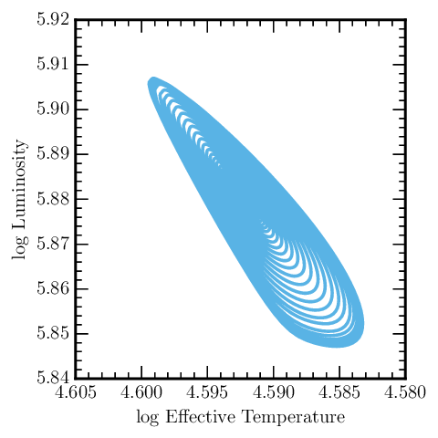
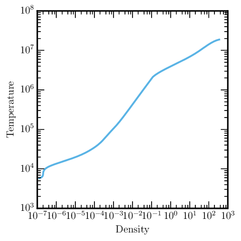

.. highlight:: console

MESA output
===========

Output files
------------

By default, MESA stores its data in the `LOGS` directory. The data files
are text-based and can fed into your favorite plotting program. You
should visit the
`Add-ons <http://cococubed.asu.edu/mesa_market/add-ons.html>`__ section
of the MESA forum and see if someone has contributed code in your
language of choice. (There are reasonably mature routines for python,
IDL, ruby and Mathematica.) An example of python plotting is shown
`later on this page <#python>`__.

In the LOGS directory, you'll find the following files.

history.data
~~~~~~~~~~~~

The history for the run is saved, one line per logged model, in the file
"history.data". The first line of history.data has column numbers, the
second line has column names, and the following lines have the
corresponding values. In case of a restart, lines are not
removed from the history.data; instead new values are simply appended to
the end of the file. As a result the model_numbers are not guaranteed to
be monotonically increasing in the log. The code that uses the history
must bear the burden of removing lines that have been made obsolete.
This can most easily be done by storing
the data into arrays as it is read using the model_number as the array
index. That way you'll automatically discard obsolete values by
overwriting them with the newer ones that appear later in the history
file.

profiles.index
~~~~~~~~~~~~~~

MESA doesn't store profiles for every step (that'd take up too much
space). This list tells you how to translate between the numbers in the
profile filenames and the MESA model numbers. By default, MESA will
store a profile at the end of the run.

For each profile, there is a line in profiles.index giving the model
number, its priority, and its profile number. Priority level 2 is for
models saved because of some special event in the evolution such as the
onset of helium burning. Priority level 1 is for models saved because
the number of models since the most recent profile has reached the
currently setting of the profile_interval parameter.

profile.data
~~~~~~~~~~~~

The profiles contain detailed information about a selected set of
models, one model per file. The name of the profile data file is
determined by the profile number. For example, if the profile number is
15, the profile data will be found in the file named 'profile15.data'.

Each profile includes both a set of global properties of the star, such
as its age, and a large set of properties for each point in the model of
the star given one line per point. In each case, the lines of data are
preceded by a line with column numbers and a line with column names.

Selecting output quantities
---------------------------

The default MESA output is set by the files

::

   $MESA_DIR/star/defaults/history_columns.list
   $MESA_DIR/star/defaults/profile_columns.list

In order to customize the output, copy these files to your work
directory

::

   cp $MESA_DIR/star/defaults/history_columns.list .
   cp $MESA_DIR/star/defaults/profile_columns.list .

Then, open up history_columns.list or profile_columns.list in a text
editor. The file describes the full list of the available options. To
add/remove the columns of interest, comment/uncomment any lines ('!' is
the comment character).

But what if you want a history or profile quantity that isn't on the
list? For that, you'll want to `use
run_star_extras.f <run_star_extras.html>`__.

Plotting MESA output
--------------------

While pgstar is great for observing your stellar models evolving in real
time and for quickly making videos, more complicated and higher-quality
plots require post-processing in another environment. Perhaps the most
popular environment in recent years is Python, and in particular, via
the `numpy <http://www.numpy.org>`__ and
`matplotlib <http://matplotlib.org>`__ packages.

While you may want to write your own tools to read and analyze the
output of your MESA calculations, `many already
exist <http://cococubed.asu.edu/mesa_market/add-ons.html>`__. In that
vein, we introduce a simple module for use in python scripts and
interactive sessions called ``mesa_reader``, which only requires
`numpy <http://www.numpy.org>`__.

What is MESA Reader?
~~~~~~~~~~~~~~~~~~~~

``mesa_reader`` is a module consisting of three classes that you can use
to read in the contents of a typical ``LOGS`` directory. These three
classes are called ``MesaData``, which corresponds to data in profiles
or history files, ``MesaProfileIndex``, which corresponds to data found
in ``profiles.index``, and ``MesaLogDir``, which ties together data in
profiles, the profile index, and the history file.

Examples
~~~~~~~~

Full documentation for how MESA Reader is installed and how to use the
three classes can be found at the project's `Github
repository <https://github.com/wmwolf/py_mesa_reader>`__ and
accompanying
`documentation <https://wmwolf.github.io/py_mesa_reader>`__. Below, we
show some simple example use cases of MESA Reader.

The Basics
^^^^^^^^^^

.. code:: python

   # import mesa_reader to make its classes accessible
   import mesa_reader as mr

   # make a MesaData object from a history file
   h = mr.MesaData('LOGS/history.data')

   # extract the star_age column of data
   ages = h.data('star_age')

   # or do it more succinctly
   ages = h.star_age

here, ``ages`` is now a numpy array that has the same values as are in
our ``LOGS/history.data`` file under the ``star_age`` header.

That's how to set up a history file, but what about profiles? We can do
the same thing if we know the exact file we want to load:

.. code:: python

   import mesa_reader as mr

   # load the profile file into a MesaData instance
   p = mr.MesaData('LOGS/profile1.data')

   # access the temperature column of data
   temperatures = 10 ** p.logT

But often it's frustrating to know exactly what profile file you want to
load, so we can use the ``MesaLogDir`` class to simplify the process. It
lets us load profiles by their associated model number and most simply
by just loading the last saved profile:

.. code:: python

   import mesa_reader as mr

   l = mr.MesaLogDir('./LOGS')

   # load the profile associated with model number 100
   p_100 = l.profile_data(100)
   # the same as the following
   p_100 = l.profile_data(model_number=100)

   # load the profile with PROFILE number 12
   p_12 = l.profile_data(profile_number=12)

   # load the last profile saved (largest model number)
   p_last = l.profile_data()

There are many ways to get at specific profile files and even to select
profiles based on criteria in the history file. See the full
`documentation <https://wmwolf.github.io/py_mesa_reader>`__ for more.

An HR Diagram
^^^^^^^^^^^^^

Okay, how about making a plot with this data? MESA Reader has no
implicit plotting capabilities, but it makes plotting in other
environments dead simple. For this example, we'll use matplotlib and
assume that it is being used in pylab's interactive mode:

.. code:: python

   # start pylab mode
   %pylab
   # import mesa_reader
   import mesa_reader as mr

   # load and plot data
   h = mr.MesaData('LOGS/history.data')
   plot(h.log_Teff, h.log_L)

   # set axis labels
   xlabel('log Effective Temperature')
   ylabel('log Luminosity')

   # invert the x-axis
   plt.gca().invert_xaxis()

For an example run simulating a massive pulsating star, this produces
something like the following image:

|sample hr diagram plot|

Don't worry if your plot has a different style than this, as that is
just a function of your ``matplotlibrc`` file, which won't be discussed
here.

A Temperature-Density Profile
~~~~~~~~~~~~~~~~~~~~~~~~~~~~~

To plot a temperature-density profile, the process is very similar:

.. code:: python

   %pylab
   import mesa_reader as mr

   # load entire LOG directory information
   l = MesaLogDir('./LOGS')
   # grab the last profile
   p = l.profile_data()

   # this works even if you only have logRho and logT!
   loglog(p.Rho, p.T)
   xlabel("Density")
   ylabel("Temperature")

which produces something like the following image:

|sample T-Rho profile|

Going Beyond
~~~~~~~~~~~~

MESA Reader is very general and is not just a tool to extract data
columns for simple plotting (though that is perhaps the most obvious
use). You can use it to filter through your data, selecting only periods
or profiles that are match some criterion (say, profiles that were taken
when the star was in a particular region of the HR diagram). More
complicated plots can be made, like Kippenhahn diagrams, with a little
bit more clever work.

