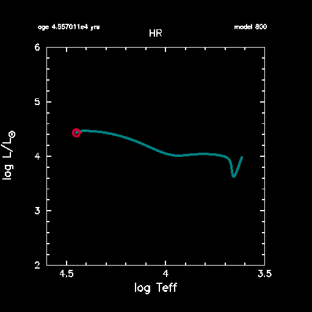
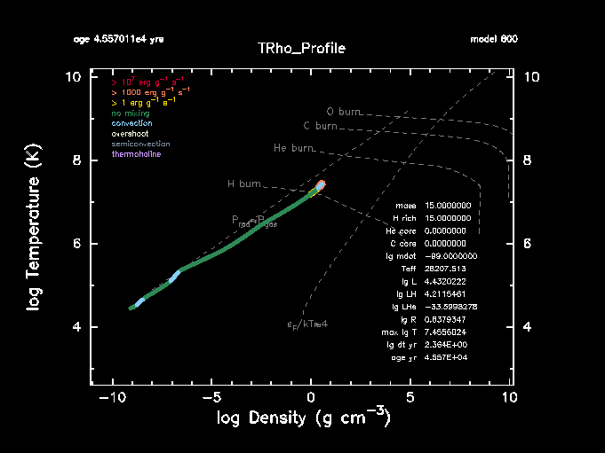

.. _running:
.. highlight:: console

Running MESA
============

This page has information about how to use MESA to evolve a single
star.  It assumes you have already installed MESA (see :ref:`installation:Installing MESA`).

The ``$MESA_DIR`` directory has lots of subdirectories.  Most of these
subdirectories are modules (the "M" in MESA) that provides some
specific functionality (e.g., "kap" provides routines for calculating
opacities). The most important module is "star", which contains the
module that knows how to put the capabilities of all the other modules
together and advance the state of a stellar model by a single step and
then suggest a new time increment for the next step.  Basically,
that's all it does.

You came here for a program that can use these modules to do
multi-step stellar evolution. You're in luck, because such a program
lives in the star/work directory, so that's where we'll start.

Make a copy of the star/work directory
--------------------------------------

You should perform and store your work somewhere other than the main
MESA directory. This will make your life simpler when you do a fresh
checkout of a new MESA version at some point in the future. Therefore
each time you want to start a new MESA project, you should make a new
copy of the star/work directory. Let's do that for this tutorial.

::

   cp -r $MESA_DIR/star/work tutorial

Now that we have our copy of the work directory, we need to compile the
code that lives in it.

::

   cd tutorial
   ./mk

Set up configuration files
--------------------------

The work directory already contains a set of simple configuration files
that will evolve a 15 solar mass star through on to the zero-age main
sequence (core hydrogen ignition). For now, you won't need to edit
anything, but you should take a look at each of these files.

inlist
~~~~~~

This is the first inlist file that MESA reads when it starts.  The
file ``inlist`` is often used to direct MESA to read one or more other
inlist files.

There are five sections (technically fortran "namelists") in star inlist files:

-  **star_job** - options for the program that evolves the star
-  **eos** - options for the MESA eos module
-  **kap** - options for the MESA kap module
-  **controls** - options for the MESA star module
-  **pgstar** - options for on-screen plotting

Each definition in a namelist is of the form

.. code-block:: fortran
   
  name = value ! comment

Values are specified using the normal fortran syntax. Blank lines and
comment lines can be freely included in the list. Blanks at the start
of a line containing a name-value pair are okay too so you can (and
should) indent things to make them more readable.

All of the controls are given reasonable default values at
initialization, so you only need to set the ones that you actually want
to change.

.. literalinclude:: ../../../star/work/inlist

inlist_project
~~~~~~~~~~~~~~

These are the options that we'll use to construct a 15 solar mass star
from a pre-main sequence model and then stop the evolution once we reach
the zero-age main sequence (ZAMS).

.. literalinclude:: ../../../star/work/inlist_project
  
inlist_pgstar
~~~~~~~~~~~~~

This houses the options for on-screen plotting. Feel free to ignore
these for now, but to learn more, have look at the :ref:`using_mesa/using_pgstar:Using PGSTAR`
section of this website.

.. literalinclude:: ../../../star/work/inlist_pgstar

Run MESA
--------

Running the code is now as simple as typing

::

   ./rn

MESA will keep you updated via terminal output that looks like this:

::

         step    lg_Tmax     Teff     lg_LH      lg_Lnuc     Mass       H_rich     H_cntr     N_cntr     Y_surf   eta_cntr   zones  retry
     lg_dt_yr    lg_Tcntr    lg_R     lg_L3a     lg_Lneu     lg_Mdot    He_core    He_cntr    O_cntr     Z_surf   gam_cntr   iters  
       age_yr    lg_Dcntr    lg_L     lg_LZ      lg_Lphoto   lg_Dsurf   C_core     C_cntr     Ne_cntr    Z_cntr   v_div_cs       dt_limit
  __________________________________________________________________________________________________________________________________________________
  
          800   7.455602  2.821E+04   4.211546   4.211546  15.000000  15.000000   0.699864   0.001978   0.280000  -5.912231    873      0
     2.364495   7.455602   0.837935 -33.599828   3.029214 -99.000000   0.000000   0.279998   0.009380   0.020000   0.014924      3
   4.5570E+04   0.596891   4.432022 -11.138110 -99.000000  -9.090996   0.000000   0.002618   0.002085   0.020138  0.000E+00    varcontrol

MESA will also display some pgstar plots that look like:

This should run for about 850 steps before stopping with the following
message:

::

   stop because Lnuc_div_L >= Lnuc_div_L_zams_limit

Resuming MESA
-------------

You are not limited to using the same parameter settings for an entire
run. You can stop the run, edit the inlist file, and restart with new
settings. This stop-restart mechanism has been carefully constructed so
that if you restart from an intermediate state without changing any
controls, you'll get exactly the same results. For that to work, the
saved information must be complete, and that means there's a lot of it.
To make this run fast, the restart information is dumped in binary
format. These binary dumps are referred to as "photos" and are saved in
a subdirectory with the same name.

It should be emphasized that the photos are not intended for long-term
storage of models. In particular, when you update to a new version of
MESA star, you should expect your existing photo files to become
obsolete.

If you scroll back in the terminal output from the run, you should find
a line that looks like (though the number may differ slightly between
MESA versions):

::

   save photos/x849 for model 849

indicating that one of these snapshots was automatically saved when the
run terminated.

Open up inlist_project in your editor. You can see there were two
stopping conditions,

::

  ! stop when the star nears ZAMS (Lnuc/L > 0.99)
  Lnuc_div_L_zams_limit = 0.99d0
  stop_near_zams = .true.
  
  ! stop when the center abundance by mass of h1 drops below this limit
  xa_central_lower_limit_species(1) = 'h1'
  xa_central_lower_limit(1) = 1d-3

As MESA indicated in the termination message, we stopped because of the
first condition (naturally, ZAMS is before H-exhaustion). Turn off this
stopping condition by editing your inlist so that

::

  stop_near_zams = .false.

and save the inlist file.

Now we can restart using the photo and our new settings. Try it.

::

   ./re x849

This resumes the run from model 849, but this time the run will stop
when our other condition is satisfied, when the central hydrogen drops
below 1e-3. This will happen at about model number 975.

Saving a model
--------------

Remember that the photo file is a machine readable binary that is not
designed for portability to different machines or even to different
versions of MESA. So we need another way to save a model so we can use
it later, perhaps as a starting model for later runs, or to send to
someone for them to use with their own copy of MESA. For example, if you
find some bug in MESA, and the developers will want to see if they can
reproduce it on their machines. You'll be asked to save a model from
just before the bug happens and send it in an email along with your
inlist.

Let's save a model file at the end of our run. Go to the following lines
to the &star_job section of your inlist:

::

  ! save a model at the end of the run
  save_model_when_terminate = .false.
  save_model_filename = '15M_at_TAMS.mod'

Tell MESA that you want to save a model file at the end by editing your
inlist and changing save_model_when_terminate to true.

Save the file and then restart MESA from the same point as before.

::

   ./re x849

This time when the run terminates MESA will save a model named
15M_at_TAMS.mod. Take a look and see.

Loading a model
---------------

Now you could begin studying the post-main sequence evolution of stars,
starting a new MESA run using the model you've just saved. In order to
do this your inlist might look like:

::

   &star_job
     ! see star/defaults/star_job.defaults

     ! start a run from a saved model
     load_saved_model = .true.
     load_model_filename = '15M_at_TAMS.mod'
   
     ! display on-screen plots
     pgstar_flag = .true.
   
   / !end of star_job namelist

   &eos
     ! eos options
     ! see eos/defaults/eos.defaults
   
   / ! end of eos namelist
   
   
   &kap
     ! kap options
     ! see kap/defaults/kap.defaults
     use_Type2_opacities = .true.
     Zbase = 0.02
   
   / ! end of kap namelist

   &controls
     ! see star/defaults/controls.defaults

     ! options for energy conservation (see MESA V, Section 3)
     energy_eqn_option = 'dedt'
     use_gold_tolerances = .true.
   
     ! configure mass loss on RGB & AGB
     cool_wind_RGB_scheme = 'Dutch'
     cool_wind_AGB_scheme = 'Dutch'
     RGB_to_AGB_wind_switch = 1d-4
     Dutch_scaling_factor = 0.8
   
   / ! end of controls namelist
   

If you want to try this out, save the preceding text as a file named
``inlist_load`` in your work directory. Make sure your file ends with 
a blank new line. Then edit your main inlist
file so that it will use ``inlist_load`` instead of ``inlist_project``
everywhere within inlist (i.e., extra_star_job_inlist_name(1) and
extra_controls_inlist1_name).

Then as usual, do

::

   ./rn

and MESA will start up using your newly saved file. Unlike the photos,
saved models don't have a complete snapshot of the internal state of the
system. Photos are guaranteed to give the same results; saved models are
not. There may be small differences when you run a saved model compared
to what you saw in the run before you saved it. The differences should
be minor, so you shouldn't have to worry, but don't be surprised by
them.

Learning about the many MESA options
------------------------------------

After looking at the previous inlist, your more pressing question may be
"where did those options come from?" and "how do I find the options
appropriate for my problem?". Your first stop should be the instrument
papers, which discuss the most important flags.

The files that contain a description of all of the MESA options and
their default values live in the directory

::

   $MESA_DIR/star/defaults

The options are organized by the namelist that they are a part of. So
the file ``controls.defaults`` contains a discussion of options in the
controls namelist.

Suppose we want to learn more about what this "Dutch_wind" is. Searching
in controls.defaults for the word "Dutch" quickly leads to the following
summary of these options.

.. literalinclude:: ../../../star/defaults/controls.defaults
   :start-at: ! Dutch_scaling_factor
   :end-before: ! Kudritzki_scaling_factor

You can browse through the .defaults files to familiarize yourself with
what's available. It can be easy to be overwhelmed by the shear number
of options. That's where the test_suite comes in handy.

