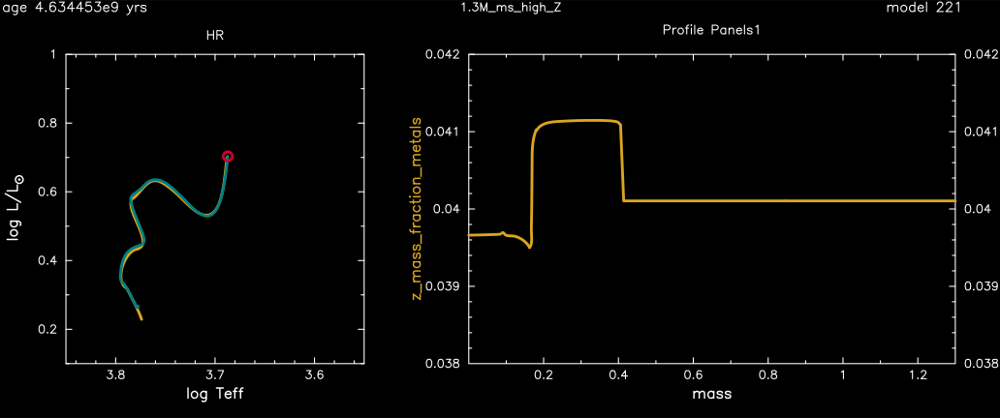

.. _1.3M_ms_high_Z:

**************
1.3M_ms_high_Z
**************

The test checks the evolution of metal-rich low-mass stars by evolving 
a 1.3 Msun, metal-rich Z=0.04 model from the pre-main sequence to core hydrogen depletion.

This test case has two parts.

* Part 1 (``inlist_zams``) creates the pre-main-sequence model and stops near zams.

* Part 2 (``inlist_1.3M_ms_high_Z``) evolves the model from zams to when the luminosity reaches log10(L/Lsun) = 0.7.

The final model, click on the image for a larger version, shows

The left plot shows the HR diagram. The yellow curve is a precalculated 
HR track loaded  from ``HR_OPAL.dat``, while the green curve is the model calculated.
The right plot shows a profile of the metal mass fraction. The curve rises above the 
background metallicity as hydrogen burns to helium and goes below the background metallicity
as core hydrogen depletes.

pgstar commands used for the plots above:

.. code-block:: console

 &pgstar

   pgstar_interval = 10

 ! device

   file_white_on_black_flag = .true. ! white_on_black flags -- true means white foreground color on black background
   file_device = 'png'            ! png
   file_extension = 'png'           

   !file_device = 'vcps'          ! postscript
   !file_extension = 'ps'           

 ! build grid
  Grid1_title = '1.3M_ms_high_Z'
  Grid1_win_flag = .true.

  Grid1_win_width = 15
  Grid1_win_aspect_ratio = 0.4 ! aspect_ratio = height/width

  Grid1_xleft = 0.05 ! fraction of full window width for margin on left
  Grid1_xright = 0.95 ! fraction of full window width for margin on right
  Grid1_ybot = 0.08 ! fraction of full window width for margin on bottom
  Grid1_ytop = 0.92 ! fraction of full window width for margin on top

  Grid1_num_cols = 5 ! divide plotting region into this many equal width cols
  Grid1_num_rows = 1 ! divide plotting region into this many equal height rows
  Grid1_num_plots = 2 ! <= 10

  Grid1_plot_name(1) = 'HR'
  Grid1_plot_row(1) = 1 ! number from 1 at top
  Grid1_plot_rowspan(1) = 1 ! plot spans this number of rows
  Grid1_plot_col(1) =  1 ! number from 1 at left
  Grid1_plot_colspan(1) = 2 ! plot spans this number of columns
  Grid1_plot_pad_left(1) = 0.025 ! fraction of full window width for padding on left
  Grid1_plot_pad_right(1) = 0.05 ! fraction of full window width for padding on right
  Grid1_plot_pad_top(1) = 0.05 ! fraction of full window height for padding at top
  Grid1_plot_pad_bot(1) = 0.05 ! fraction of full window height for padding at bottom
  Grid1_txt_scale_factor(1) = 1.0 ! multiply txt_scale for subplot by this

  Grid1_plot_name(2) = 'Profile_Panels1'
  Grid1_plot_row(2) = 1 ! number from 1 at top
  Grid1_plot_rowspan(2) = 1 ! plot spans this number of rows
  Grid1_plot_col(2) = 3 ! number from 1 at left
  Grid1_plot_colspan(2) = 3 ! plot spans this number of columns
  Grid1_plot_pad_left(2) = 0.05 ! fraction of full window width for padding on left
  Grid1_plot_pad_right(2) = 0.025 ! fraction of full window width for padding on right
  Grid1_plot_pad_top(2) = 0.05 ! fraction of full window height for padding at top
  Grid1_plot_pad_bot(2) = 0.05 ! fraction of full window height for padding at bottom
  Grid1_txt_scale_factor(2) = 1.0 ! multiply txt_scale for subplot by this

  ! file output
  Grid1_file_flag = .true.
  Grid1_file_dir = 'png'
  Grid1_file_prefix = 'grid1'
  Grid1_file_interval = 1000000 ! output when mod(model_number,Grid1_file_interval)==0
  Grid1_file_width = 15 ! negative means use same value as for window
  Grid1_file_aspect_ratio = -1 ! negative means use same value as for window

   pgstar_model_scale = 1.4
   pgstar_model_disp = 1.5
   pgstar_model_coord = 0.98
   pgstar_model_fjust = 1.0

   pgstar_age_scale = 1.4
   pgstar_age_disp = 1.5
   pgstar_age_coord = -0.04
   pgstar_age_fjust = 0.0

  ! HR diagram
  HR_win_flag = .false.
  HR_win_aspect_ratio = 1.0

  ! set static plot bounds
  HR_logT_min = 3.55
  HR_logT_max = 3.85
  HR_logL_min = 0.1
  HR_logL_max = 1.0

  ! show OPAL results
  HR_fname = 'HR_OPAL.dat' ! file name for extra HR data

 ! profile 
  Profile_Panels1_win_flag = .false.

  Profile_Panels1_num_panels = 1

  Profile_Panels1_xaxis_name = 'mass'
  Profile_Panels1_xmin = -101d0 ! only used if /= -101d0
  Profile_Panels1_xmax = -101d0 ! only used if /= -101d0

  Profile_Panels1_yaxis_name(1) = 'z_mass_fraction_metals'
  Profile_Panels1_ymin(1) = 0.038 ! only used if /= -101d0
  Profile_Panels1_ymax(1) = 0.042 ! only used if /= -101d0

  Profile_Panels1_other_yaxis_name(:) = ''

 / ! end of pgstar namelist

Last-Updated: 27May2021 (MESA ebecc10) by fxt

