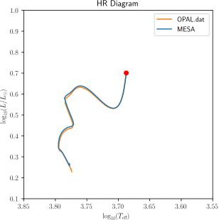

.. _1.3M_ms_high_Z:

**************
1.3M_ms_high_Z
**************

The test checks the evolution of metal-rich low-mass stars by evolving
a 1.3 |Msun|, metal-rich Z=0.04 model from the pre-main sequence to core hydrogen depletion.

This test case has two parts.

* Part 1 (``inlist_zams``) creates the pre-main-sequence model and stops near zams.

* Part 2 (``inlist_1.3M_ms_high_Z``) evolves the model from zams to when the luminosity reaches log10(L/Lsun) = 0.7.

The final model, click on the image for a larger version, shows

The left plot shows the HR diagram. The yellow curve is a precalculated
HR track loaded  from ``HR_OPAL.dat``, while the green curve is the model calculated.
The right plot shows a profile of the metal mass fraction. The curve rises above the
background metallicity as hydrogen burns to helium and goes below the background metallicity
as core hydrogen depletes.

pgstar commands used for the plots above:

.. literalinclude:: ../../../star/test_suite/1.3M_ms_high_Z/inlist_pgstar
  :language: console

The figures can also be created in Python with ``matplotlib`` and reading in data with the ``mesa_reader`` package:

The Python script used to create the figures above:

.. literalinclude:: ../../../star/test_suite/1.3M_ms_high_Z/plot.py
  :language: python

Last-Updated: 27May2021 (MESA ebecc10) by fxt

Last-Run: 22Oct2024 (MESA 9b2017ca) by pmocz on C916PXT6XW in 234 seconds using 8 threads.
