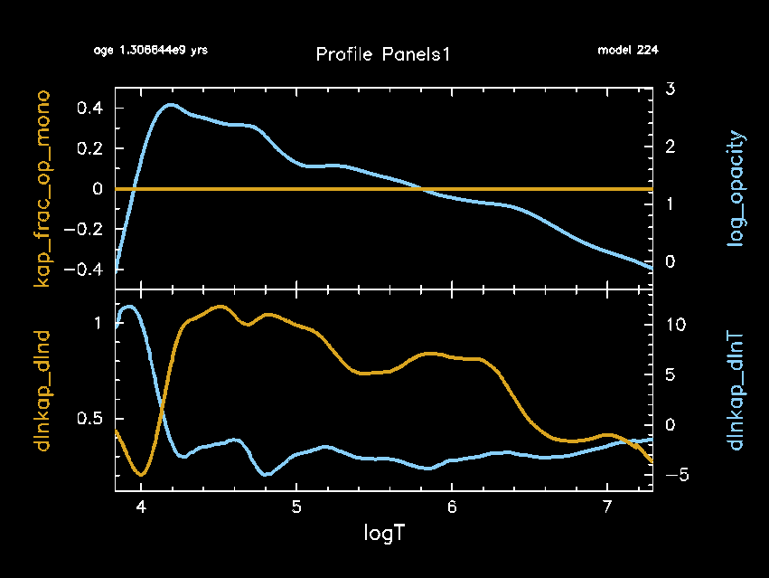
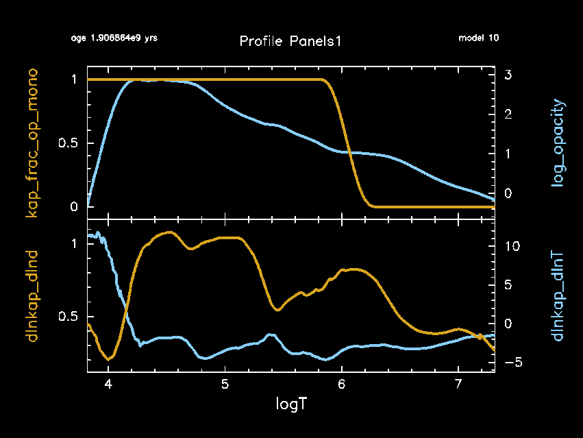
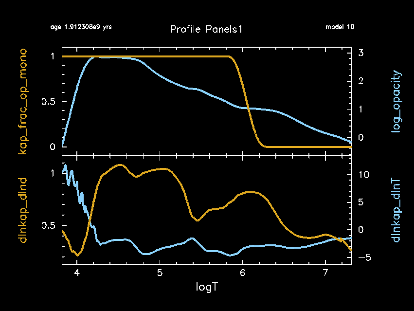

.. _1.4M_ms_op_mono:

***************
1.4M_ms_op_mono
***************

The test checks the functionality of OP mono opacities. The test vehicle is a 
1.4 Msun solar metallicity model.

This test case has three parts.

* Part 1 (``inlist_1.4M_ms_initial_model``) creates the pre-main-sequence model and evolves the model until the central hydrogen mass fractions falls below 0.5. During this evolution the OP mono opacities are off.

The upper plot shows the fraction of the opacity that is from OP mono (yellow curve) and the opacity (blue curve)
as a function of the temperature profile - center on right, surface on left.
The lower plot shows the opacity derivatives.

* Part 2 (``inlist_1.4M_ms_op_mono``) continues the evolution of ``inlist_1.4M_ms_initial_model`` for 10 timesteps using the OP mono opacities, as shown by the fraction of the opacity that is from OP mono (yellow curve, upper plot)

* Part 3 (``inlist_1.4M_ms_op_mono``) continues the evolution of ``inlist_1.4M_ms_initial_model`` for 10 timesteps using an alternative formulation of the OP mono opacities, as shown by the smoother opacity derivatives in the lower plot. See $MESA_DIR/kap/public/kap_lib.f.90 for the differences between the regular and alternative OP mono formulations.

Last-Updated: 21May2021 (MESA ebecc10) by fxt

