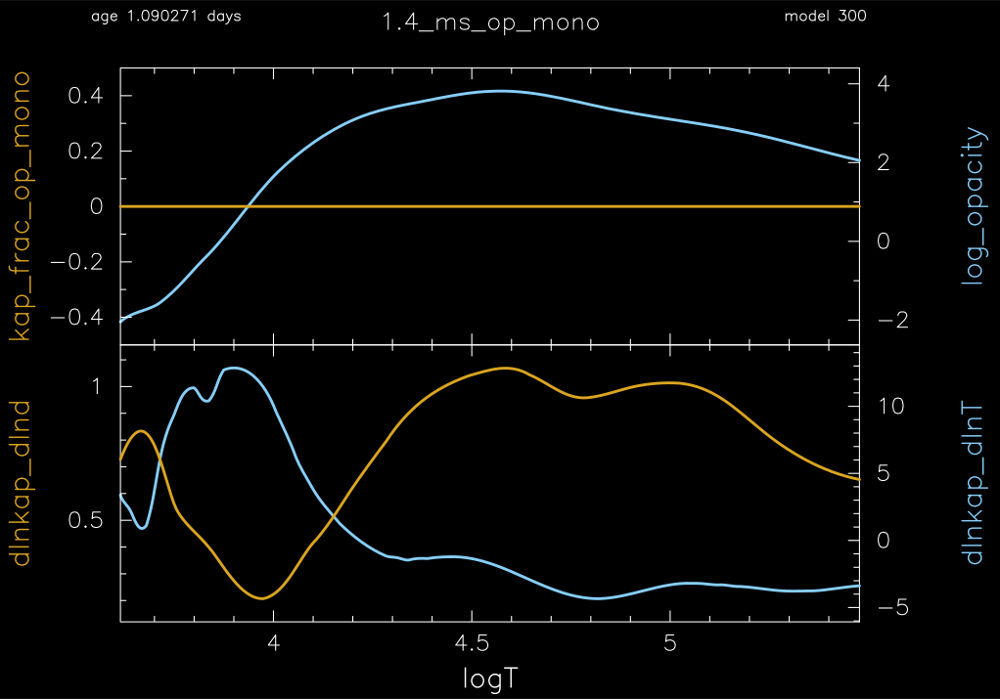
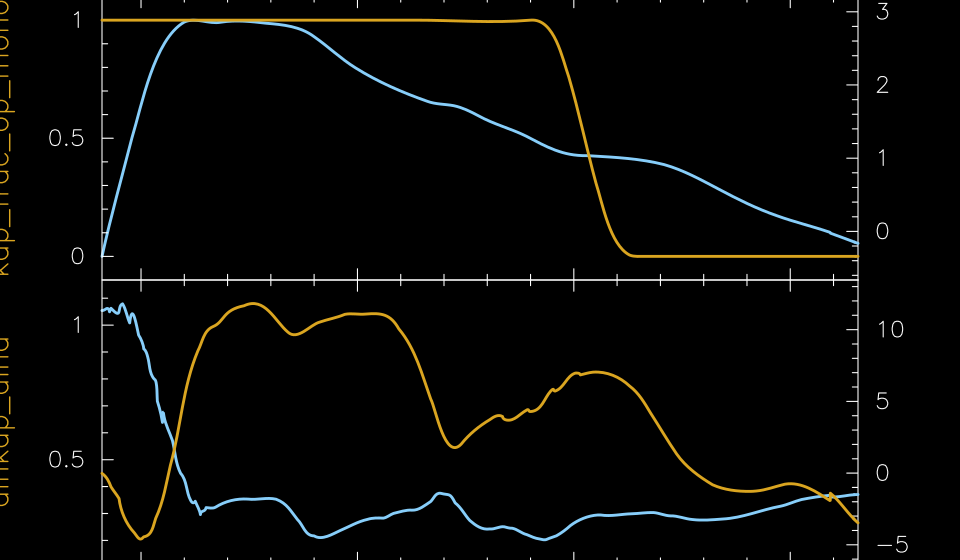
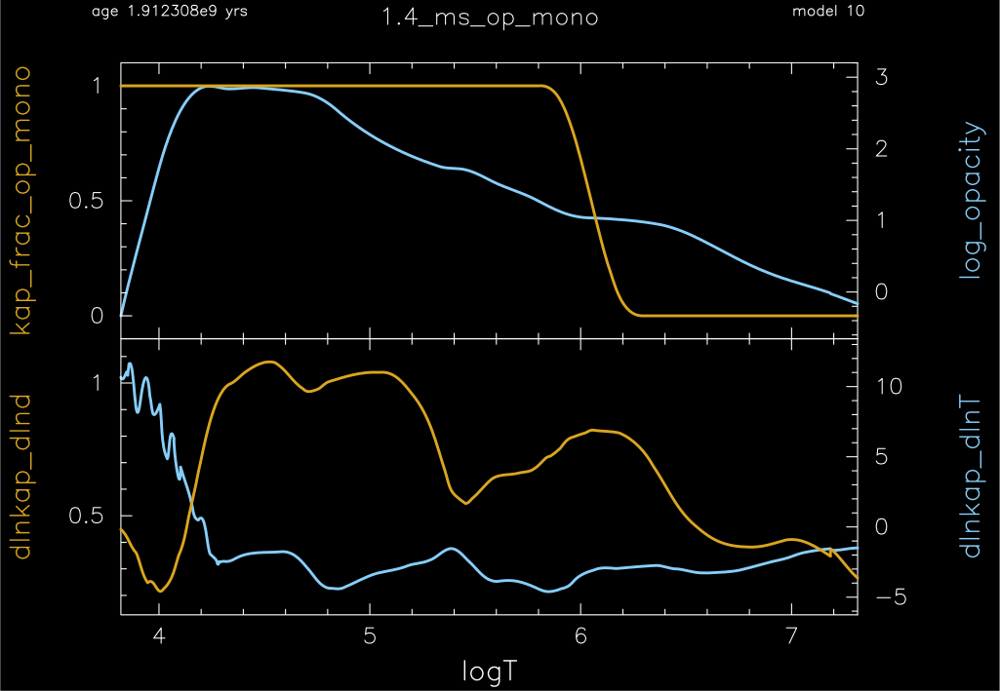

.. _1.4M_ms_op_mono:

***************
1.4M_ms_op_mono
***************

The test checks the functionality of OP mono opacities. The test vehicle is a 
1.4 Msun solar metallicity model.

This test case has three parts. Click to see a larger view of a plot.

* Part 1 (``inlist_1.4M_ms_initial_model``) creates the pre-main-sequence model and evolves the model until the central hydrogen mass fractions falls below 0.5. During this evolution the OP mono opacities are off.

The upper plot shows the fraction of the opacity that is from OP mono (yellow curve) and the opacity (blue curve)
as a function of the temperature profile - center on right, surface on left.
The lower plot shows the opacity derivatives.

* Part 2 (``inlist_1.4M_ms_op_mono``) continues the evolution of ``inlist_1.4M_ms_initial_model`` for 10 timesteps using the OP mono opacities, as shown by the fraction of the opacity that is from OP mono (yellow curve, upper plot)

* Part 3 (``inlist_1.4M_ms_op_mono``) continues the evolution of ``inlist_1.4M_ms_initial_model`` for 10 timesteps using an alternative formulation of the OP mono opacities, as shown by the smoother opacity derivatives in the lower plot. See $MESA_DIR/kap/public/kap_lib.f.90 for the differences between the regular and alternative OP mono formulations.

pgstar commands used for the plots above:

.. code-block:: console

 &pgstar

     pgstar_interval = 10

  ! device

   file_white_on_black_flag = .true. ! white_on_black flags -- true means white foreground color on black background
   !file_device = 'png'            ! png
   !file_extension = 'png'           

   file_device = 'vcps'          ! postscript
   file_extension = 'ps'           

  ! two profile panels
    Profile_Panels1_win_flag = .true.

    Profile_Panels1_win_width = 15
    Profile_Panels1_win_aspect_ratio = 0.75

    Profile_Panels1_xleft = 0.15
    Profile_Panels1_xright = 0.85
    Profile_Panels1_ybot = 0.15
    Profile_Panels1_ytop = 0.85
    Profile_Panels1_txt_scale = 1.0
    Profile_Panels1_title = '1.4_ms_op_mono'

    Profile_Panels1_num_panels = 2

    Profile_Panels1_xaxis_name = 'logT'
    Profile_Panels1_xaxis_reversed = .false.
    Profile_Panels1_xmin = -101d0
    Profile_Panels1_xmax = -101d0

    Profile_Panels1_yaxis_name(1) = 'kap_frac_op_mono'
    Profile_Panels1_other_yaxis_name(1) = 'log_opacity'

    Profile_Panels1_yaxis_name(2) = 'dlnkap_dlnd'
    Profile_Panels1_other_yaxis_name(2) = 'dlnkap_dlnT'

    Profile_Panels1_file_flag = .true.
    Profile_Panels1_file_dir = 'png'
    Profile_Panels1_file_prefix = 'profile_panels1_'
    Profile_Panels1_file_interval = 10
    Profile_Panels1_file_width = 15
    Profile_Panels1_file_aspect_ratio = -1

 / ! end of pgstar namelist

Last-Updated: 27May2021 (MESA ebecc10) by fxt

