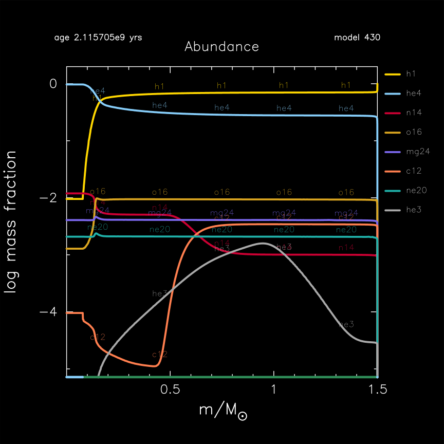

.. _1.5M_with_diffusion:

*******************
1.5M_with_diffusion
*******************

The test checks the functionality of element diffusion.
The test vehicle is a 1.5 |Msun| solar metallicity model.

This test case has two parts. Click to see a larger view of a plot.

* Part 1 (``inlist_to_ZAMS``) creates the pre-main-sequence model and evolves it to the main sequence. In the mass fraction plot, note the roughness of the 12C mass fraction profile (orange curve) from convection and that the surface hydrogen profile is flat (yellow curve).

* Part 2 (``1.5M_with_diffusion``) continues the evolution until the central hydrogen mass fraction drops below 0.01. In the mass fraction plot, note the 12C mass fraction profile (orange) has been smoothed by element diffusion and that the surface is nearly pure hydrogen (yellow upwards spike) from heavier elements diffusing inwards (e.g., orange downwards spike in 16O).

pgstar commands used for the plots above, e.g.:

.. literalinclude:: ../../../star/test_suite/1.5M_with_diffusion/inlist_1.5M_with_diffusion
  :language: console
  :start-at: &pgstar
  :end-at: ! end of pgstar namelist

Last-Updated: 27May2021 (MESA ebecc10) by fxt

Last-Run: 22Oct2024 (MESA 9b2017ca) by pmocz on C916PXT6XW in 426 seconds using 8 threads.
