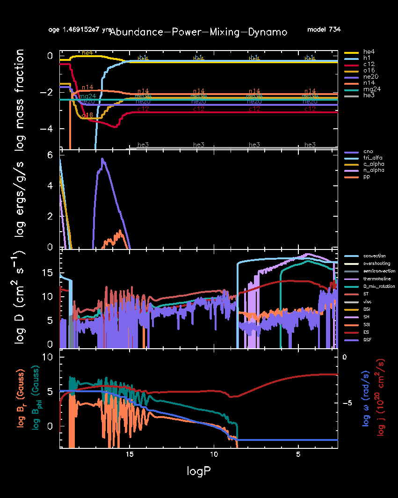

.. _15M_dynamo:

**********
15M_dynamo
**********

The test checks the functionality of rotation in a 15 Msun, Z=0.02 metallicity model.

This test case has three parts.

* Part 1 (``inlist_zams``) creates a 15 Msun pre-main-sequence model and evolves it to the main sequence. 

* Part 2 (``inlist_to_he_burn``) turns on rotation nnd continues the evolution for 500 steps (for test case purposes), ending approximately at core hydrogen depletion.

* Part 3 (``inlist_15M_dynamo``) continues the evolution until the central helium mass fractions drops below 0.6. When Part 3 finishes some key quantities are reported:

.. code-block:: console

                                              star_mass    1.3594434969402300D+01    1.2500000000000000D+01    1.4000000000000000D+01
                             log total_angular_momentum    5.1715669926154646D+01    5.0000000000000000D+01    5.2500000000000000D+01
                                       log center_omega   -3.6544135314663877D+00   -5.0000000000000000D+00   -3.0000000000000000D+00
                                      log he_core_omega   -3.8384987279876719D+00   -5.0000000000000000D+00   -3.0000000000000000D+00
                                           he_core_mass    4.3637120754430354D+00    3.7000000000000002D+00    4.5000000000000000D+00
                                          surface j_rot    1.8118707631236759D+01    1.7000000000000000D+01    1.9000000000000000D+01
                                          surface v_rot    4.3973127251833821D-01    2.0000000000000001D-01    5.9999999999999998D-01

                               avg from 3.0 to 3.4 Msun
                                                   logT    7.8701272702080942D+00    7.5000000000000000D+00    8.0999999999999996D+00
                                                 logRho    2.1496257586049281D+00    1.0000000000000000D+00    3.0000000000000000D+00
                                              log j_rot    1.6534742503463203D+01    1.5800000000000001D+01    1.6800000000000001D+01
                                                   D_ES    5.2149802632259092D+00    3.5000000000000000D+00    6.5000000000000000D+00
                                                   D_ST    6.8331912334335545D+00    1.0000000000000000D+00    1.0000000000000000D+01
                                                  nu_ST    1.0769419816211398D+01    9.0999999999999996D+00    1.1900000000000000D+01

 all values are within tolerances

where the number in the second column is the value from running the test case,
the number in the second column is the allowed lower bound, and
the number in the second column is the allowed upper bound.

At this ending point the abundances, power, and dynamo profiles as a function of pressure are shown below.
Helium has begun to deplete in the core (top panel), where the triple-alpha reaction is dominating the energy generation rate (second panel).
Hydrogen burning by the CNO cycles dominates the energy generation in the hydrogen shell (second panel).
Convection is occuring in two regions: in the core and in the hydrogen-rich envelope (blue curves in the third panel).
Spruit-Taylor magnetic diffusion is the dominant mixing processes in the radiative region between these
two convective regions (third panel).
The radial and azimuthal components of the magnetic field
are only being generated in the radiative region between convection zone (bottom panel).

Last-Updated: 23May2021 (MESA ebecc10) by fxt

