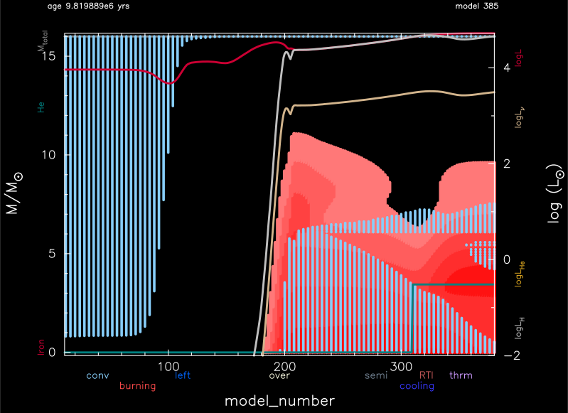

.. _16M_predictive_mix:

******************
16M_predictive_mix
******************

This test suite example re-creates the 16-solar mass main-sequence
evolution with the inclusion of predictive mixing (using the Ledoux
criterion), as detailed in Section 2 of the MESA IV instrument paper
(Paxton et al 2018).

This test case has two parts.

* Part 1 (``inlist_start``) creates a 16 Msun pre-main-sequence model and evolves it for 10 time steps.

* Part 2 (``inlist_16M_predictive_mix``) continues the evolution until core hydrogen depletion (mass fraction h1_center < 1e-6).

A Kippenhahn diagram shows the evolution of a retreating convective core on the main sequence, the blue region between model numbers 240 and 385.
This can be compared to Figure 3 in the MESA IV instrument paper, and the convective pre-mixing Kippenhahn diagram in :ref:`16M_conv_premix`.

Last-Updated: 24May2021 (MESA ebecc10) by fxt

