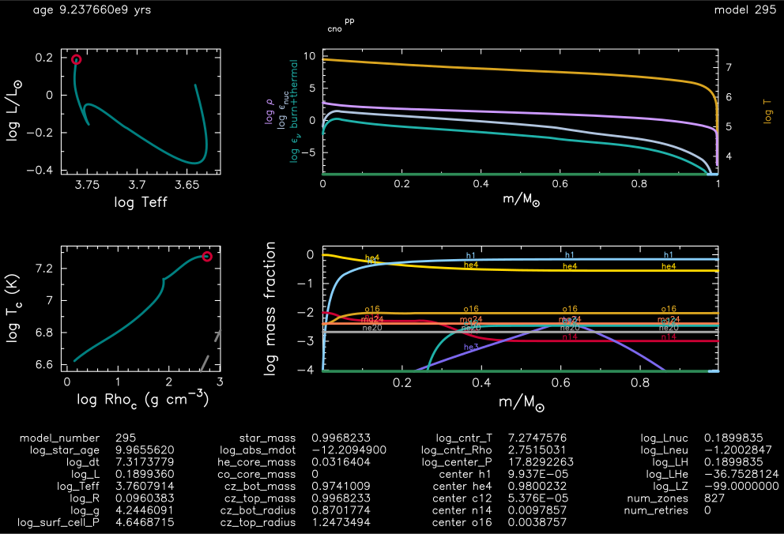
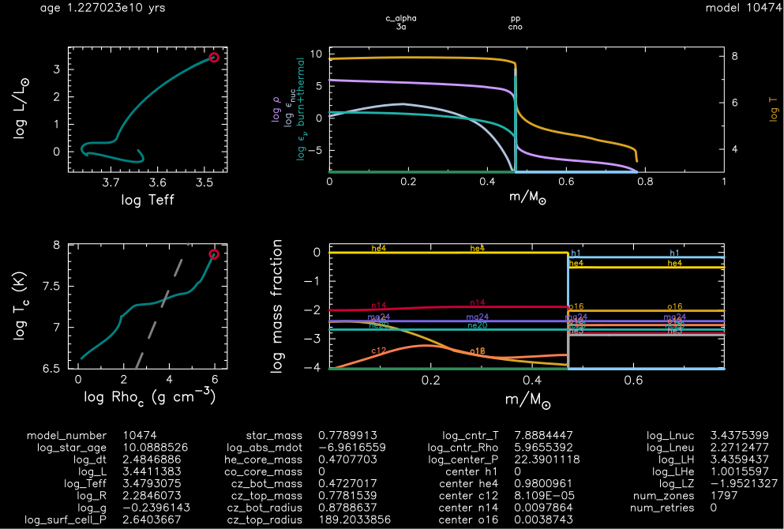
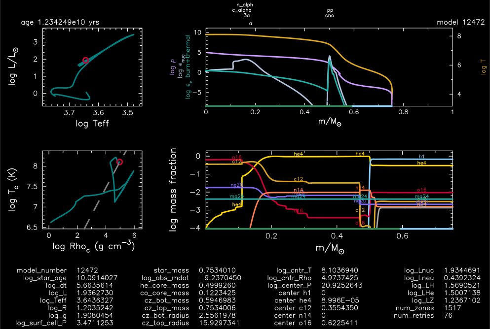
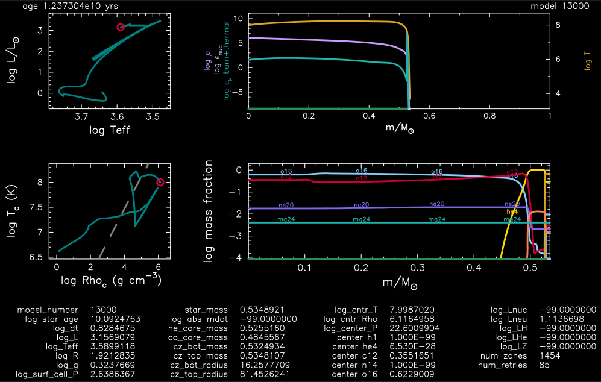
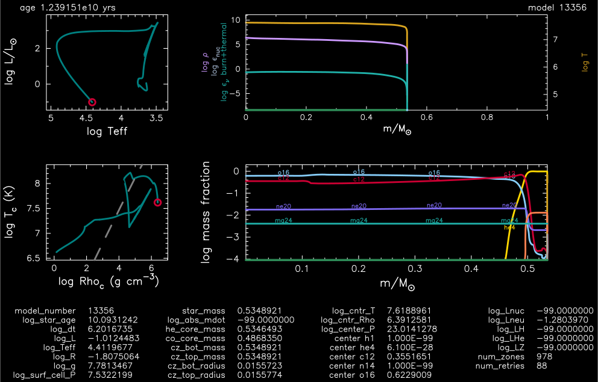

.. _1M_pre_ms_to_wd:

***************
1M_pre_ms_to_wd
***************

This test case checks the evolution of a 1 Msun, Z=0.02 metallicity from the pre-main sequence to a white dwarf. 

This test case has six parts.

* Part 1 (``inlist_start_header``) builds a 1 Msun, Z=0.02 metallicity pre-main-sequence model.

* Part 2 (``inlist_to_end_core_h_burn``) continues the evolution until core hydrogen depletion (mass fraction h1_center < 1e-4).

* Part 3 (``inlist_to_start_he_core_flash_header``) continues the evolution until the onset of core helium ignition (power from he burning > 10).

* Part 4 (``inlist_to_end_core_he_burn``) continues the evolution until core helium depletion (mass fraction he4_center < 1e-4).

* Part 5 (``inlist_to_end_agb``) continues the evolution through the thermal pulses until the end of the AGB phase of evolution (hydrogen-rich envelope mass < 1e-2 Msun).

* Part 6 (``inlist_to_wd``) continues the evolution until the luminosity of the cooling white dwarf reaches L < 0.1 Lsun.

Last-Updated: 25May2021 (MESA ebecc10) by fxt

