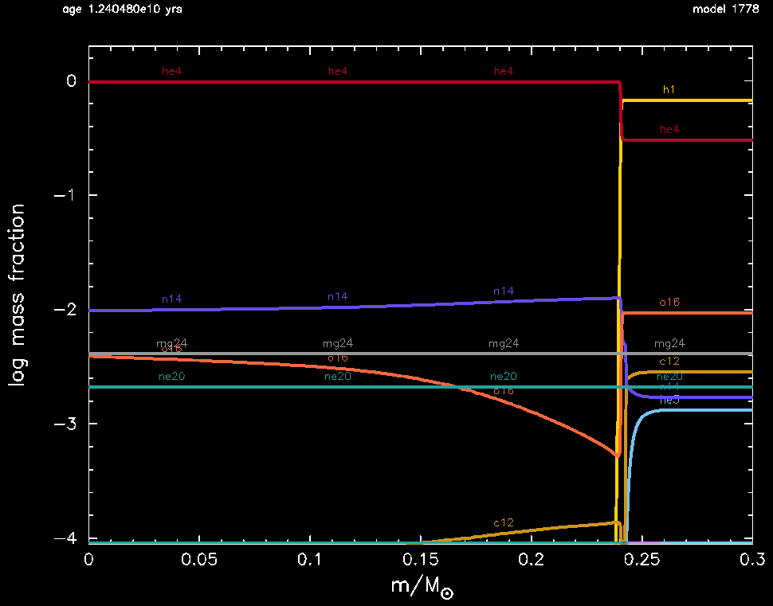
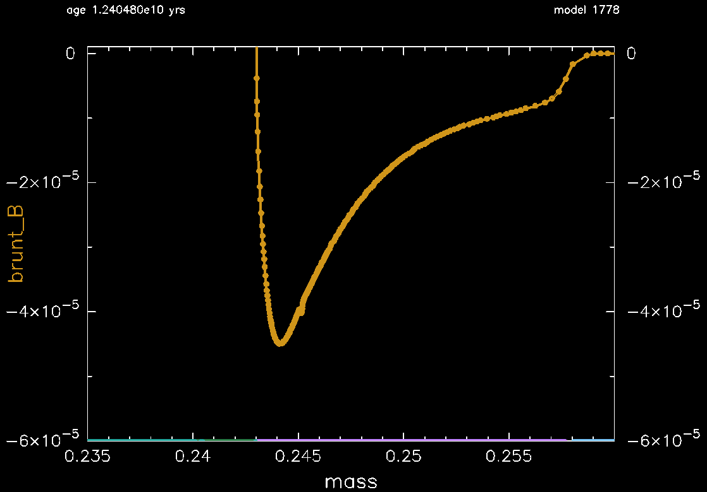

.. _1M_thermohaline:

***************
1M_thermohaline
***************

The test checks thermohaline mixing in a rotating, 1 Msun, Z=0.02 metallicity model.

This test case has one part.

* Part 1 (``inlist_1M_thermohaline``) loads a 1 Msun main-sequence model, applies a 10 km/s rotation profile, and evolves the model until the helium core mass reaches 0.24 Msun, where some key quantities are reported:

.. code-block:: console

                             log total_angular_momentum    4.9035137416802272D+01    4.5000000000000000D+01    5.5000000000000000D+01
                                       log center_omega   -3.1662469710636527D+00   -4.0000000000000000D+00   -2.0000000000000000D+00
                                      log he_core_omega   -3.5604175013324988D+00   -5.0000000000000000D+00   -2.0000000000000000D+00
                                          surface j_rot    1.6493785476693525D+01    5.0000000000000000D+00    2.5000000000000000D+01
                                          surface v_rot    6.5326185185705721D-01    0.0000000000000000D+00    1.0000000000000000D+00

                                    avg near 0.245 Msun
                                                   logT    7.0563695678521912D+00    7.0000000000000000D+00    7.5000000000000000D+00
                                                 logRho    5.5453590488347027D-01    5.0000000000000000D-01    2.0000000000000000D+00
                                              log j_rot    1.3841508360873403D+01    1.0000000000000000D+01    2.0000000000000000D+01
                                                   D_ST    6.4461480105952242D+00    1.0000000000000000D+00    8.0000000000000000D+00
                                                  nu_ST    7.3797815429416946D+00    4.0000000000000000D+00    9.0000000000000000D+00

 all values are within tolerances

where the number in the second column is the value from running the test case,
the number in the second column is the allowed lower bound, and
the number in the second column is the allowed upper bound.

At the end of the evolution the abundance is shown in the following plot.  The mixing
type is indicated on the x-axis: green = radiative, blue = convective,
and light purple = thermohaline.  The core is radiative, the thick
hydrogen-rich envelope is convective, and sandwiched between them is a
thermohaline region. Within the thermohaline region, nuclear burning
is starting to transform the hydrogen-rich envelope to the helium-rich core.

The brunt B profile in the vicinity of the thermohaline region is
shown the following plot.  The mixing type is again indicated on the
x-axis.  A negative brunt B corresponds to a negative molecular weight
gradient, which is the hallmark of of a region that is unstable to
thermohaline mixing. Note the thermohaline region begins and ends
where brunt B becomes negative.

Last-Updated: 26May2021 (MESA e37f76f) by fxt

