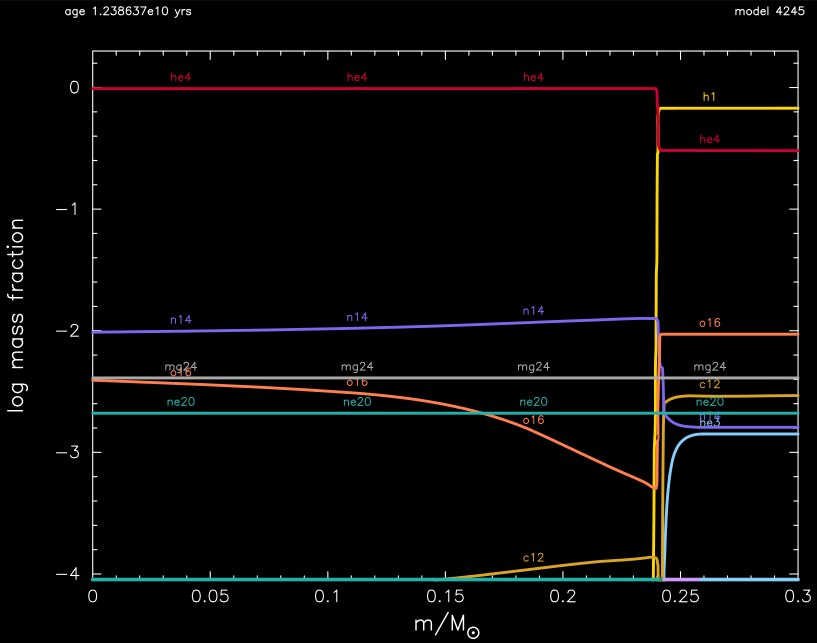
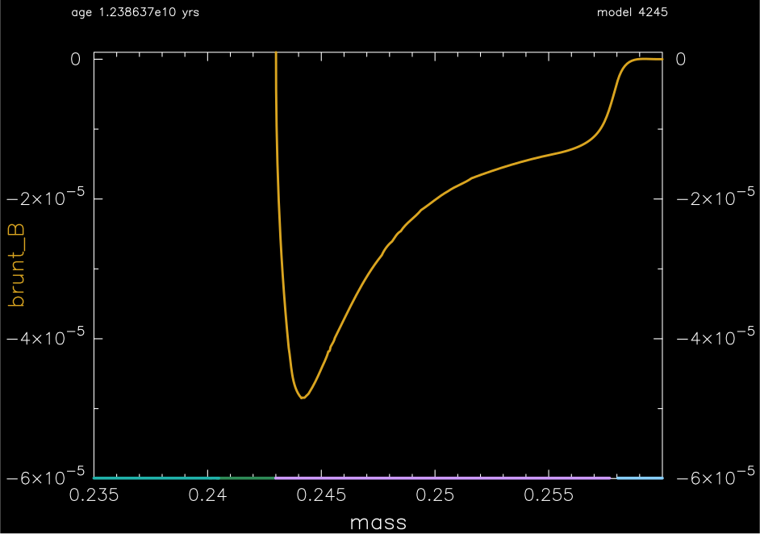

.. _1M_thermohaline:

***************
1M_thermohaline
***************

The test checks thermohaline mixing in a rotating, 1 Msun, Z=0.02 metallicity model.

This test case has one part. Click to see a larger view of a plot.

* Part 1 (``inlist_1M_thermohaline``) loads a 1 Msun main-sequence model, applies a 10 km/s rotation profile, and evolves the model until the helium core mass reaches 0.24 Msun, where some key quantities are reported:

.. code-block:: console

                             log total_angular_momentum    4.9035137416802272D+01    4.5000000000000000D+01    5.5000000000000000D+01
                                       log center_omega   -3.1662469710636527D+00   -4.0000000000000000D+00   -2.0000000000000000D+00
                                      log he_core_omega   -3.5604175013324988D+00   -5.0000000000000000D+00   -2.0000000000000000D+00
                                          surface j_rot    1.6493785476693525D+01    5.0000000000000000D+00    2.5000000000000000D+01
                                          surface v_rot    6.5326185185705721D-01    0.0000000000000000D+00    1.0000000000000000D+00

                                    avg near 0.245 Msun
                                                   logT    7.0563695678521912D+00    7.0000000000000000D+00    7.5000000000000000D+00
                                                 logRho    5.5453590488347027D-01    5.0000000000000000D-01    2.0000000000000000D+00
                                              log j_rot    1.3841508360873403D+01    1.0000000000000000D+01    2.0000000000000000D+01
                                                   D_ST    6.4461480105952242D+00    1.0000000000000000D+00    8.0000000000000000D+00
                                                  nu_ST    7.3797815429416946D+00    4.0000000000000000D+00    9.0000000000000000D+00

 all values are within tolerances

where the number in the second column is the value from running the test case,
the number in the second column is the allowed lower bound, and
the number in the second column is the allowed upper bound.

At the end of the evolution the abundance is shown in the following plot.  The mixing
type is indicated on the x-axis: green = radiative, blue = convective,
and light purple = thermohaline.  The core is radiative, the thick
hydrogen-rich envelope is convective, and sandwiched between them is a
thermohaline region. Within the thermohaline region, nuclear burning
is starting to transform the hydrogen-rich envelope to the helium-rich core.

The brunt B profile in the vicinity of the thermohaline region is
shown the following plot.  The mixing type is again indicated on the
x-axis.  A negative brunt B corresponds to a negative molecular weight
gradient, which is the hallmark of of a region that is unstable to
thermohaline mixing. Note the thermohaline region begins and ends
where brunt B becomes negative.

pgstar commands used for the plots above:

.. code-block:: console

 &pgstar

   file_white_on_black_flag = .true. ! white_on_black flags -- true means white foreground color on black background
   file_device = 'png'            ! png
   file_extension = 'png'

   !file_device = 'vcps'          ! postscript
   !file_extension = 'ps'

    pgstar_interval = 10
    file_digits = 8

      Grid3_win_flag = .true.
         
         Grid3_win_width = 12
         Grid3_win_aspect_ratio = 0.7 ! aspect_ratio = height/width
         
         Grid3_xleft = 0.10 ! fraction of full window width for margin on left
         Grid3_xright = 0.89 ! fraction of full window width for margin on right
         Grid3_ybot = 0.08 ! fraction of full window width for margin on bottom
         Grid3_ytop = 0.92 ! fraction of full window width for margin on top
         Grid3_title = 'Mixing'

         Grid3_num_cols = 2 ! divide plotting region into this many equal width cols
         Grid3_num_rows = 4 ! divide plotting region into this many equal height rows
         Grid3_num_plots = 4 ! <= 10
         
         Grid3_plot_name(1) = 'Mixing'

         Mixing_xmin = 0.22 ! only used if /= -101d0
         Mixing_xmax = 0.28 ! only used if /= -101d0
         
         Mixing_ymin = -101d0 ! only used if /= -101d0
         Mixing_ymax = -101d0 ! only used if /= -101d0        
         Mixing_dymin = -101d0 ! only used if /= -101d0
         
         
         Grid3_plot_row(1) = 3 ! number from 1 at top
         Grid3_plot_rowspan(1) = 2 ! plot spans this number of rows
         Grid3_plot_col(1) =  2 ! number from 1 at left
         Grid3_plot_colspan(1) = 1 ! plot spans this number of columns 
         Grid3_plot_pad_left(1) = 0.08 ! fraction of full window width for padding on left
         Grid3_plot_pad_right(1) = 0.00 ! fraction of full window width for padding on right
         Grid3_plot_pad_top(1) = 0.08 ! fraction of full window height for padding at top
         Grid3_plot_pad_bot(1) = 0.00 ! fraction of full window height for padding at bottom
         Grid3_txt_scale_factor(1) = 0.7 ! multiply txt_scale for subplot by this
         
         Grid3_plot_name(2) = 'History_Panels1'
         
         History_Panels1_title = 'History'      

         History_Panels1_num_panels = 2
         History_Panels1_yaxis_name(1) = 'log_center_T' 
         History_Panels1_other_yaxis_name(1) = 'log_L' 
         History_Panels1_yaxis_name(2) = 'log_center_Rho' 
         History_Panels1_other_yaxis_name(2) = 'log_Teff' 
         
         Grid3_plot_row(2) = 3 ! number from 1 at top
         Grid3_plot_rowspan(2) = 2 ! plot spans this number of rows
         Grid3_plot_col(2) =  1 ! number from 1 at left
         Grid3_plot_colspan(2) = 1 ! plot spans this number of columns 
         Grid3_plot_pad_left(2) = 0.00 ! fraction of full window width for padding on left
         Grid3_plot_pad_right(2) = 0.08 ! fraction of full window width for padding on right
         Grid3_plot_pad_top(2) = 0.08 ! fraction of full window height for padding at top
         Grid3_plot_pad_bot(2) = 0.00 ! fraction of full window height for padding at bottom
         Grid3_txt_scale_factor(2) = 0.7 ! multiply txt_scale for subplot by this

         
         Grid3_plot_name(3) = 'TRho_Profile'
         Grid3_plot_row(3) = 1 ! number from 1 at top
         Grid3_plot_rowspan(3) = 2 ! plot spans this number of rows
         Grid3_plot_col(3) =  2 ! number from 1 at left
         Grid3_plot_colspan(3) = 1 ! plot spans this number of columns 
         Grid3_plot_pad_left(3) = 0.08 ! fraction of full window width for padding on left
         Grid3_plot_pad_right(3) = 0.00 ! fraction of full window width for padding on right
         Grid3_plot_pad_top(3) = 0.00 ! fraction of full window height for padding at top
         Grid3_plot_pad_bot(3) = 0.08 ! fraction of full window height for padding at bottom
         Grid3_txt_scale_factor(3) = 0.7 ! multiply txt_scale for subplot by this

         
         
         Grid3_plot_name(4) = 'Kipp'
         
         Kipp_show_mass_boundaries = .false.
         Kipp_mass_max = 0.28 ! (Msun units) negative means use default
         Kipp_mass_min = 0.22 ! (Msun units) negative means use default

         Kipp_show_luminosities = .false.
         Kipp_lgL_max = 2d0 ! only used if /= -101d0; (L in Lsun units)
         Kipp_lgL_min = 1d0 ! only used if /= -101d0; (L in Lsun units)
         
         
         Grid3_plot_row(4) = 1 ! number from 1 at top
         Grid3_plot_rowspan(4) = 2 ! plot spans this number of rows
         Grid3_plot_col(4) =  1 ! number from 1 at left
         Grid3_plot_colspan(4) = 1 ! plot spans this number of columns 
         Grid3_plot_pad_left(4) = 0.00 ! fraction of full window width for padding on left
         Grid3_plot_pad_right(4) = 0.08 ! fraction of full window width for padding on right
         Grid3_plot_pad_top(4) = 0.00 ! fraction of full window height for padding at top
         Grid3_plot_pad_bot(4) = 0.08 ! fraction of full window height for padding at bottom
         Grid3_txt_scale_factor(4) = 0.7 ! multiply txt_scale for subplot by this

         ! file output
         Grid3_file_flag = .true.
         Grid3_file_dir = 'grid3_png'
         Grid3_file_prefix = 'Mixing_'
         Grid3_file_interval = 100 ! output when mod(model_number,Grid3_file_interval)==0
         Grid3_file_width = 14        ! (inches) negative means use same value as for window

  ! Brunt B profile
     Profile_Panels1_win_flag = .true.
     Profile_Panels1_win_width = 14
     Profile_Panels1_title = '' 
     Profile_Panels1_show_grid = .true.

     Profile_Panels1_xaxis_name = 'mass'
     Profile_Panels1_xmin = 0.235
     Profile_Panels1_xmax = 0.26
     Profile_Panels1_show_mix_regions_on_xaxis = .true.

     Profile_Panels1_num_panels = 1
     Profile_Panels1_yaxis_name(1) = 'brunt_B'
     Profile_Panels1_ymin(:) = -0.00006 ! 0.633
     Profile_Panels1_ymax(:) = 0.000001 ! 0.634
     Profile_Panels1_other_yaxis_name(1) = ''

     Profile_Panels1_file_flag = .true.
     Profile_Panels1_file_dir = 'profile_png'
     Profile_Panels1_file_prefix = 'profile_panels1_'
     Profile_Panels1_file_interval = 100
     Profile_Panels1_file_width = 14

  ! Abundance profile plot

   Abundance_win_flag = .true.

  ! window properties
  Abundance_win_width = 14
  Abundance_win_aspect_ratio = 0.75
  Abundance_title = ''

  Abundance_num_isos_to_show = 8

  Abundance_which_isos_to_show(1)  = 'h1'
  Abundance_which_isos_to_show(2)  = 'he3'
  Abundance_which_isos_to_show(3)  = 'he4'
  Abundance_which_isos_to_show(4)  = 'c12'
  Abundance_which_isos_to_show(5)  = 'n14'
  Abundance_which_isos_to_show(6)  = 'o16'
  Abundance_which_isos_to_show(7)  = 'ne20'
  Abundance_which_isos_to_show(8)  = 'mg24'

  ! number and size of isotope labels along curves
  num_abundance_line_labels = 4
  Abundance_line_txt_scale_factor = 0.8

  ! number and size of isotopes on legend
  Abundance_legend_max_cnt = 0

  ! xaxis name and orientation
  Abundance_xaxis_name = 'mass'
  Abundance_xaxis_reversed = .false.

  ! xaxis limits
  Abundance_xmin = 0.0
  Abundance_xmax = 0.3

  ! yaxis limits
  Abundance_log_mass_frac_min = -4.0
  Abundance_log_mass_frac_max =  0.3

  ! file output
  Abundance_file_flag = .true.
  Abundance_file_dir = 'abund_png'
  Abundance_file_prefix = 'abund_'
  Abundance_file_interval = 100     ! output when mod(model_number,file_interval)==0
  Abundance_file_width = 14        ! (inches) negative means use same value as for window
  Abundance_file_aspect_ratio = -1 ! negative means use same value as for window

 / ! end of pgstar namelist

Last-Updated: 28May2021 (MESA e37f76f) by fxt

