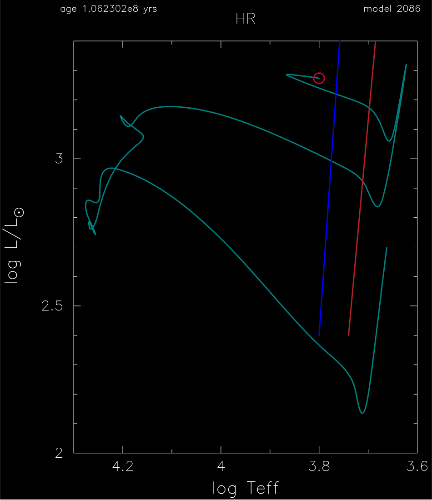

.. _5M_cepheid_blue_loop:

********************
5M_cepheid_blue_loop
********************

This test case checks that the evolution of a 5 Msun, metal-poor Z = 0.008, helium-enriched Y=0.256 model
executes a blue-loop in the HR diagram and crosses the classical Cepheid instability strip boundaries three times.

This test case has two parts. Click to see a larger view of a plot.

* Part 1 (``inlist_start``) creates a pre-main sequence model and evolves it to the onset of core helium burning, just past the tip of the Red Giant branch.

* Part 2 (``inlist_cepheid_blue_loop``) monitors the ensuring evolution as core helium burning proceeds and the model executes a blue loop.

pgstar commands used:

.. code-block:: console

 &pgstar

   file_white_on_black_flag = .true. ! white_on_black flags -- true means white foreground color on black background
   file_device = 'png'            ! png
   file_extension = 'png'

   !file_device = 'vcps'          ! postscript
   !file_extension = 'ps'

    pgstar_interval = 10

   HR_win_flag = .true.

   HR_win_width = 12
   HR_win_aspect_ratio = 1.2 ! aspect_ratio = height/width

   ! axis limits -- to override system default selections
   HR_logT_min = 3.6 ! -101 ! only used if > -100
   HR_logT_max = 4.3 ! only used if > -100
   HR_logL_min = 2.0 ! -101 ! only used if > -100
   HR_logL_max = 3.4 ! -101 ! only used if > -100

   ! file output
   HR_file_flag = .true.
   HR_file_dir = 'pgstar_out'
   HR_file_prefix = 'hr'
   HR_file_interval = 100 ! output when mod(model_number,HR_file_interval)==0
   HR_file_width = 15 ! negative means use same value as for window
   HR_file_aspect_ratio = -1 ! negative means use same value as for window

 / ! end of pgstar namelist

Last-Updated: 29May2021 (MESA e37f76f) by fxt

