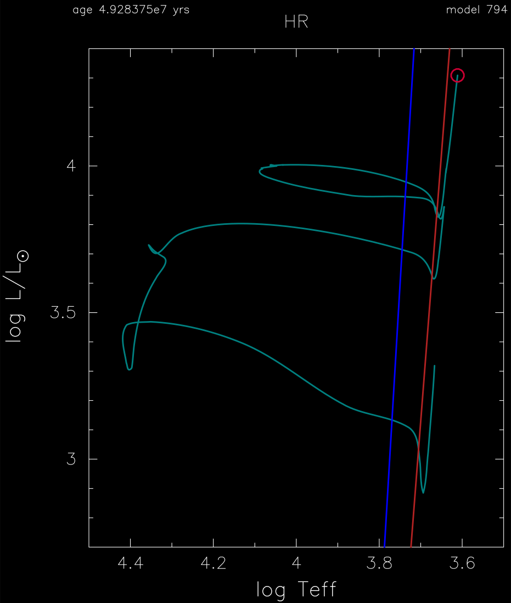

.. _7M_prems_to_AGB:

***************
7M_prems_to_AGB
***************

This test case checks that the evolution of a 7 Msun, metal-poor Z = 0.001, model reaches the AGB.

This test case has two parts. Click to see a larger view of a plot.

* Part 1 (``inlist_start``) creates a pre-main sequence model.

* Part 2 (``inlist_7M_prems_to_AGB``) continues the evolution as core hydrogen and helium burning proceed, terminating when log10(L/Lsun)=4.3 is reached. The model executes a blue loop as helium depletes, with the red edge and blue edge of the classical Cepheid instability strip boundaries shown in the HR diagram:

pgstar commands used:

.. code-block:: console

 &pgstar

   file_white_on_black_flag = .true. ! white_on_black flags -- true means white foreground color on black background
   file_device = 'png'            ! png
   file_extension = 'png'

   !file_device = 'vcps'          ! postscript
   !file_extension = 'ps'

    pgstar_interval = 10

   HR_win_flag = .true.
   HR_win_width = 12
   HR_win_aspect_ratio = 1.2 ! aspect_ratio = height/width

   HR_logT_min = 3.5 
   HR_logT_max = 4.5 
   HR_logL_min = 2.7 
   HR_logL_max = 4.4 

   ! file output
   HR_file_flag = .true.
   HR_file_dir = 'pgstar_out'
   HR_file_prefix = 'hr'
   HR_file_interval = 100 ! output when mod(model_number,HR_file_interval)==0
   HR_file_width = 15 ! negative means use same value as for window
   HR_file_aspect_ratio = -1 ! negative means use same value as for window

 / ! end of pgstar namelist

Last-Updated: 29May2021 (MESA e37f76f) by fxt

