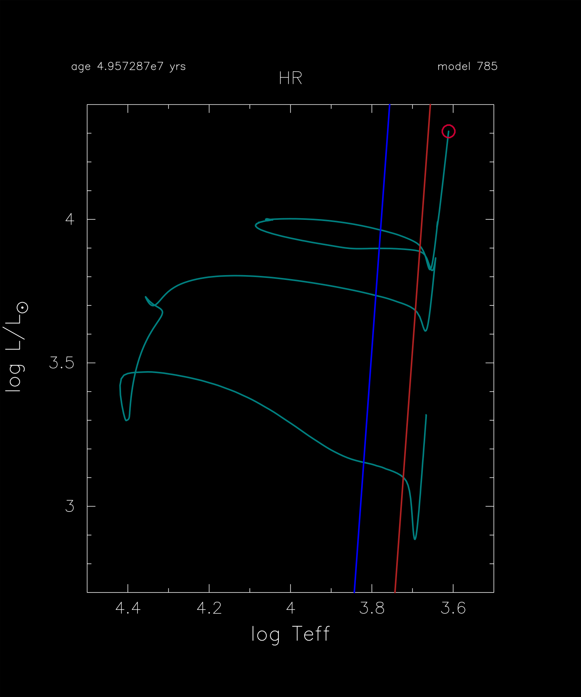

.. _7M_prems_to_AGB:

***************
7M_prems_to_AGB
***************

This test case checks that the evolution of a 7 |Msun|, metal-poor Z = 0.001, model reaches the AGB.

This test case has two parts. Click to see a larger view of a plot.

* Part 1 (``inlist_start``) creates a pre-main sequence model.

* Part 2 (``inlist_7M_prems_to_AGB``) continues the evolution as core hydrogen and helium burning proceed, terminating when log10(L/Lsun)=4.3 is reached. The model executes a blue loop as helium depletes, with the red edge and blue edge of the classical Cepheid instability strip boundaries shown in the HR diagram:

pgstar commands used:

.. literalinclude:: ../../../star/test_suite/7M_prems_to_AGB/inlist_pgstar
  :language: console
  :start-at: &pgstar
  :end-at: ! end of pgstar namelist

Last-Updated: 29May2021 (MESA e37f76f) by fxt

Last-Run: 22Oct2024 (MESA 9b2017ca) by pmocz on C916PXT6XW in 407 seconds using 8 threads.
