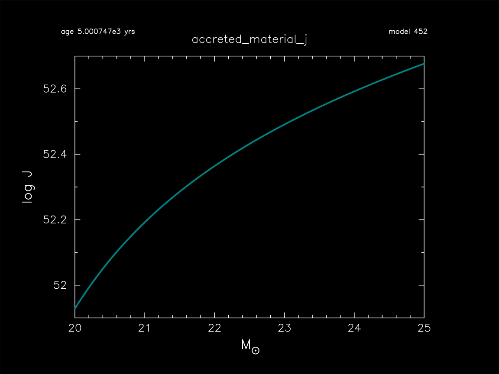

.. _accreted_material_j:

*******************
accreted_material_j
*******************

This test suite example checks the accretion of material and angular momentum onto a 20 Msun model.

This test case has two parts. Click to see a larger view of a plot.

* Part 1 (``inlist_zams``) creates a 20 Msun, Z=0.02 metallicity, main-sequence model.

* Part 2 (``inlist_accreted_material_j``) continues the evolution by first applying uniform rotation Omega/Omega_crit = 0.1, and then accreting material with the same composition as the outermost cell at a rate of 0.001 Msun/year with an angular momentum of 0.1 Keplerian. The model terminates when the mass reaches 25 Msun:

pgstar commands used for the plots above:

.. code-block:: console

 &pgstar

   file_white_on_black_flag = .true. ! white_on_black flags -- true means white foreground color on black background
   file_device = 'png'            ! png
   file_extension = 'png'

   !file_device = 'vcps'          ! postscript
   !file_extension = 'ps'

    pgstar_interval = 10

    History_Track_win_flag(1) = .true.
    History_Track_win_width(1) = 12
    History_Track_title(1) = 'accreted_material_j'
    History_Track_xname(1) = 'star_mass'
    History_Track_yname(1) = 'log_total_angular_momentum'
    History_Track_yaxis_label(1) = 'log J'
    History_Track_xaxis_label(1) = 'M\d\(2281)'
    History_Track_reverse_xaxis(1) = .false.
    History_Track_reverse_yaxis(1) = .false.

    History_Track_xmin(1) = 20.0
    History_Track_xmax(1) = 25.0
    History_Track_ymin(1) = 51.9
    History_Track_ymax(1) = 52.7

 ! file output
    History_Track_file_flag(1) = .true.
    History_Track_file_dir(1) = 'png'
    History_Track_file_prefix(1) = 'track1_'
    History_Track_file_interval(1) = 10
    History_Track_file_width(1) =12
    History_Track_file_aspect_ratio(1) = -1

 / ! end of pgstar namelist

Last-Updated: 30May2021 (MESA e37f76f) by fxt

