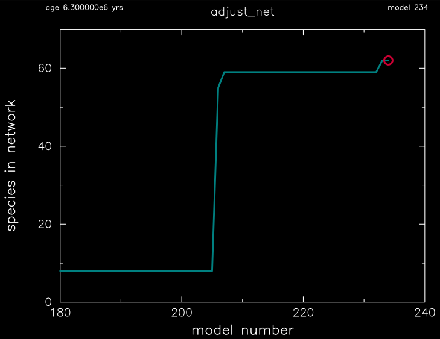
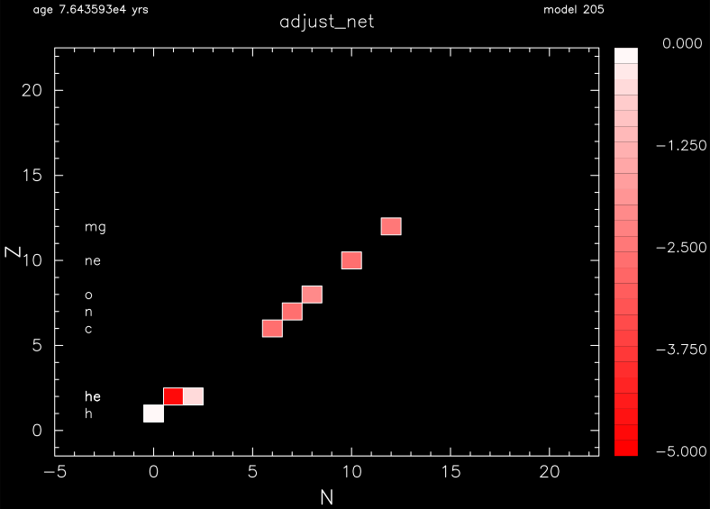
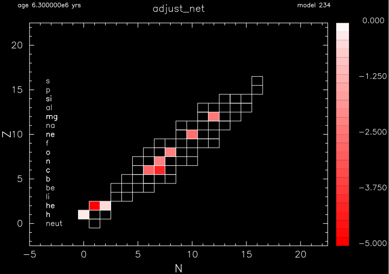

.. _adjust_net:

**********
adjust_net
**********

This test suite example checks the functionality of the adaptive nuclear reaction network.

This test case tracks the number of isotopes it has at the end of the run.

This test case has two parts. Click to see a larger view of a plot.

* Part 1 (``inlist_zams``) creates a 15 Msun, Z=0.02 metallicity, main-sequence model using the default 8 isotope ``basic.net``.

* Part 2 (``inlist_adjust_net_header``) continues the evolution, activates the adaptive nuclear reaction network, and terminates at about 2 million years with 62 isotopes in the reaction network:

pgstar commands used for the plots above:

.. code-block:: console

 &pgstar

   file_white_on_black_flag = .true. ! white_on_black flags -- true means white foreground color on black background
   file_device = 'png'            ! png
   file_extension = 'png'

   !file_device = 'vcps'          ! postscript
   !file_extension = 'ps'

    pgstar_interval = 10

    Network_win_flag = .true.
    Network_win_width = 12
    Network_win_aspect_ratio = 0.75
    Network_title = 'adjust_net'

    Network_nmin = -101d0
    Network_nmax = 20.0
    Network_zmin = -101d0
    Network_zmax = 20.0

    Network_show_mass_fraction = .true.
    Network_show_element_names = .true.
    Network_show_colorbar = .true.

    Network_log_mass_frac_min = -5.0d0
    Network_log_mass_frac_max = 0.0d0

    Network_file_flag = .true.
    Network_file_dir = 'png'
    Network_file_prefix = 'Network_'
    Network_file_interval = 10
    Network_file_width = 12
    Network_file_aspect_ratio = -1

    History_Track1_win_flag = .true.
    History_Track1_win_width = 12
    History_Track1_title = 'adjust_net'                                                                                                                                                                                   
    History_Track1_xname = 'model_number'
    History_Track1_xaxis_label = 'model number'

    History_Track1_yname = 'species'
    History_Track1_yaxis_label = 'species in network'

    History_Track1_reverse_xaxis = .false.
    History_Track1_reverse_yaxis = .false.

    History_Track1_xmin = 180.0
    History_Track1_xmax = 240.0
    History_Track1_ymin = 0.0
    History_Track1_ymax = 70.0

    History_Track1_file_flag = .true.
    History_Track1_file_dir = 'png'
    History_Track1_file_prefix = 'track1_'
    History_Track1_file_interval = 10
    History_Track1_file_width =12
    History_Track1_file_aspect_ratio = -1

 / ! end of pgstar namelist

Last-Updated: 31May2021 (MESA e37f76f) by fxt

