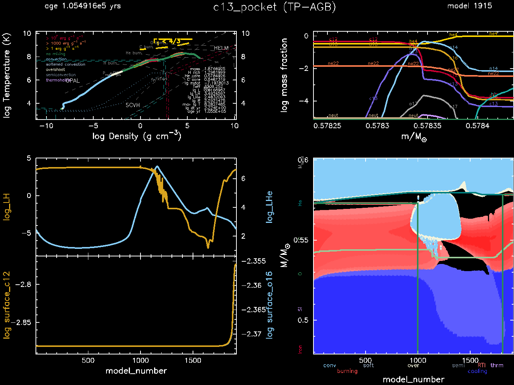

.. _c13_pocket:

**********
c13_pocket
**********

This test suite case shows a 2.0 |Msun|, :math:`Z = 0.01` thermally
pulsing AGB star undergoing third dredge up.  It is a
re-implementation of the example shown in Section 7.2.1 of |MESA I|.

The test checks the development of a pocket of :math:`^{13}{\rm C}`
during the thermal pulse cycle.  This occurs due to the penetration of
protons from the envelope into the He intershell as a result of mixing
associated with convective overshoot and their capture on the
:math:`^{12}{\rm C}` present in this region.

This test case has 4 parts, but by default, saved models are used to
skip to part 3.  Options shared between all parts are contained in
``inlist_common``.

* Part 0 (``inlist_pre_ms``) creates the pre-main-sequence model.

* Part 1 (``inlist_to_TACHeB``) evolves from the pre-main-sequence to
  core helium depletion (TACHeB).

* Part 2 (``inlist_to_3DUP``) evolves from TACHeB until the third
  thermal pulse with third dredge-up has occurred.

* Part 3 (``inlist_c13_pocket``) evolves over a thermal pulse cycle
  and checks for the formation of the :math:`^{13}{\rm C}` pocket as
  well as surface enhancement of :math:`^{12}{\rm C}` due to third
  dredge up.

The most important options in parts 2 and 3 are contained in
``inlist_TP_AGB``.  This contains spatial/temporal resolution controls
that ensure the thermal pulse cycle and the pocket are well resolved.
This also adds the large exponential overshooting at the base of the
convective envelope that mixes the protons into the intershell.

At the end of this test, MESA has succesfully evolved through a
thermal pulse and the :math:`^{13}{\rm C}` pocket is apparent.

.. note::

  When you run parts 0-2, the ``run_star_extras`` file attemps to
  automatically do the analysis reported in Table 11 of |MESA I|.
  This can be useful for detailed comparisons between versions.
  Uncomment the parts in ``rn`` and then grep in the output for
  ``[TestHub]``.

Last-Updated: 2020-03-12 (mesa r12778) by Josiah Schwab
