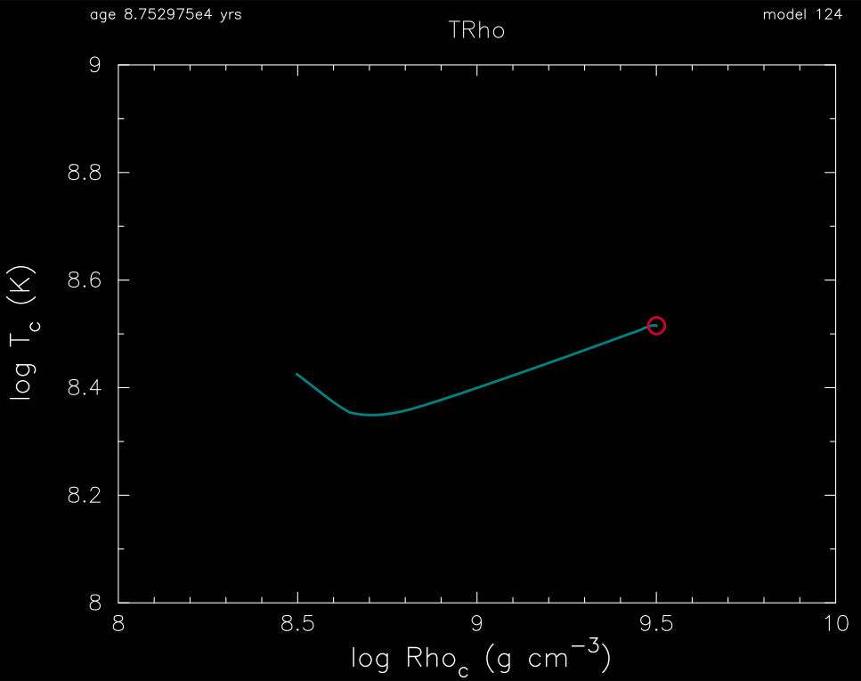
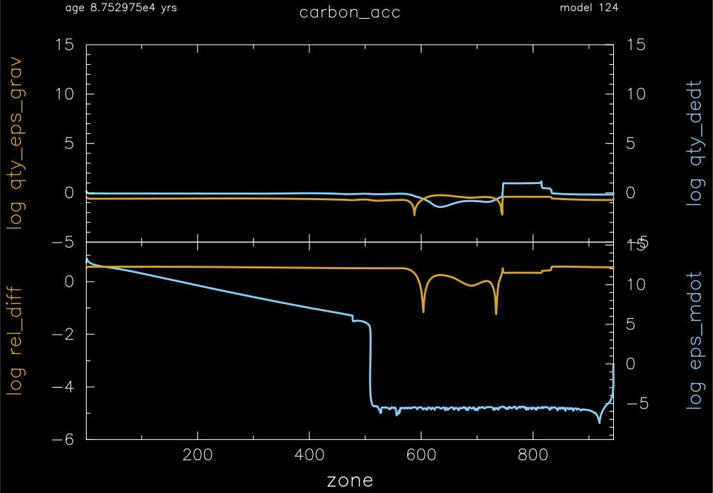

.. _carbon_acc:

**********
carbon_acc
**********

This test suite example checks the acceration of carbon onto a pure carbon white dwarf.

This test case has one part. Click to see a larger view of a plot.

* Part 1 (``inlist_carbon_acc``) loads a 1.3 Msun pure carbon white dwarf model with a central density of 3.1e8 g/cm\ :sup:`3`. It then accretes pure carbon material at a rate of 1e-6 Msun/year until the central density exceeds 3.1e9 g/cm\ :sup:`3`, at which point the mass is 1.387 Msun:

pgstar commands used for the plots above:

.. code-block:: console

 &pgstar

   file_white_on_black_flag = .true. ! white_on_black flags -- true means white foreground color on black background
   file_device = 'png'            ! png
   file_extension = 'png'

   !file_device = 'vcps'          ! postscript
   !file_extension = 'ps'

    pgstar_interval = 1

  TRho_win_flag = .true.
  TRho_win_width = 12
  TRho_logT_min = 8
  TRho_logT_max = 9
  TRho_logRho_min = 8
  TRho_logRho_max = 10

 ! file output
  TRho_file_flag = .true.
  TRho_file_dir = 'png'
  TRho_file_prefix = 'trhoc_'
  TRho_file_interval = 10 ! output when `mod(model_number,TRho_file_interval)==0`
  TRho_file_width = 16 ! (inches) negative means use same value as for window
  TRho_file_aspect_ratio = -1 ! negative means use same value as for window

  Profile_Panels1_win_flag = .true.

  Profile_Panels1_win_width = 15
  Profile_Panels1_win_aspect_ratio = 0.75 ! aspect_ratio = height/width

  Profile_Panels1_xleft = 0.15
  Profile_Panels1_xright = 0.85
  Profile_Panels1_ybot = 0.15
  Profile_Panels1_ytop = 0.85
  Profile_Panels1_txt_scale = 1.0
  Profile_Panels1_title = 'carbon_acc'

  Profile_Panels1_xaxis_name = 'zone'
  Profile_Panels1_xaxis_reversed = .false.
  Profile_Panels1_xmin = -101d0 ! only used if /= -101d0
  Profile_Panels1_xmax = -101d0 ! only used if /= -101d0
  Profile_Panels1_xmargin = 0d0
  Profile_Panels1_show_mix_regions_on_xaxis = .false.

  Profile_Panels1_show_grid = .false.

  Profile_Panels1_num_panels = 2
  Profile_Panels1_yaxis_name(1) = 'qty_eps_grav'
  Profile_Panels1_yaxis_log(1) = .true.
  Profile_Panels1_other_yaxis_name(1) = 'qty_dedt'
  Profile_Panels1_other_yaxis_log(1) = .true.

  Profile_Panels1_ymin(1) = -5
  Profile_Panels1_ymax(1) = 15

  Profile_Panels1_other_ymin(1) = -5
  Profile_Panels1_other_ymax(1) = 15

  Profile_Panels1_yaxis_name(2) = 'rel_diff'
  Profile_Panels1_yaxis_log(2) = .true.
  Profile_Panels1_other_yaxis_name(2) = 'eps_mdot'
  Profile_Panels1_other_yaxis_log(2) = .true.

  Profile_Panels1_ymin(2) = -6
  Profile_Panels1_ymax(2) = 1.5

  ! file output
  Profile_Panels1_file_flag = .true.
  Profile_Panels1_file_dir = 'png'
  Profile_Panels1_file_prefix = 'profile_panels1_'
  Profile_Panels1_file_interval = 10 ! output when `mod(model_number,Profile_Panels1_file_interval)==0`
  Profile_Panels1_file_width = -1 ! (inches) negative means use same value as for window
  Profile_Panels1_file_aspect_ratio = -1 ! negative means use same value as for window

 / ! end of pgstar namelist

Last-Updated: 31May2021 (MESA e37f76f) by fxt

