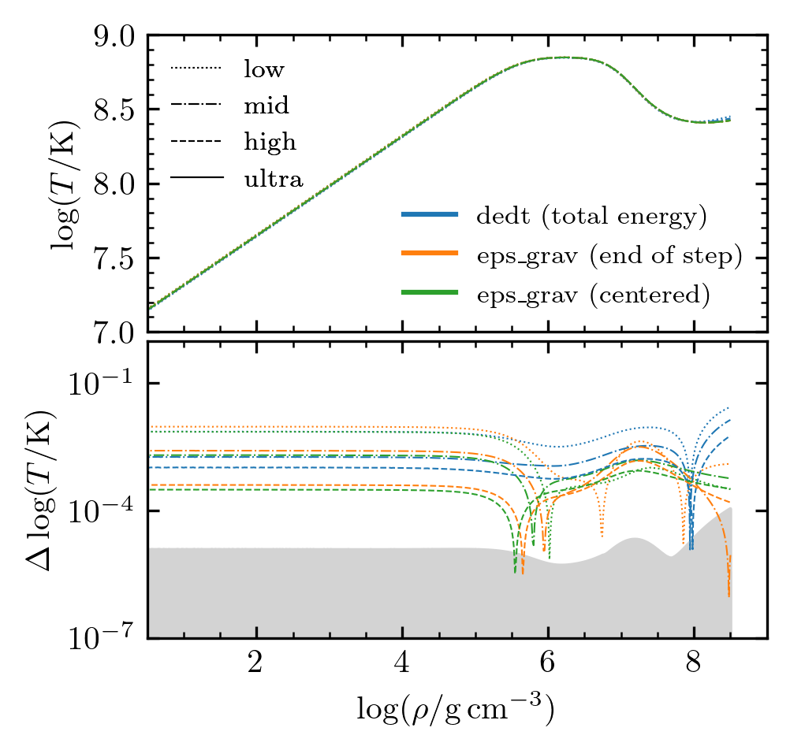
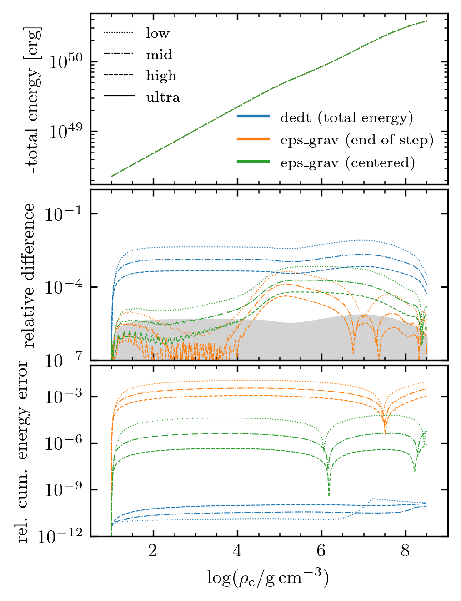

.. _carbon_kh:

*********
carbon_kh
*********

This test case evolves an initially low-density, 1.3 |Msun| stellar
model with a pure carbon composition as it Kelvin-Helmholtz contracts.

The model begins at a central density of 10 |gpercm3| and we follow
the contraction over a more than 2 dex in decrease in radius and a
more than 7 dex increase in central density.  Nuclear reactions are
not considered.  For simplicity, we assume that the radiative
opacities are given by electron scattering and include standard
thermal neutrino losses.  We exclusively use the HELM EOS, as the use
of a single EOS that is formulated from the Helmholtz free energy
avoids most of the EOS inconsistencies.

This case is not meant to model an object realized in nature, but
provides a simple example problem that has neither mass changes nor
composition changes.  It is nonetheless demanding as the conditions in
the star vary tremendously during the evolution as material goes from
non-degenerate conditions to conditions of relativistic electron
degeneracy and the dominant energy loss mechanism transitions from
radiative diffusion to optically-thin neutrino cooling.

This case is discussed extensively in section 5.2 of
`MESA Instrument Paper VI <https://ui.adsabs.harvard.edu/abs/2023ApJS..265...15J/abstract>`__.
You can run the full resolution study described in that section by
using the ``rnall`` bash script, which links to different energy equation
and resolution options to run through the model 12 times. This will produce
the output necessary for reproducing plots like the ones below and seen in
figures 9 and 10 of the instrument paper.

By default, the test suite ``rn`` script runs just one of these instances:
the high resolution run using the ``eps_grav`` energy equation option,
which should run in a few minutes, appears reasonably converged based on the plots
below, and exhibits a small cumulative energy error.

The included Jupyter notebook (``docs/carbon_kh.ipynb``) provides
information about reproducing the following convergence study.

.. image:: ../../../star/test_suite/carbon_kh/docs/carbon_kh_Rhoc-Tc_history_with_dt.png

Last-Updated: 2023-04-03 (mesa 81ad921) by Evan Bauer

