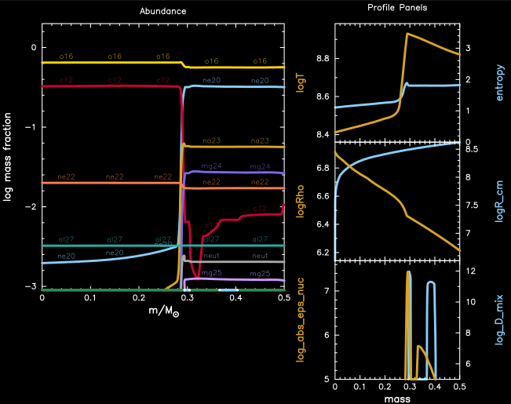
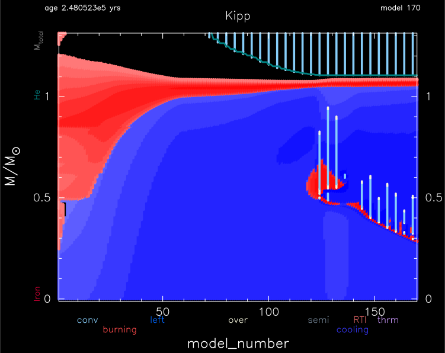

.. _cburn_inward:

************
cburn_inward
************

This test suite example checks the inward propagation of a carbon burning front in a 7.5 Msun model.

Physical checks
===============

This test case tracks the mass co-orindate when carbon ignites, the density at that point, and 
the C/O core mass at that instance.

This mass should be about half the C/O core mass (0.5 |Msun|). If its not then the initial model needs updating.
If the mass is smaller, then either decrease the initial mass of the star or decrease overshoot
during core helium burning. If the ignition mass is higher then increase the initial mass or 
increase overshoot during core helium burning.

The ignition density should be about |logRho| ~ 6.2 (`Farmer et al (2015) <https://ui.adsabs.harvard.edu/abs/2015ApJ...807..184F/abstract>`__).
If its signficantly different (0.1 dex) then we have a microphysics problem (or more likely an issue tracking the flame location).

The C/O core mass should be between 1.0 and 1.4 |Msun|, if different then tune the initial mass/overshot, otherwise
we may not get a carbon flame.

Inlists
=======

This test case has two parts. Click to see a larger view of a plot.

* Part 1 (``inlist_initial``) creates a 7.5 Msun, Z=0.02 metallicity, pre-main sequence model and evolves it to core helium depletion (mass fraction helium < 1e-5.)

* Part 2 (``cburn_inward``) continues the evoluton where an off-center carbon burning front ignites, develops a convective region behind the burning front, and propagates towards the center through oxygen-neon-magnesium rich material.

pgstar commands used for the plots above:

.. code-block:: console

 &pgstar

   file_white_on_black_flag = .true. ! white_on_black flags -- true means white foreground color on black background
   file_device = 'png'            ! png
   file_extension = 'png'

   !file_device = 'vcps'          ! postscript
   !file_extension = 'ps'

    pgstar_interval = 1

      Grid_win_flag(2) = .true.
         Grid_win_width(2) = 15
         Grid_win_aspect_ratio(2) = 0.5 ! aspect_ratio = height/width

         Grid_num_cols(2) = 7 ! divide plotting region into this many equal width cols
         Grid_num_rows(2) = 8 ! divide plotting region into this many equal height rows
         Grid_num_plots(2) = 6 ! <= 10

         Grid_plot_pad_right(2, 5) = 0.00 ! fraction of full window width for padding on right
         Grid_plot_colspan(2, 5) = 3 ! plot spans this number of columns
         Grid_plot_colspan(2, 4) = 5 ! plot spans this number of columns

         Grid_plot_name(2, 6) = 'Profile_Panels1'
         Grid_plot_row(2, 6) = 1 ! number from 1 at top
         Grid_plot_rowspan(2, 6) = 8 ! plot spans this number of rows
         Grid_plot_col(2, 6) =  6 ! number from 1 at left
         Grid_plot_colspan(2, 6) = 2 ! plot spans this number of columns
         Grid_plot_pad_left(2, 6) = 0.06 ! fraction of full window width for padding on left
         Grid_plot_pad_right(2, 6) = 0.03 ! fraction of full window width for padding on right
         Grid_plot_pad_top(2, 6) = 0.0 ! fraction of full window height for padding at top
         Grid_plot_pad_bot(2, 6) = 0.0 ! fraction of full window height for padding at bottom
         Grid_txt_scale_factor(2, 6) = 0.65 ! multiply txt_scale for subplot by this

         TRho_logRho_dlogRho_min = 0.01 
         TRho_logT_dlogT_min = 0.02 
         HR_dlogT_min = 0.02
         HR_dlogL_min = 0.01

         Text_Summary_name(1, 2, 1) = 'star_age'

  ! file output
         Grid_file_flag(2) = .true.
         Grid_file_dir(2) = 'png'
         Grid_file_prefix(2) = 'grid_'
         Grid_file_interval(2) = 10 ! 1 ! output when mod(model_number,Grid_file_interval(2))==0
         Grid_file_width(2) = -1 ! negative means use same value as for window
         Grid_file_aspect_ratio(2) = -1 ! negative means use same value as for window
      
      
      show_TRho_Profile_eos_regions = .false.
      TRho_Profile_xmin = -5.1
      TRho_Profile_xmax = 10.2
      TRho_Profile_ymin = 5.1
      TRho_Profile_ymax = 10.2        

         Text_Summary_name(1, 1, 3) = 'log_cntr_Rho'
         Text_Summary_name(1, 2, 3) = 'log_cntr_T'
         Text_Summary_name(1, 3, 3) = 'max_T'
         Text_Summary_name(1, 8, 1) = 'species'
      
      Abundance_win_flag = .false.
      Abundance_win_width = 6
      Abundance_win_aspect_ratio = 1 ! aspect_ratio = height/width

      Abundance_xaxis_name = 'mass' 
      Abundance_xaxis_reversed = .false.
      Abundance_xmin = 0 ! only used if /= -101d0
      
      Abundance_line_txt_scale_factor = 1.1 ! relative to other text
      Abundance_legend_txt_scale_factor = 1.1 ! relative to other text
      Abundance_legend_max_cnt = 0
      Abundance_log_mass_frac_min = -3 ! only used if < 0

  ! file output      
      Abundance_file_flag = .false.
      Abundance_file_dir = 'png'
      Abundance_file_prefix = 'abund_'
      Abundance_file_interval = 5 ! output when mod(model_number,Abundance_file_interval)==0
      Abundance_file_width = -1 ! (inches) negative means use same value as for window
      Abundance_file_aspect_ratio = -1 ! negative means use same value as for window
      
      
      Profile_Panels_win_width(1) = 6
      Profile_Panels_win_aspect_ratio = 1 ! aspect_ratio(1) = height/width

      Profile_Panels_title(1) = 'Profile Panels'
      Profile_Panels_num_panels(1) = 3
             
      Profile_Panels_yaxis_name(1, 1) = 'logT'
      Profile_Panels_other_yaxis_name(1, 1) = 'entropy'
         Profile_Panels_other_ymin(1, 1) = 0 ! only used if /= -101d0
         Profile_Panels_other_ymax(1, 1) = -101d0 ! only used if /= -101d0
         Profile_Panels_other_ymargin(1, 1) = 1
            
      Profile_Panels_yaxis_name(1, 2) = 'logRho'
      Profile_Panels_other_yaxis_name(1, 2) = 'logR_cm'
         Profile_Panels_other_ymin(1, 2) = -101d0 ! only used if /= -101d0
         Profile_Panels_other_ymax(1, 2) = -101d0 ! only used if /= -101d0
         Profile_Panels_other_ymargin(1, 2) = 0
      
      Profile_Panels_yaxis_name(1, 3) = 'log_abs_eps_nuc'
         Profile_Panels_ymin(1, 3) = 5 ! only used if /= -101d0
         !Profile_Panels_ymax(1, 3) = 0.51 ! only used if /= -101d0
         !Profile_Panels_ymargin(1, 3) = 0.1
      Profile_Panels_other_yaxis_name(1, 3) = 'log_D_mix'
         Profile_Panels_other_ymin(1, 3) = 5 ! only used if /= -101d0
         !Profile_Panels_other_ymax(1, 3) = 300d0 ! only used if /= -101d0
         !Profile_Panels_other_ymargin(1, 3) = 10
  
  
      Profile_Panels_xaxis_name(1) = 'mass'
      Profile_Panels_xaxis_reversed(1) = .false.
      Profile_Panels_xmin(1) = 0.0 ! only used if /= -101d0
      
      Profile_Panels_xmargin(1) = 0d0

      Profile_Panels_xmax(1) = 0.5 ! -101d0 ! only used if /= -101d0
      Abundance_xmax = 0.5 ! -101 ! only used if /= -101d0

	kipp_win_flag = .true.
        kipp_win_width = 12
	kipp_mass_max = 1.3
	kipp_file_flag = .true.
        Kipp_file_flag = .true.
        Kipp_file_dir = 'png'
        Kipp_file_prefix = 'kipp_'
        Kipp_file_interval = 10 ! 1 ! output when mod(model_number,Kipp_file_interval)==0
        Kipp_file_width = -1 ! negative means use same value as for window
        Kipp_file_aspect_ratio = -1 ! negative means use same value as for window

 / ! end of pgstar namelist

Last-Updated: 01Jun2021 (MESA 5a0c270) by fxt

