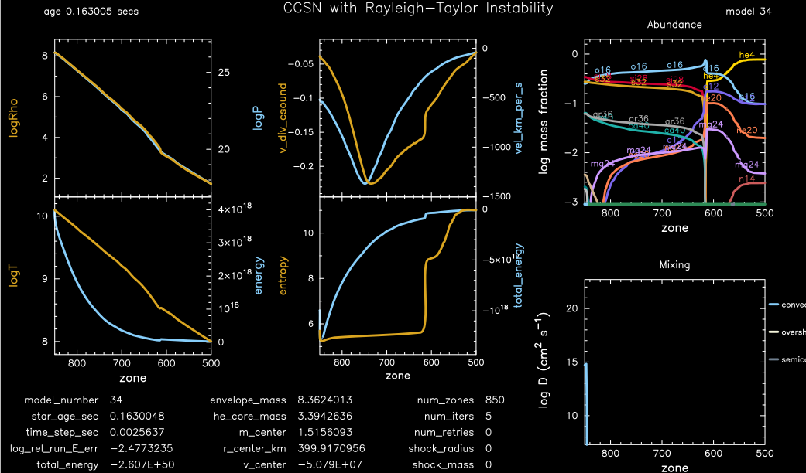
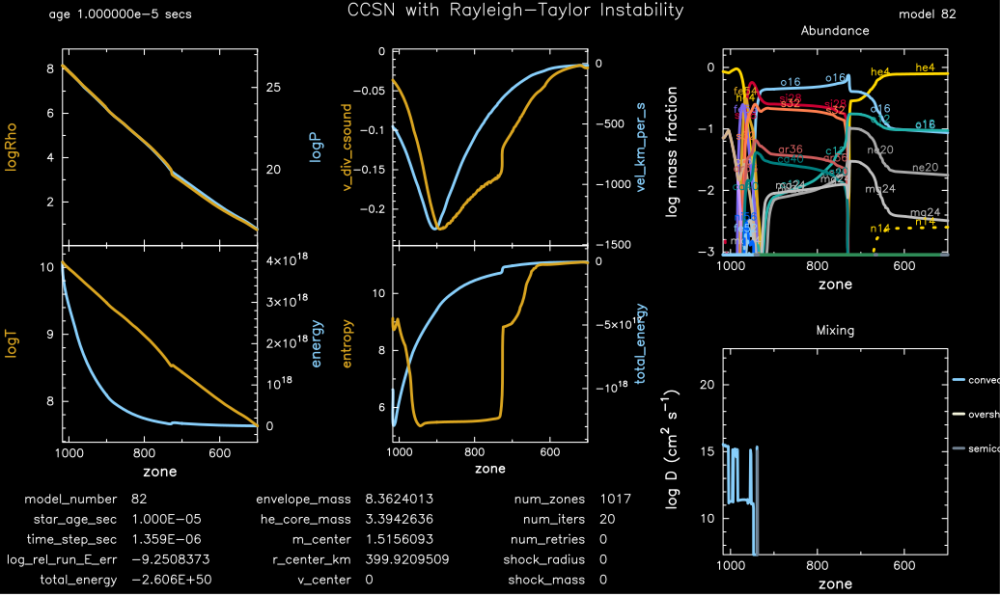
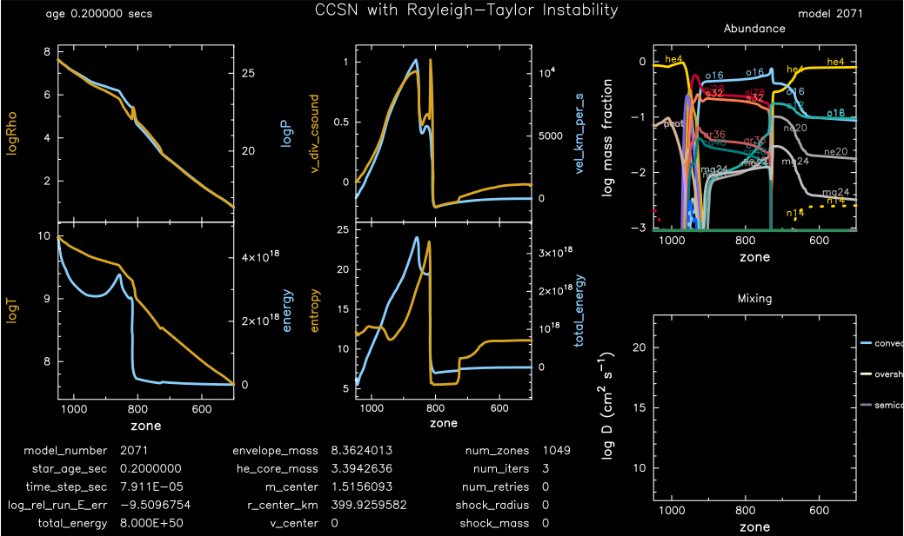
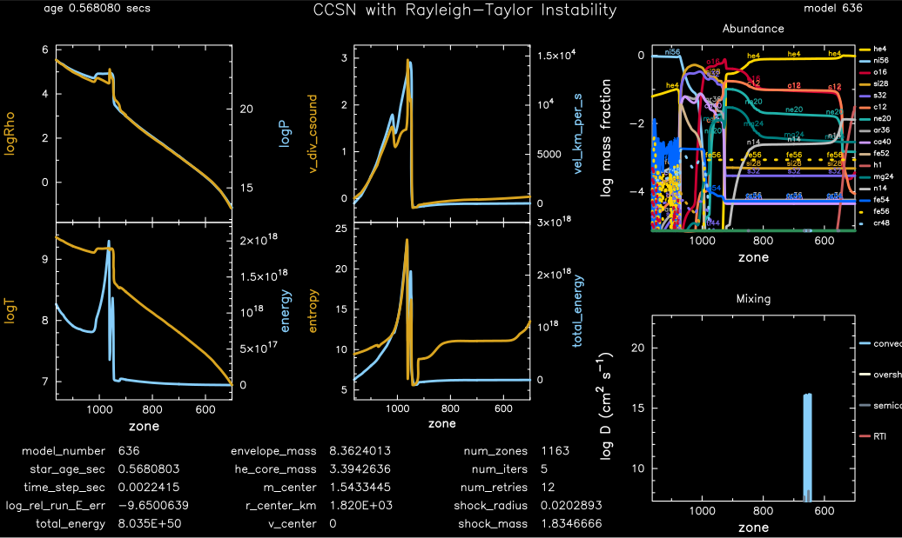
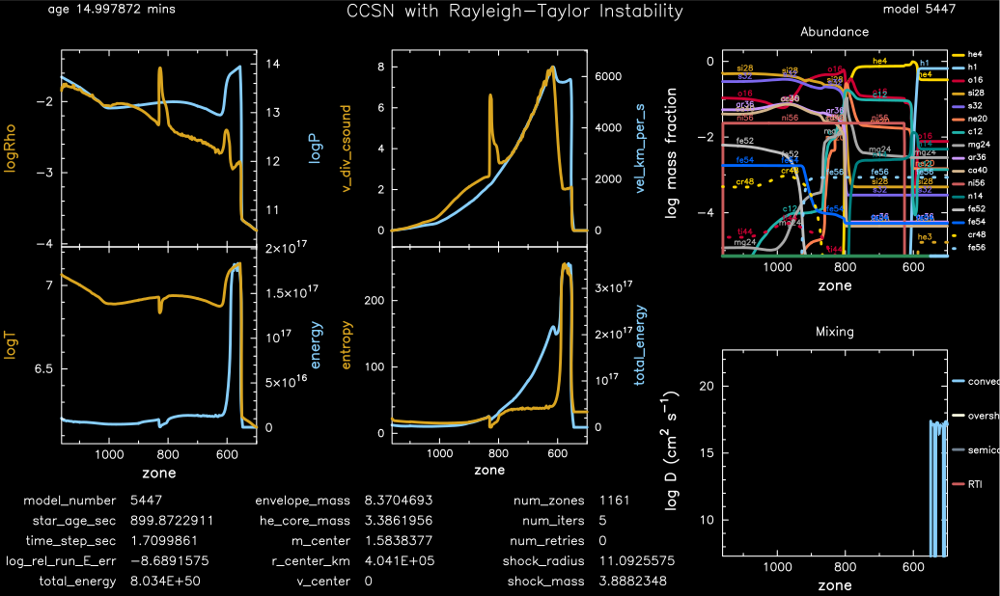
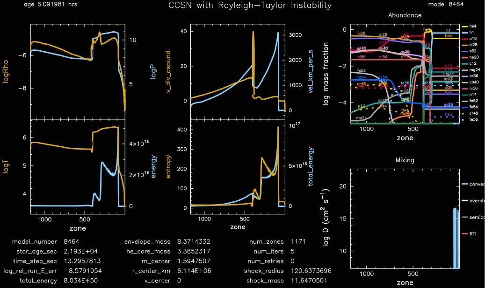
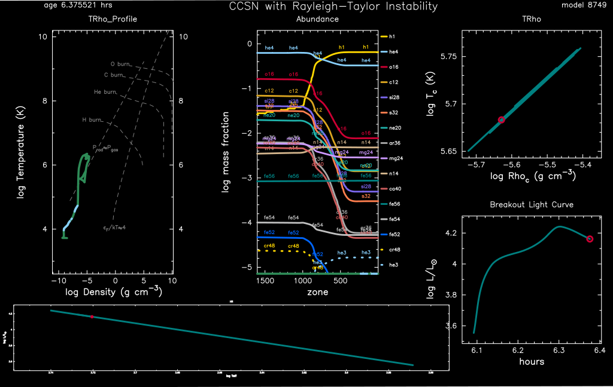

.. _ccsn_IIp:

********
ccsn_IIp
********

This test suite example builds a Type IIp supernova model, including Rayleigh-Taylor Instability mixing, for subsquent use in STELLA.

This test case has 8 parts and ``src/run_star_extras.f90`` is important. Click to see a larger view of a plot.

* Part 1 (``inlist_infall``) loads ``pre_ccsn.mod`` from ``make_pre_ccsn_IIp``. The evolution of the 11.7 MSun model with with cell center Riemann velocities (u) and a total energy of -9.4e50 erg continues util R_center drops below 400 km:

* Part 2 (``inlist_end_infall``) continues the evolution for an additional 1e-5 sec using HLLC hydrodynamics:

* Part 3 (``inlist_edep``) injects thermal energy into the inner 0.2 Msun until the model reaches a total energy of 8e50 erg:

* Part 4 (``inlist_shock_part1``) contnues the evolution until the outward bound shock reaches 1.83 Msun:

* Part 5 (``inlist_shock_part2``) contnues the evolution until the outward bound shock reaches 2.68 Msun:

.. image:: ../../../star/test_suite/ccsn_IIp/docs/part2.svg
   :scale: 100%

* Part 6 (``inlist_shock_part3``) contnues the evolution until the outward bound shock reaches 3.88 Msun:

* Part 7 (``inlist_shock_part4``) contnues the evolution until the outward bound shock reaches 11.64 Msun:

* Part 8 (``inlist_shock_part5``) continues the approach to shock breakout, terminating when the shock reaches 11.70 Msun, and creating the ``mesa.abn`` and ``mesa.abn`` files for subsequent use with STELLA:

pgstar commands used for the first 7 plots:

.. code-block:: console

 &pgstar

   file_white_on_black_flag = .true. ! white_on_black flags -- true means white foreground color on black background
   file_device = 'png'            ! png
   file_extension = 'png'

   !file_device = 'vcps'          ! postscript
   !file_extension = 'ps'

    pgstar_interval = 10

  pgstar_grid_title_disp = 1.8

  Mixing_ymin = 8
  Mixing_ymax = 22

  Profile_Panels1_title = ''
  Profile_Panels1_xaxis_name = 'mass'
  Profile_Panels1_xaxis_reversed = .false.

  Profile_Panels1_yaxis_name(1) = 'logRho'
  Profile_Panels1_yaxis_name(2) = 'logT'

  Profile_Panels1_ymin(1) = -101
  ! Profile_Panels1_ymin(2) = -10
  ! Profile_Panels1_ymax(2) = 0.3

  Profile_Panels1_other_yaxis_name(1) = 'logP'
  Profile_Panels1_other_yaxis_name(2) = 'energy'

  Profile_Panels1_other_ymin(1) = -101
  ! Profile_Panels1_other_ymin(2) = -12
  ! Profile_Panels1_other_ymax(2) = 0

  Profile_Panels1_num_panels = 2

  Profile_Panels2_title = ''
  Profile_Panels2_xaxis_name = 'mass'
  Profile_Panels2_xaxis_reversed = .false.

  Profile_Panels2_num_panels = 2
  Profile_Panels2_yaxis_name(1) = 'v_div_csound'
  Profile_Panels2_yaxis_name(2) = 'entropy'

  Profile_Panels2_ymin(1) = -101
  Profile_Panels2_ymin(2) = -101

  Profile_Panels2_other_yaxis_name(1) = 'vel_km_per_s'
  Profile_Panels2_other_yaxis_name(2) = 'total_energy'

  Profile_Panels2_other_ymin(1) = -101
  Profile_Panels2_other_ymin(2) = -101

  Text_Summary1_txt_scale = 5.5

  Text_Summary1_num_rows = 5
  Text_Summary1_num_cols = 3
  Text_Summary1_name(1, 1) = 'model_number'
  Text_Summary1_name(2, 1) = 'star_age_sec'
  Text_Summary1_name(3, 1) = 'time_step_sec'
  Text_Summary1_name(4, 1) = 'log_rel_run_E_err'
  Text_Summary1_name(5, 1) = 'total_energy'
  Text_Summary1_name(6, 1) = 'log_R'
  Text_Summary1_name(7, 1) = 'log_g'
  Text_Summary1_name(8, 1) = 'log_surf_cell_P'
  Text_Summary1_name(1, 2) = 'envelope_mass'
  Text_Summary1_name(2, 2) = 'he_core_mass'
  Text_Summary1_name(3, 2) = 'm_center'
  Text_Summary1_name(4, 2) = 'r_center_km'
  Text_Summary1_name(5, 2) = 'v_center'
  Text_Summary1_name(6, 2) = 'cz_top_mass'
  Text_Summary1_name(7, 2) = 'cz_bot_radius'
  Text_Summary1_name(8, 2) = 'cz_top_radius'
  Text_Summary1_name(1, 3) = 'num_zones'
  Text_Summary1_name(2, 3) = 'num_iters'
  Text_Summary1_name(3, 3) = 'num_retries'
  Text_Summary1_name(4, 3) = 'shock_radius'
  Text_Summary1_name(5, 3) = 'shock_mass'
  Text_Summary1_name(6, 3) = 'center c12'
  Text_Summary1_name(7, 3) = 'center n14'
  Text_Summary1_name(8, 3) = 'center o16'
  Text_Summary1_name(1, 4) = 'log_Lnuc'
  Text_Summary1_name(2, 4) = 'log_Lneu'
  Text_Summary1_name(3, 4) = 'log_LH'
  Text_Summary1_name(4, 4) = 'log_LHe'
  Text_Summary1_name(5, 4) = 'log_LZ'
  Text_Summary1_name(6, 4) = 'num_zones'
  Text_Summary1_name(7, 4) = 'num_retries'
  Text_Summary1_name(8, 4) = ''

  Grid2_title = 'CCSN with Rayleigh-Taylor Instability'
  Grid2_plot_name(1) = 'Profile_Panels1'
  Grid2_plot_name(2) = 'Text_Summary1'
  Grid2_plot_name(3) = 'Abundance'
  Grid2_plot_name(4) = 'Mixing'
  Grid2_plot_name(5) = 'Profile_Panels2'
  Grid2_plot_row(1) = 1
  Grid2_plot_row(2) = 7
  Grid2_plot_row(3) = 1
  Grid2_plot_row(4) = 5
  Grid2_plot_row(5) = 1
  Grid2_plot_rowspan(1) = 6
  Grid2_plot_rowspan(2) = 2
  Grid2_plot_rowspan(3) = 4
  Grid2_plot_rowspan(4) = 4
  Grid2_plot_rowspan(5) = 6
  Grid2_plot_col(1) = 1
  Grid2_plot_col(2) = 1
  Grid2_plot_col(3) = 5
  Grid2_plot_col(4) = 5
  Grid2_plot_col(5) = 3
  Grid2_plot_colspan(1) = 2
  Grid2_plot_colspan(2) = 4
  Grid2_plot_colspan(3) = 3
  Grid2_plot_colspan(4) = 3
  Grid2_plot_colspan(5) = 2
  Grid2_plot_pad_left(1) = -0.02
  Grid2_plot_pad_left(2) = -0.08
  Grid2_plot_pad_left(3) = 0.14
  Grid2_plot_pad_left(4) = 0.14
  Grid2_plot_pad_left(5) = 0.06
  Grid2_plot_pad_right(1) = 0.07
  Grid2_plot_pad_right(2) = -0.12
  Grid2_plot_pad_right(3) = 0
  Grid2_plot_pad_right(4) = 0
  Grid2_plot_pad_right(5) = -0.01
  Grid2_plot_pad_top(1) = 0
  Grid2_plot_pad_top(2) = 0.08
  Grid2_plot_pad_top(3) = 0
  Grid2_plot_pad_top(4) = 0.06
  Grid2_plot_pad_top(5) = 0
  Grid2_plot_pad_bot(1) = 0
  Grid2_plot_pad_bot(2) = -0.04
  Grid2_plot_pad_bot(3) = 0.09
  Grid2_plot_pad_bot(4) = 0.03
  Grid2_plot_pad_bot(5) = 0
  Grid2_txt_scale_factor(1) = 0.65
  Grid2_txt_scale_factor(2) = 0.19
  Grid2_txt_scale_factor(3) = 0.65
  Grid2_txt_scale_factor(4) = 0.65
  Grid2_txt_scale_factor(5) = 0.65

  Grid2_num_cols = 7
  Grid2_num_rows = 8
  Grid2_num_plots = 5
  
  Grid2_win_flag = .true.
  Grid2_win_width = 15
  Grid2_win_aspect_ratio = 0.6
  
  Grid2_file_flag = .true.
  Grid2_file_dir = 'png' 
  Grid2_file_prefix = 'test_'
  Grid2_file_interval = 100
  Grid2_file_width = 15
  Grid2_file_aspect_ratio = -1

  Profile_Panels1_xaxis_name = 'zone'
  Profile_Panels1_xaxis_reversed = .true.
  Profile_Panels1_xmin = 500
  Profile_Panels1_xmax = -101d0

  Profile_Panels2_xaxis_name = 'zone'
  Profile_Panels2_xaxis_reversed = .true.
  Profile_Panels2_xmin = 500
  Profile_Panels2_xmax = -101d0

  Mixing_xaxis_name = 'zone'
  Mixing_xaxis_reversed = .true.
  Mixing_xmin = 500
  Mixing_xmax = -101d0

  Abundance_xaxis_name = 'zone'
  Abundance_xaxis_reversed = .true.
  Abundance_xmin = 500
  Abundance_xmax = -101d0

 / ! end of pgstar namelist

pgstar commands used for the 8th plot:

.. code-block:: console

 &pgstar

   file_white_on_black_flag = .true. ! white_on_black flags -- true means white foreground color on black background
   file_device = 'png'            ! png
   file_extension = 'png'

   !file_device = 'vcps'          ! postscript
   !file_extension = 'ps'

    pgstar_interval = 1

  Abundance_xmin = -101

  Mixing_xmin = -101

  Profile_Panels1_xmin = -101

  Profile_Panels1_yaxis_name(1) = 'logT'
  Profile_Panels1_yaxis_name(2) = 'v_div_csound'

  Profile_Panels1_ymin(2) = 0
  Profile_Panels1_ymax(2) = -101

  Profile_Panels1_other_yaxis_name(1) = 'entropy'
  Profile_Panels1_other_yaxis_name(2) = 'csound'

  Profile_Panels1_other_ymin(2) = -101
  Profile_Panels1_other_ymax(2) = -101

  Profile_Panels2_xmin = -101

  Profile_Panels2_yaxis_name(1) = 'Abundance'
  Profile_Panels2_yaxis_name(2) = 'luminosity'

  Profile_Panels2_ymin(2) = -101

  Profile_Panels2_other_yaxis_name(2) = 'log_dr_div_cs'

  Profile_Panels2_other_ymin(2) = -101

  History_Track1_title = 'Breakout Light Curve'
  History_Track1_xname = 'star_age_hr'
  History_Track1_yname = 'log_L'
  History_Track1_xaxis_label = 'hours'
  History_Track1_yaxis_label = 'log L/L\d\(2281)'
  History_Track1_reverse_xaxis = .false.
  History_Track1_reverse_yaxis = .false.
  History_Track1_log_xaxis = .false.
  History_Track1_log_yaxis = .false.

  Text_Summary1_name(1, 1) = 'model_number'
  Text_Summary1_name(2, 1) = 'log_star_age'
  Text_Summary1_name(3, 1) = 'log_dt'
  Text_Summary1_name(4, 1) = 'log_L'
  Text_Summary1_name(5, 1) = 'log_Teff'
  Text_Summary1_name(6, 1) = 'log_R'
  Text_Summary1_name(7, 1) = 'log_g'
  Text_Summary1_name(8, 1) = 'log_surf_cell_P'
  Text_Summary1_name(1, 2) = 'star_mass'
  Text_Summary1_name(2, 2) = 'log_abs_mdot'
  Text_Summary1_name(3, 2) = 'he_core_mass'
  Text_Summary1_name(4, 2) = 'c_core_mass'
  Text_Summary1_name(5, 2) = 'cz_bot_mass'
  Text_Summary1_name(6, 2) = 'cz_top_mass'
  Text_Summary1_name(7, 2) = 'cz_bot_radius'
  Text_Summary1_name(8, 2) = 'cz_top_radius'
  Text_Summary1_name(1, 3) = 'log_cntr_T'
  Text_Summary1_name(2, 3) = 'log_cntr_Rho'
  Text_Summary1_name(3, 3) = 'log_center_P'
  Text_Summary1_name(4, 3) = 'center h1'
  Text_Summary1_name(5, 3) = 'v_div_csound_surf'
  Text_Summary1_name(6, 3) = 'center c12'
  Text_Summary1_name(7, 3) = 'center n14'
  Text_Summary1_name(8, 3) = 'center o16'
  Text_Summary1_name(1, 4) = 'log_Lnuc'
  Text_Summary1_name(2, 4) = 'log_Lneu'
  Text_Summary1_name(3, 4) = 'log_LH'
  Text_Summary1_name(4, 4) = 'log_LHe'
  Text_Summary1_name(5, 4) = 'log_LZ'
  Text_Summary1_name(6, 4) = 'num_zones'
  Text_Summary1_name(7, 4) = 'num_retries'
  Text_Summary1_name(8, 4) = ''

  Grid2_plot_name(1) = 'TRho_Profile'
  Grid2_plot_name(2) = 'HR'
  Grid2_plot_name(3) = 'TRho'
  Grid2_plot_name(4) = 'History_Track1'
  Grid2_plot_name(5) = 'Abundance'

   Grid2_win_flag = .true.

  Grid2_file_flag = .true.
  Grid2_file_dir = 'png' 
  Grid2_file_prefix = 'test_'
  Grid2_file_interval = 100
  Grid2_file_width = 15
  Grid2_file_aspect_ratio = -1

 / ! end of pgstar namelist

Last-Updated: 03Jun2021 (MESA 5be9e57) by fxt

