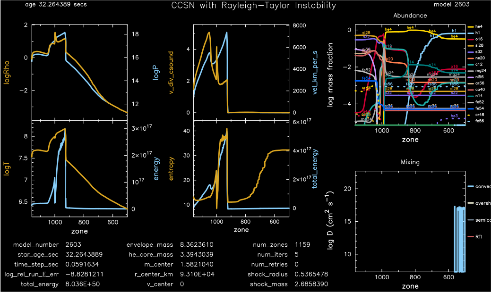

.. _ccsn_IIp:

********
ccsn_IIp
********

This test suite example builds a Type IIp supernova model, including Rayleigh-Taylor Instability mixing, for subsquent use in STELLA.

This test case has 8 parts and ``src/run_star_extras.f90`` is important. Click to see a larger view of a plot.

* Part 1 (``inlist_infall``) loads ``pre_ccsn.mod`` from ``make_pre_ccsn_IIp``. The evolution of the 11.7 MSun model with with cell center Riemann velocities (u) and a total energy of -9.4e50 erg continues util R_center drops below 400 km:

.. image:: ../../../star/test_suite/ccsn_IIp/docs/infall.svg
   :scale: 100%

* Part 2 (``inlist_end_infall``) continues the evolution for an additional 1e-5 sec using HLLC hydrodynamics:

.. image:: ../../../star/test_suite/ccsn_IIp/docs/end_infall.svg
   :scale: 100%

* Part 3 (``inlist_edep``) injects thermal energy into the inner 0.2 Msun until the model reaches a total energy of 8e50 erg:

* Part 4 (``inlist_shock_part1``) contnues the evolution until the outward bound shock reaches 1.83 Msun:

.. image:: ../../../star/test_suite/ccsn_IIp/docs/part1.svg
   :scale: 100%

* Part 5 (``inlist_shock_part2``) contnues the evolution until the outward bound shock reaches 2.68 Msun:

* Part 6 (``inlist_shock_part3``) contnues the evolution until the outward bound shock reaches 3.88 Msun:

* Part 7 (``inlist_shock_part4``) contnues the evolution until the outward bound shock reaches 11.64 Msun:

.. image:: ../../../star/test_suite/ccsn_IIp/docs/part4.svg
   :scale: 100%

* Part 8 (``inlist_shock_part5``) continues the approach to shock breakout, terminating when the shock reaches 11.70 Msun, and creating the ``mesa.abn`` and ``mesa.abn`` files for subsequent use with STELLA:

.. image:: ../../../star/test_suite/ccsn_IIp/docs/part5.svg
   :scale: 100%

pgstar commands used for the first 7 plots:

.. code-block:: console

 &pgstar

   file_white_on_black_flag = .true. ! white_on_black flags -- true means white foreground color on black background
   file_device = 'png'            ! png
   file_extension = 'png'

   !file_device = 'vcps'          ! postscript
   !file_extension = 'ps'

    pgstar_interval = 10

  pgstar_grid_title_disp = 1.8

  Mixing_ymin = 8
  Mixing_ymax = 22

  Profile_Panels_title(1) = ''
  Profile_Panels_xaxis_name(1) = 'mass'
  Profile_Panels_xaxis_reversed(1) = .false.

  Profile_Panels_yaxis_name(1, 1) = 'logRho'
  Profile_Panels_yaxis_name(1, 2) = 'logT'

  Profile_Panels_ymin(1, 1) = -101
  ! Profile_Panels_ymin(1, 2) = -10
  ! Profile_Panels_ymax(1, 2) = 0.3

  Profile_Panels_other_yaxis_name(1, 1) = 'logP'
  Profile_Panels_other_yaxis_name(1, 2) = 'energy'

  Profile_Panels_other_ymin(1, 1) = -101
  ! Profile_Panels_other_ymin(1, 2) = -12
  ! Profile_Panels_other_ymax(1, 2) = 0

  Profile_Panels_num_panels(1) = 2

  Profile_Panels_title(2) = ''
  Profile_Panels_xaxis_name(2) = 'mass'
  Profile_Panels_xaxis_reversed(2) = .false.

  Profile_Panels_num_panels(2) = 2
  Profile_Panels_yaxis_name(2, 1) = 'v_div_csound'
  Profile_Panels_yaxis_name(2, 2) = 'entropy'

  Profile_Panels_ymin(2, 1) = -101
  Profile_Panels_ymin(2, 2) = -101

  Profile_Panels_other_yaxis_name(2, 1) = 'vel_km_per_s'
  Profile_Panels_other_yaxis_name(2, 2) = 'total_energy'

  Profile_Panels_other_ymin(2, 1) = -101
  Profile_Panels_other_ymin(2, 2) = -101

  Text_Summary_txt_scale(1) = 5.5

  Text_Summary_num_rows(1) = 5
  Text_Summary_num_cols(1) = 3
  Text_Summary_name(1, 1, 1) = 'model_number'
  Text_Summary_name(1, 2, 1) = 'star_age_sec'
  Text_Summary_name(1, 3, 1) = 'time_step_sec'
  Text_Summary_name(1, 4, 1) = 'log_rel_run_E_err'
  Text_Summary_name(1, 5, 1) = 'total_energy'
  Text_Summary_name(1, 6, 1) = 'log_R'
  Text_Summary_name(1, 7, 1) = 'log_g'
  Text_Summary_name(1, 8, 1) = 'log_surf_cell_P'
  Text_Summary_name(1, 1, 2) = 'envelope_mass'
  Text_Summary_name(1, 2, 2) = 'he_core_mass'
  Text_Summary_name(1, 3, 2) = 'm_center'
  Text_Summary_name(1, 4, 2) = 'r_center_km'
  Text_Summary_name(1, 5, 2) = 'v_center'
  Text_Summary_name(1, 6, 2) = 'cz_top_mass'
  Text_Summary_name(1, 7, 2) = 'cz_bot_radius'
  Text_Summary_name(1, 8, 2) = 'cz_top_radius'
  Text_Summary_name(1, 1, 3) = 'num_zones'
  Text_Summary_name(1, 2, 3) = 'num_iters'
  Text_Summary_name(1, 3, 3) = 'num_retries'
  Text_Summary_name(1, 4, 3) = 'shock_radius'
  Text_Summary_name(1, 5, 3) = 'shock_mass'
  Text_Summary_name(1, 6, 3) = 'center c12'
  Text_Summary_name(1, 7, 3) = 'center n14'
  Text_Summary_name(1, 8, 3) = 'center o16'
  Text_Summary_name(1, 1, 4) = 'log_Lnuc'
  Text_Summary_name(1, 2, 4) = 'log_Lneu'
  Text_Summary_name(1, 3, 4) = 'log_LH'
  Text_Summary_name(1, 4, 4) = 'log_LHe'
  Text_Summary_name(1, 5, 4) = 'log_LZ'
  Text_Summary_name(1, 6, 4) = 'num_zones'
  Text_Summary_name(1, 7, 4) = 'num_retries'
  Text_Summary_name(1, 8, 4) = ''

  Grid_title(2) = 'CCSN with Rayleigh-Taylor Instability'
  Grid_plot_name(2, 1) = 'Profile_Panels1'
  Grid_plot_name(2, 2) = 'Text_Summary1'
  Grid_plot_name(2, 3) = 'Abundance'
  Grid_plot_name(2, 4) = 'Mixing'
  Grid_plot_name(2, 5) = 'Profile_Panels2'
  Grid_plot_row(2, 1) = 1
  Grid_plot_row(2, 2) = 7
  Grid_plot_row(2, 3) = 1
  Grid_plot_row(2, 4) = 5
  Grid_plot_row(2, 5) = 1
  Grid_plot_rowspan(2, 1) = 6
  Grid_plot_rowspan(2, 2) = 2
  Grid_plot_rowspan(2, 3) = 4
  Grid_plot_rowspan(2, 4) = 4
  Grid_plot_rowspan(2, 5) = 6
  Grid_plot_col(2, 1) = 1
  Grid_plot_col(2, 2) = 1
  Grid_plot_col(2, 3) = 5
  Grid_plot_col(2, 4) = 5
  Grid_plot_col(2, 5) = 3
  Grid_plot_colspan(2, 1) = 2
  Grid_plot_colspan(2, 2) = 4
  Grid_plot_colspan(2, 3) = 3
  Grid_plot_colspan(2, 4) = 3
  Grid_plot_colspan(2, 5) = 2
  Grid_plot_pad_left(2, 1) = -0.02
  Grid_plot_pad_left(2, 2) = -0.08
  Grid_plot_pad_left(2, 3) = 0.14
  Grid_plot_pad_left(2, 4) = 0.14
  Grid_plot_pad_left(2, 5) = 0.06
  Grid_plot_pad_right(2, 1) = 0.07
  Grid_plot_pad_right(2, 2) = -0.12
  Grid_plot_pad_right(2, 3) = 0
  Grid_plot_pad_right(2, 4) = 0
  Grid_plot_pad_right(2, 5) = -0.01
  Grid_plot_pad_top(2, 1) = 0
  Grid_plot_pad_top(2, 2) = 0.08
  Grid_plot_pad_top(2, 3) = 0
  Grid_plot_pad_top(2, 4) = 0.06
  Grid_plot_pad_top(2, 5) = 0
  Grid_plot_pad_bot(2, 1) = 0
  Grid_plot_pad_bot(2, 2) = -0.04
  Grid_plot_pad_bot(2, 3) = 0.09
  Grid_plot_pad_bot(2, 4) = 0.03
  Grid_plot_pad_bot(2, 5) = 0
  Grid_txt_scale_factor(2, 1) = 0.65
  Grid_txt_scale_factor(2, 2) = 0.19
  Grid_txt_scale_factor(2, 3) = 0.65
  Grid_txt_scale_factor(2, 4) = 0.65
  Grid_txt_scale_factor(2, 5) = 0.65

  Grid_num_cols(2) = 7
  Grid_num_rows(2) = 8
  Grid_num_plots(2) = 5
  
  Grid_win_flag(2) = .true.
  Grid_win_width(2) = 15
  Grid_win_aspect_ratio(2) = 0.6
  
  Grid_file_flag(2) = .true.
  Grid_file_dir(2) = 'png'
  Grid_file_prefix(2) = 'test_'
  Grid_file_interval(2) = 100
  Grid_file_width(2) = 15
  Grid_file_aspect_ratio(2) = -1

  Profile_Panels_xaxis_name(1) = 'zone'
  Profile_Panels_xaxis_reversed(1) = .true.
  Profile_Panels_xmin(1) = 500
  Profile_Panels_xmax(1) = -101d0

  Profile_Panels_xaxis_name(2) = 'zone'
  Profile_Panels_xaxis_reversed(2) = .true.
  Profile_Panels_xmin(2) = 500
  Profile_Panels_xmax(2) = -101d0

  Mixing_xaxis_name = 'zone'
  Mixing_xaxis_reversed = .true.
  Mixing_xmin = 500
  Mixing_xmax = -101d0

  Abundance_xaxis_name = 'zone'
  Abundance_xaxis_reversed = .true.
  Abundance_xmin = 500
  Abundance_xmax = -101d0

 / ! end of pgstar namelist

pgstar commands used for the 8th plot:

.. code-block:: console

 &pgstar

   file_white_on_black_flag = .true. ! white_on_black flags -- true means white foreground color on black background
   file_device = 'png'            ! png
   file_extension = 'png'

   !file_device = 'vcps'          ! postscript
   !file_extension = 'ps'

    pgstar_interval = 1

  Abundance_xmin = -101

  Mixing_xmin = -101

  Profile_Panels_xmin(1) = -101

  Profile_Panels_yaxis_name(1, 1) = 'logT'
  Profile_Panels_yaxis_name(1, 2) = 'v_div_csound'

  Profile_Panels_ymin(1, 2) = 0
  Profile_Panels_ymax(1, 2) = -101

  Profile_Panels_other_yaxis_name(1, 1) = 'entropy'
  Profile_Panels_other_yaxis_name(1, 2) = 'csound'

  Profile_Panels_other_ymin(1, 2) = -101
  Profile_Panels_other_ymax(1, 2) = -101

  Profile_Panels_xmin(2) = -101

  Profile_Panels_yaxis_name(2, 1) = 'Abundance'
  Profile_Panels_yaxis_name(2, 2) = 'luminosity'

  Profile_Panels_ymin(2, 2) = -101

  Profile_Panels_other_yaxis_name(2, 2) = 'log_dr_div_cs'

  Profile_Panels_other_ymin(2, 2) = -101

  History_Track_title(1) = 'Breakout Light Curve'
  History_Track_xname(1) = 'star_age_hr'
  History_Track_yname(1) = 'log_L'
  History_Track_xaxis_label(1) = 'hours'
  History_Track_yaxis_label(1) = 'log L/L\d\(2281)'
  History_Track_reverse_xaxis(1) = .false.
  History_Track_reverse_yaxis(1) = .false.
  History_Track_log_xaxis(1) = .false.
  History_Track_log_yaxis(1) = .false.

  Text_Summary_name(1, 1, 1) = 'model_number'
  Text_Summary_name(1, 2, 1) = 'log_star_age'
  Text_Summary_name(1, 3, 1) = 'log_dt'
  Text_Summary_name(1, 4, 1) = 'log_L'
  Text_Summary_name(1, 5, 1) = 'log_Teff'
  Text_Summary_name(1, 6, 1) = 'log_R'
  Text_Summary_name(1, 7, 1) = 'log_g'
  Text_Summary_name(1, 8, 1) = 'log_surf_cell_P'
  Text_Summary_name(1, 1, 2) = 'star_mass'
  Text_Summary_name(1, 2, 2) = 'log_abs_mdot'
  Text_Summary_name(1, 3, 2) = 'he_core_mass'
  Text_Summary_name(1, 4, 2) = 'c_core_mass'
  Text_Summary_name(1, 5, 2) = 'cz_bot_mass'
  Text_Summary_name(1, 6, 2) = 'cz_top_mass'
  Text_Summary_name(1, 7, 2) = 'cz_bot_radius'
  Text_Summary_name(1, 8, 2) = 'cz_top_radius'
  Text_Summary_name(1, 1, 3) = 'log_cntr_T'
  Text_Summary_name(1, 2, 3) = 'log_cntr_Rho'
  Text_Summary_name(1, 3, 3) = 'log_center_P'
  Text_Summary_name(1, 4, 3) = 'center h1'
  Text_Summary_name(1, 5, 3) = 'v_div_csound_surf'
  Text_Summary_name(1, 6, 3) = 'center c12'
  Text_Summary_name(1, 7, 3) = 'center n14'
  Text_Summary_name(1, 8, 3) = 'center o16'
  Text_Summary_name(1, 1, 4) = 'log_Lnuc'
  Text_Summary_name(1, 2, 4) = 'log_Lneu'
  Text_Summary_name(1, 3, 4) = 'log_LH'
  Text_Summary_name(1, 4, 4) = 'log_LHe'
  Text_Summary_name(1, 5, 4) = 'log_LZ'
  Text_Summary_name(1, 6, 4) = 'num_zones'
  Text_Summary_name(1, 7, 4) = 'num_retries'
  Text_Summary_name(1, 8, 4) = ''

  Grid_plot_name(2, 1) = 'TRho_Profile'
  Grid_plot_name(2, 2) = 'HR'
  Grid_plot_name(2, 3) = 'TRho'
  Grid_plot_name(2, 4) = 'History_Track1'
  Grid_plot_name(2, 5) = 'Abundance'

   Grid_win_flag(2) = .true.

  Grid_file_flag(2) = .true.
  Grid_file_dir(2) = 'png'
  Grid_file_prefix(2) = 'test_'
  Grid_file_interval(2) = 100
  Grid_file_width(2) = 15
  Grid_file_aspect_ratio(2) = -1

 / ! end of pgstar namelist

Last-Updated: 03Jun2021 (MESA 5be9e57) by fxt

