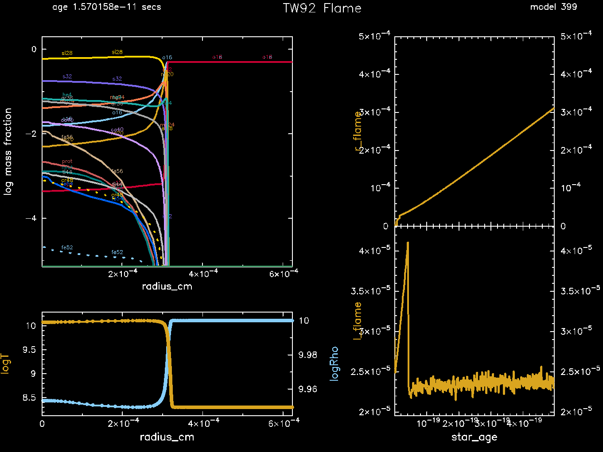

.. _conductive_flame:

****************
conductive_flame
****************

This test suite case models a conductively-propagated deflagration
wave ("flame") in a high-density, degenerate carbon-oxygen mixture.
It is similar to a calculation presented by |Timmes1992|.

.. warning::

   Careful modeling of the flame speed requires a much larger nuclear
   network than the 21 isotope network used in this test.
   |Timmes1992| use a 130 isotope network, |Chamulak2007| use a 430
   isotope network, and |Schwab2020| use a 495 isotope network.

Unlike most MESA calculations, this models a small sphere of material
(instead of an entire star).  The initial model is built in
``run_star_extras`` using the ``other_build_initial_model`` hook.  A
spatially uniform model with a given density, temperature, and
composition is constructed.  A small hot spot is then added at the
center of the model.  The properties of this initial model can be
controlled from the inlist.

.. literalinclude:: ../../../star/test_suite/conductive_flame/inlist_conductive_flame
   :start-after: ! use our own routine to build the model
   :lines: 1-11

The inner boundary is at r = 0.  The outer boundary has a fixed
temperature and a fixed pressure equal to the initial pressure of the
material.  This is achieved via the ``use_other_surface_PT`` hook.

After an initial transient, the entire flame structure, approximately
isobaric, propagates into the upstream fuel with a unique speed and
width.  The test succeeds if the flame successfully propagates through
half of the domain.

.. |Timmes1992| replace:: `Timmes & Woosley (1992) <https://ui.adsabs.harvard.edu/abs/1992ApJ...396..649T/abstract>`__

.. |Chamulak2007| replace:: `Chamulak et al. (2007) <https://ui.adsabs.harvard.edu/abs/2007ApJ...655L..93C/abstract>`__

.. |Schwab2020| replace:: `Schwab et al. (2020) <https://ui.adsabs.harvard.edu/abs/2020ApJ...891....5S/abstract>`__

Last-Updated: 2019-11-16 (mesa r12307) by Josiah Schwab

