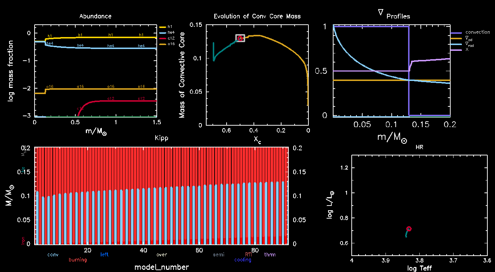

.. _conv_core_cpm:

*************
conv_core_cpm
*************

This test case evolves a 1.5 |Msun| star part of the way through
the main sequence with convective pre-mixing (CPM) enabled and checks that its convective
core has grown to an appropriate mass coordinate.

The model evolves until the core H mass fraction reaches 0.5.
It then checks that the convective core mass has grown to encompass
about 0.13 |Msun|. In other words, the top-middle panel in the pgstar
grid below must show that the red dot falls within the white box.
The gold curve in that panel shows the expected evolution of the convective
core if the model continued to evolve beyond its stopping condition.

Last-Updated: 2023-03-14 (MESA d6bbdf4) by Evan Bauer
