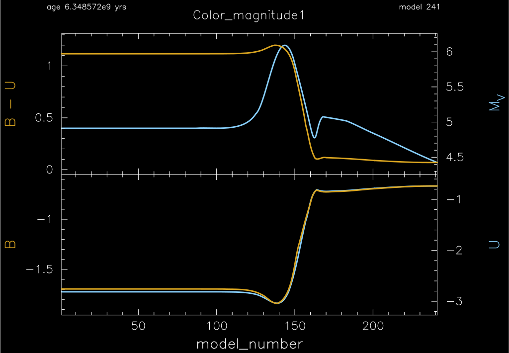
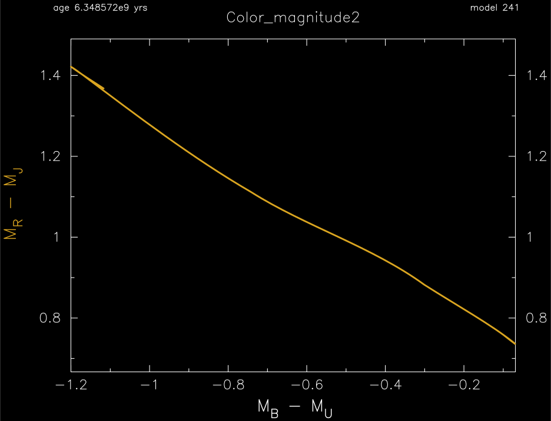
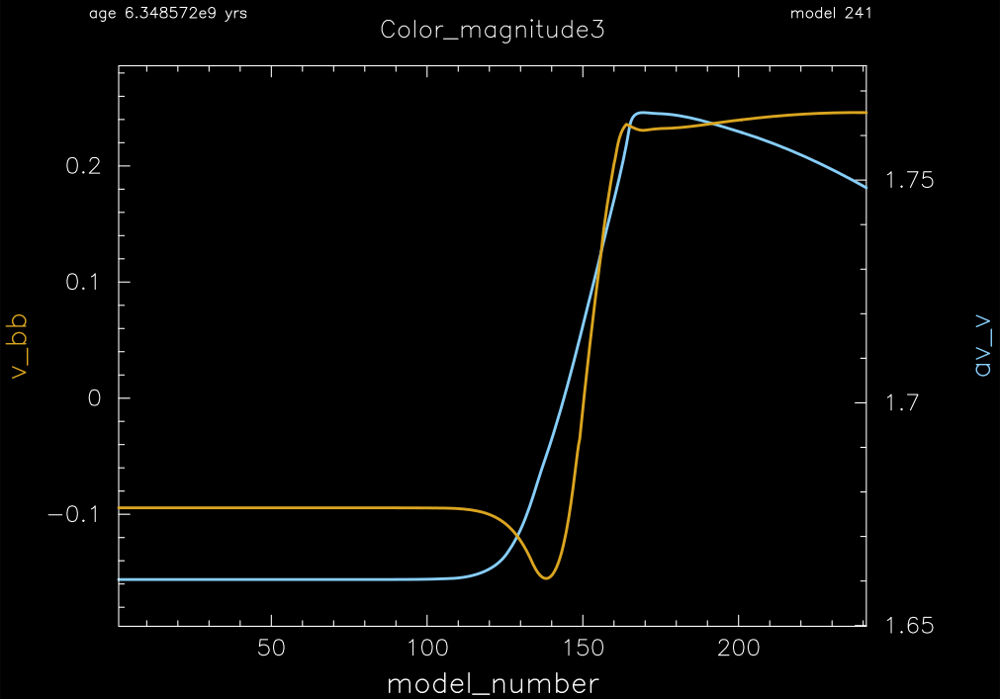

.. _custom_colors:

*************
custom_colors
*************

This test suite example shows how to use user-defined color filter and extinction files.

This test case has 1 part. Click to see a larger view of a plot.

* Part 1 (``inlist_1.0``) builds a 1.0 Msun, Z=0.02 metallicity, pre-main sequence model and evolves until core hydrogen depletion (mass fraction h1 < 0.1). This example loads the default |LCB98| color filter ''lcb98cor.dat'', a custom color filter ``data/blackbody_bc_v.txt`` which in this case is blackbody V band filter, and a custom extinction color correction file ``data/fake_av_v.txt``. Example color-color, color-magnitude, magnitude-color and magnitude-magnitude plots::

pgstar commands used for the first 7 plots:

.. code-block:: console

 &pgstar

   file_white_on_black_flag = .true. ! white_on_black flags -- true means white foreground color on black background
   file_device = 'png'            ! png
   file_extension = 'png'

   !file_device = 'vcps'          ! postscript
   !file_extension = 'ps'

    pgstar_interval = 1

 !# Color Magnitude Panels
   ! Plots either color-color, color-magnitude, magnitude-color or magnitude-magnitude

      !### Color_magnitude1

         Color_magnitude1_win_flag = .true.

         Color_magnitude1_win_width = 15
         Color_magnitude1_win_aspect_ratio = 0.75 ! aspect_ratio = height/width

         Color_magnitude1_xleft = 0.15
         Color_magnitude1_xright = 0.85
         Color_magnitude1_ybot = 0.15
         Color_magnitude1_ytop = 0.85
         Color_magnitude1_txt_scale = 1.0
         Color_magnitude1_title = 'Color_magnitude1'

         ! setup default
         Color_magnitude1_num_panels = 2

         ! Plots xaxis1-xaxis2 leave xaxis2 blank if you only want to plot xaxis1.
         Color_magnitude1_xaxis1_name = 'model_number'
         Color_magnitude1_xaxis2_name = ''

         ! Plots yaxis1-yaxis2 leave yaxis2 blank if you only want to plot yaxis1.
         Color_magnitude1_yaxis1_name(1) = 'bc_B'
         Color_magnitude1_yaxis2_name(1) = 'bc_U'
         Color_magnitude1_yaxis_reversed(1) = .false.
         
         ! Plots `other_yaxis1-other_yaxis2` leave `other_yaxis2` blank if you only want to plot `other_yaxis1`.
         Color_magnitude1_other_yaxis1_name(1) = 'abs_mag_V'
         Color_magnitude1_other_yaxis2_name(1) = ''
         Color_magnitude1_other_yaxis_reversed(1) = .true.

         Color_magnitude1_yaxis1_name(2) = 'bc_B'
         Color_magnitude1_other_yaxis1_name(2) = 'bc_U'
         
         ! Enables calling a subroutine to add extra information to a plot
         ! see `$MESA_DIR/star/other/pgstar_decorator.f90`
         Color_magnitude1_use_decorator = .true.

         ! file output
         Color_magnitude1_file_flag = .true.
         Color_magnitude1_file_dir = 'png'
         Color_magnitude1_file_prefix = 'Color_magnitude1_'
         Color_magnitude1_file_interval = 5 ! output when `mod(model_number,Color_magnitude1_file_interval)==0`
         Color_magnitude1_file_width = -1 ! (inches) negative means use same value as for window
         Color_magnitude1_file_aspect_ratio = -1 ! negative means use same value as for window

      !### Color_magnitude2

         Color_magnitude2_win_flag = .true.

         Color_magnitude2_win_width = 15
         Color_magnitude2_win_aspect_ratio = 0.75 ! aspect_ratio = height/width

         Color_magnitude2_xleft = 0.15
         Color_magnitude2_xright = 0.85
         Color_magnitude2_ybot = 0.15
         Color_magnitude2_ytop = 0.85
         Color_magnitude2_txt_scale = 1.0
         Color_magnitude2_title = 'Color_magnitude2'

         ! Plots xaxis1-xaxis2 leave xaxis2 blank if you only want to plot xaxis1.
         Color_magnitude2_xaxis1_name = 'abs_mag_B'
         Color_magnitude2_xaxis2_name = 'abs_mag_U'

         ! Plots yaxis1-yaxis2 leave yaxis2 blank if you only want to plot yaxis1.
         Color_magnitude2_yaxis1_name(1) = 'abs_mag_R'
         Color_magnitude2_yaxis2_name(1) = 'abs_mag_J'

         ! setup default
         Color_magnitude2_num_panels = 1
         ! file output
         Color_magnitude2_file_flag = .true.
         Color_magnitude2_file_dir = 'png'
         Color_magnitude2_file_prefix = 'Color_magnitude2_'
         Color_magnitude2_file_interval = 5 ! output when `mod(model_number,Color_magnitude2_file_interval)==0`
         Color_magnitude2_file_width = -1 ! (inches) negative means use same value as for window
         Color_magnitude2_file_aspect_ratio = -1 ! negative means use same value as for window

      !### Color_magnitude3

         Color_magnitude3_win_flag = .true.

         Color_magnitude3_win_width = 15
         Color_magnitude3_win_aspect_ratio = 0.75 ! aspect_ratio = height/width

         Color_magnitude3_xleft = 0.15
         Color_magnitude3_xright = 0.85
         Color_magnitude3_ybot = 0.15
         Color_magnitude3_ytop = 0.85
         Color_magnitude3_txt_scale = 1.0
         Color_magnitude3_title = 'Color_magnitude3'

         ! Plots xaxis1-xaxis2 leave xaxis2 blank if you only want to plot xaxis1.
         Color_magnitude3_xaxis1_name = 'model_number'
         Color_magnitude3_xaxis2_name = ''

         ! Plots yaxis1-yaxis2 leave yaxis2 blank if you only want to plot yaxis1.
         Color_magnitude3_yaxis1_name(1) = 'bc_v_bb'
         
         Color_magnitude3_other_yaxis1_name(1) = 'av_v'
         
         ! setup default
         Color_magnitude3_num_panels = 1
         ! file output
         Color_magnitude3_file_flag = .true.
         Color_magnitude3_file_dir = 'png'
         Color_magnitude3_file_prefix = 'Color_magnitude3_'
         Color_magnitude3_file_interval = 5 ! output when `mod(model_number,Color_magnitude3_file_interval)==0`
         Color_magnitude3_file_width = -1 ! (inches) negative means use same value as for window
         Color_magnitude3_file_aspect_ratio = -1 ! negative means use same value as for window

 / ! end of pgstar namelist

.. |LCB98| replace:: `Lejeune, Cuisinier, & Buser (1998) <https://ui.adsabs.harvard.edu/abs/1998A%26AS..130...65L/abstract>`__

Last-Updated: 05Jun2021 (MESA 5be9e57) by fxt

