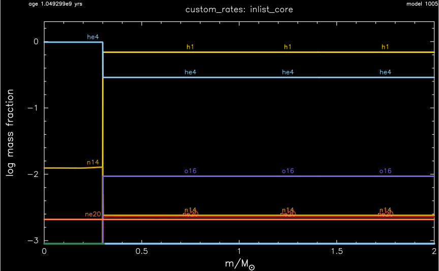
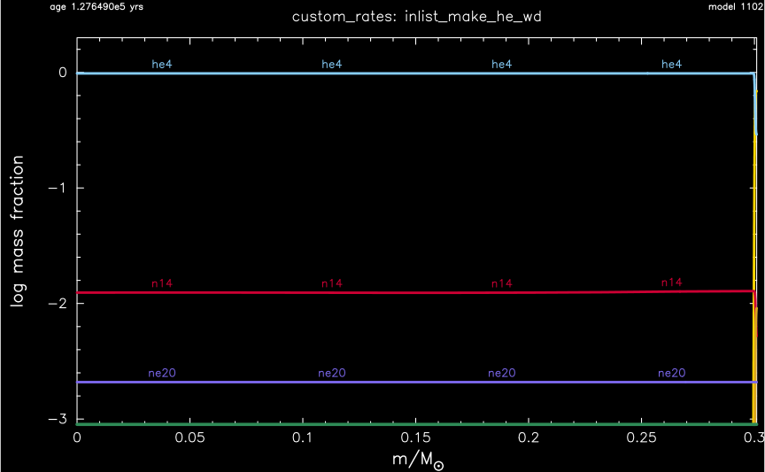
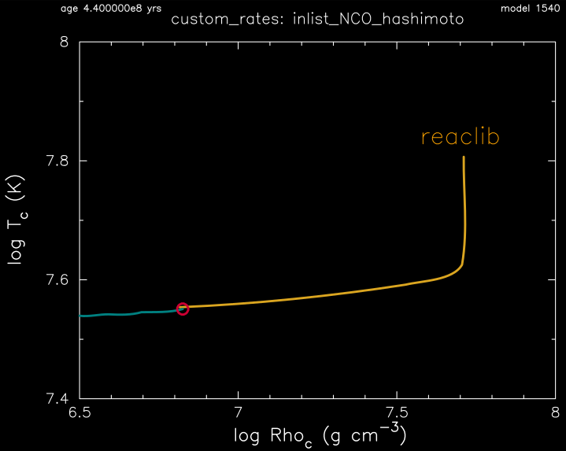
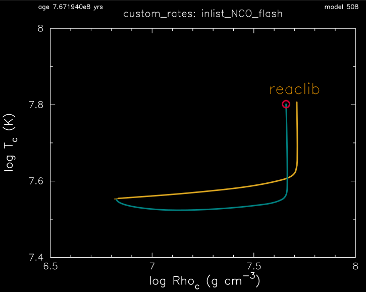
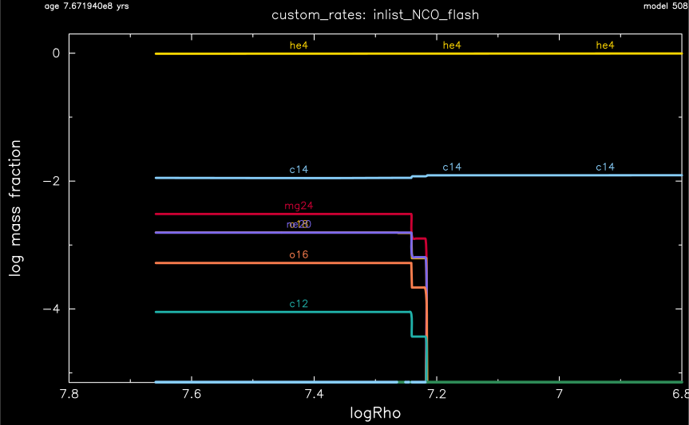

.. _custom_rates:

************
custom_rates
************

This test suite case checks the use of custom nuclear reaction rates in an accreting 0.3 Msun helium white dwarf model.

This test case has 5 parts. Click to see a larger view of a plot.

* Part 1 (``inlist_core``) builds a 2.0 Msun, Z=0.02 metallicity, pre-main sequence model and evolves until the helium core reaches 0.3 Msun:

* Part 2 (``inlist_make_he_wd``) removes the outer 1.7 Msun by gradually changing the total mass to 0.3 Msun by a wind:

* Part 3 (``inlist_cool``) continues the evolution until the central temperature cools to log10(T/K) = 7.43.

* Part 4 (``inlist_NCO_hashimoto``) loads the custom reaction rates, including those from |Hash86|, begins accreting mass at 1e-9 Msun/year, and continues the evolution to just before the nitrogen-carbon-oxygen (NCO) driven flash:

* Part 5 (``inlist_NCO_flash``) continues the evolution and terminates when nuclear burning NCO runaway causes the temperature to exceed log10(T/K) = 7.8. See |BSB17| for a science application. The evolution one would get by using the default JINA reaclib rates (yellow curve) instead of the custom rates (green curve) :

pgstar commands used for the first 7 plots:

.. code-block:: console

 &pgstar

   file_white_on_black_flag = .true. ! white_on_black flags -- true means white foreground color on black background
   file_device = 'png'            ! png
   file_extension = 'png'

   !file_device = 'vcps'          ! postscript
   !file_extension = 'ps'

    pgstar_interval = 10

      Abundance_win_flag = .true.

     Abundance_win_width = 12
     Abundance_win_aspect_ratio = 0.618 ! golden ratio

     Abundance_xleft = 0.10
     Abundance_xright = 0.99
     Abundance_ybot = 0.10
     Abundance_ytop = 0.91

     Abundance_title = 'custom_rates'

  ! for before the onset of NCO flash
     Abundance_num_isos_to_show = 7
     Abundance_which_isos_to_show(1)  = 'h1'
     Abundance_which_isos_to_show(2)  = 'he3'
     Abundance_which_isos_to_show(3)  = 'he4'
     Abundance_which_isos_to_show(4)  = 'c12'
     Abundance_which_isos_to_show(5)  = 'n14'
     Abundance_which_isos_to_show(6)  = 'o16'
     Abundance_which_isos_to_show(7)  = 'ne20'

     num_abundance_line_labels = 4
     Abundance_line_txt_scale_factor = 1.0
     Abundance_legend_max_cnt = 0
     Abundance_legend_txt_scale_factor = 0.6

     Abundance_xaxis_name = 'mass' 
     Abundance_xaxis_reversed = .false.
     Abundance_xmin = 0.0 
     Abundance_xmax = -101d0 

     Abundance_log_mass_frac_min = -3.0 
     Abundance_log_mass_frac_max =  0.3

 ! for the NCO flash parts
      Abundance_xaxis_name = 'logRho'
      Abundance_xaxis_reversed = .true.
      Abundance_xmin = 6.8
      Abundance_xmax = 7.8

     Abundance_file_flag = .true.
     Abundance_file_dir = 'png'
     Abundance_file_prefix = 'abund_'
     Abundance_file_interval = 100000  ! output when mod(model_number,file_interval)==0
     Abundance_file_width = 12        ! (inches) negative means use same value as for window
      

      TRho_win_flag = .true.
      TRho_win_width = 12
      TRho_win_aspect_ratio = 0.75 ! aspect_ratio = height/width

      TRho_xleft = 0.15
      TRho_xright = 0.85
      TRho_ybot = 0.15
      TRho_ytop = 0.85
      TRho_txt_scale = 1.0
      TRho_title = 'custom_rates'

      TRho_logT_min = 7.4 ! only used if /= -101d0
      TRho_logT_max = 8.0 ! only used if /= -101d0
      TRho_logRho_min = 6.5 ! only used if /= -101d0
      TRho_logRho_max = 8.0 ! only used if /= -101d0

      TRho_logT_margin = 0.1
      TRho_logRho_margin = 0.1
      TRho_logRho_dlogRho_min = -1
      TRho_logT_dlogT_min = -1

      TRho_step_min = -1 ! only plot models with model number >= this
      TRho_step_max = 999999 ! only plot models with model number <= this

      show_TRho_annotation1 = .true.

      annotation1_ci = 8 ! color index
      annotation1_ch = 2.0 ! character height
      annotation1_lw = 1 ! line width
      annotation1_cf = 1 ! character font (1=sans serif, 2=roman, 3=italic, 4=script)
      annotation1_side = 'T' ! T, B, L, or R
      annotation1_disp = -4 ! displacement perpendicular to axis
      annotation1_coord = 0.8 ! fractional location along axis
      annotation1_fjust = 0.5 ! 0 => left justified, 0.5 => centered, 1 => right justified
      annotation1_text = 'reaclib'

      show_TRho_annotation2 = .false.
      show_TRho_annotation3 = .false.

      TRho_fname = 'TRho-unmodified.data' ! file name for extra TRho data

      TRho_file_flag = .true.
      TRho_file_dir = 'png'
      TRho_file_prefix = 'trho_'
      TRho_file_interval = 100000 ! output when mod(model_number,TRho_file_interval)==0
      TRho_file_width = -1 ! (inches) negative means use same value as for window
      TRho_file_aspect_ratio = -1 ! negative means use same value as for window

 / ! end of pgstar namelist

.. |BSB17| replace:: `Bauer, Schwab, Bildsten (2017) <https://ui.adsabs.harvard.edu/abs/2017ApJ...845...97B/abstract>`__

.. |Hash86| replace:: `Hashimoto et al (1986) <https://ui.adsabs.harvard.edu/abs/1986ApJ...307..687H/abstract>`__

Last-Updated: 06Jun2021 (MESA 5be9e57) by fxt

