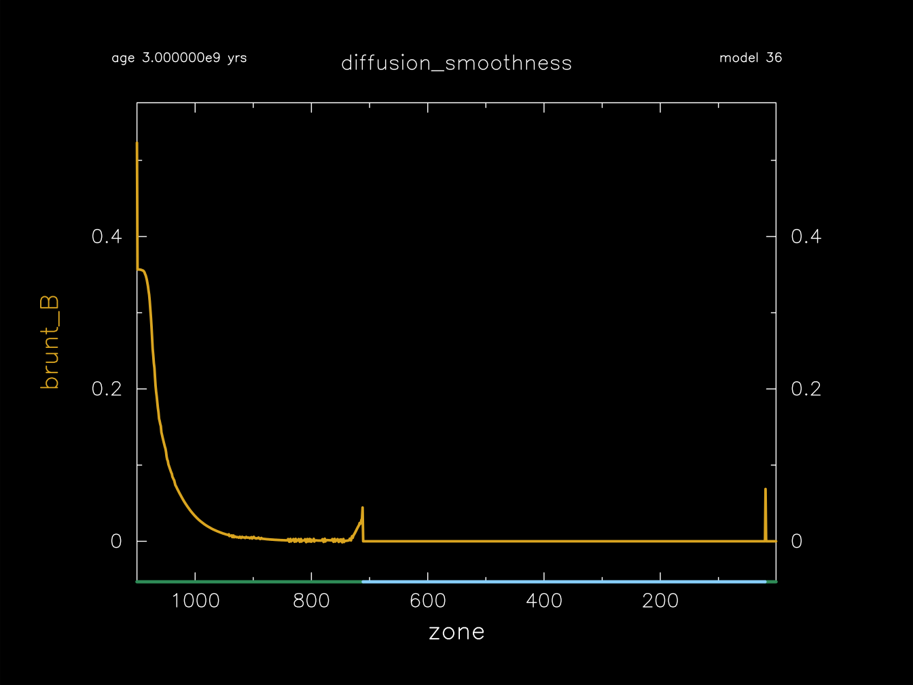

.. _diffusion_smoothness:

********************
diffusion_smoothness
********************

This test suite case checks that element diffusion produces a sufficiently smooth Brunt profile.

This test case has 2 part2. Click to see a larger view of a plot.

* Part 1 (``inlist_zams``) builds a 1.0 |Msun|, Z=0.02 metallicity, main-sequence model.

* Part 2 (``inlist_diffusion_smoothness``) activates element diffusion and continues the evolution for 3e9 years. The ``run-star_extras.f90`` then checks that the Brunt profile is sufficiently smooth in the central portion of the model.

pgstar commands used for the plot:

.. literalinclude:: ../../../star/test_suite/diffusion_smoothness/inlist_diffusion_smoothness
  :language: console
  :start-at: &pgstar
  :end-at: ! end of pgstar namelist

Last-Updated: 06Jun2021 (MESA 5be9e57) by fxt

Last-Run: 22Oct2024 (MESA 9b2017ca) by pmocz on C916PXT6XW in 80 seconds using 8 threads.
