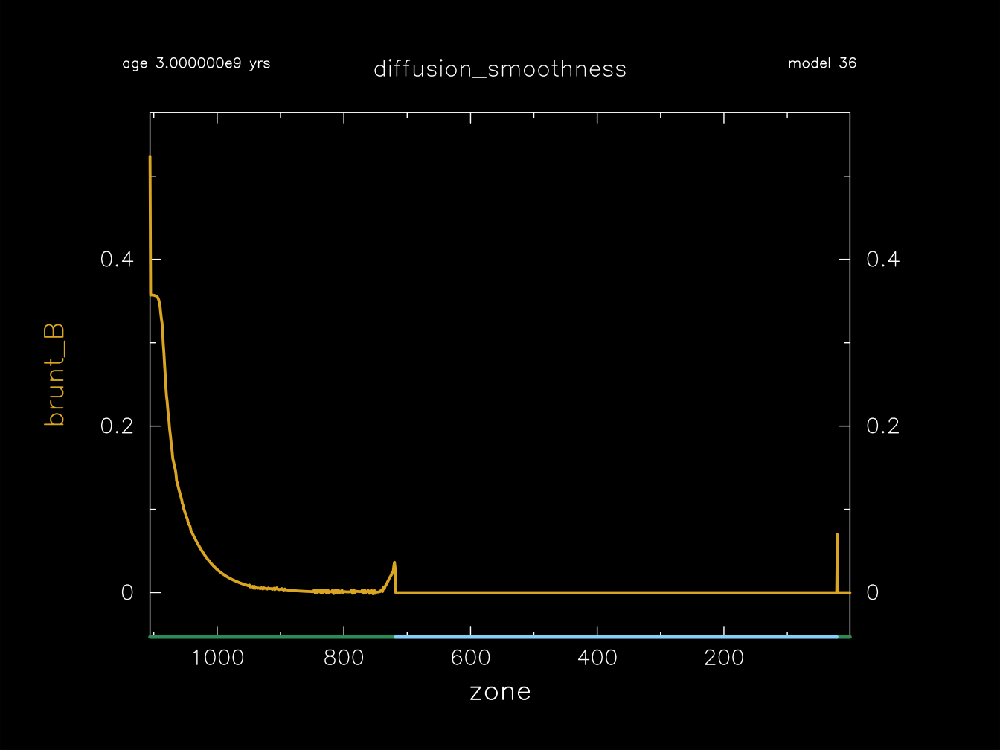

.. _diffusion_smoothness:

********************
diffusion_smoothness
********************

This test suite case checks that element diffusion produces a sufficiently smooth Brunt profile.

This test case has 2 part2. Click to see a larger view of a plot.

* Part 1 (``inlist_zams``) builds a 1.0 Msun, Z=0.02 metallicity, main-sequence model.

* Part 2 (``inlist_diffusion_smoothness``) activates element diffusion and continues the evolution for 3e9 years. The ``run-star_extras.f90`` then checks that the Brunt profile is sufficiently smooth in the central portion of the model.

pgstar commands used for the plot:

.. code-block:: console

 &pgstar

   file_white_on_black_flag = .true. ! white_on_black flags -- true means white foreground color on black background
   file_device = 'png'            ! png
   file_extension = 'png'

   !file_device = 'vcps'          ! postscript
   !file_extension = 'ps'

    pgstar_interval = 1

 ! Brunt B profile
    Profile_Panels1_win_flag = .true.
    Profile_Panels1_win_width = 14
    Profile_Panels1_show_grid = .false
    Profile_Panels1_title = 'diffusion_smoothness'

    Profile_Panels1_xaxis_name = 'zone'
    Profile_Panels1_xmin = -101d0
    Profile_Panels1_xmax = -101d0
    Profile_Panels1_xaxis_reversed = .true.
    Profile_Panels1_show_mix_regions_on_xaxis = .true.

    Profile_Panels1_num_panels = 1
    Profile_Panels1_yaxis_name(1) = 'brunt_B'
    Profile_Panels1_ymin(:) = -101d0
    Profile_Panels1_ymax(:) = -101d0
    Profile_Panels1_other_yaxis_name(1) = ''

    Profile_Panels1_file_flag = .true.
    Profile_Panels1_file_dir = 'png'
    Profile_Panels1_file_prefix = 'brunt_'
    Profile_Panels1_file_interval = 10000
    Profile_Panels1_file_width = 14      

 / ! end of pgstar namelist

Last-Updated: 06Jun2021 (MESA 5be9e57) by fxt

