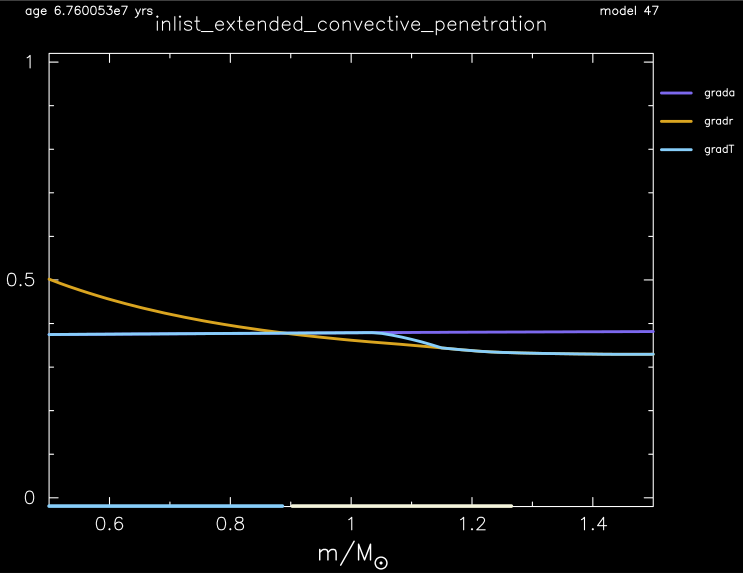
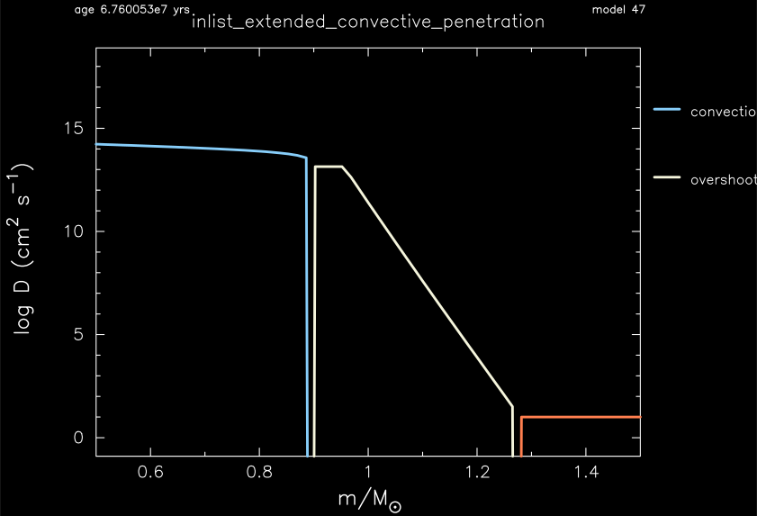

.. _extended_convective_penetration:

*******************************
extended_convective_penetration
*******************************

This test case checks the implementation of the extended convective penetration prescription for core boundary mixing.

This test case has 2 parts. Click to see a larger view of a plot.

* Part 1 (``inlist_zams``) builds a 5.0 Msun, Z=0.02 metallicity, pre-main sequence model and evolves it to the main sequence.

* Part 2 (``inlist_extended_convective_penetration``) continues the evolution until the hydrogen mass fraction drops below 0.4 Msun. The mixing types and temperature gradients are then checked at 4 points in the model:

.. code-block:: console

                                mixing type at 0.8 Msun                         1                         1                         1
                               mixing type at 0.95 Msun                         2                         2                         2
                                mixing type at 1.1 Msun                         2                         2                         2
                                mixing type at 1.5 Msun                         7                         7                         7

                    grada fraction of gradT at 1.1 Msun    4.5164690641019917D-01    1.0000000000000001D-01    9.0000000000000002D-01

                                      gradT at 0.8 Msun    3.7728203576441710D-01    3.7621664244426162D-01    3.7821664244426162D-01
                                     gradT at 0.95 Msun    3.7844578815081442D-01    3.7738177282197527D-01    3.7938177282197527D-01
                                      gradT at 1.1 Msun    3.6352870022789374D-01    3.6239798159685188D-01    3.6439798159685188D-01
                                      gradT at 1.5 Msun    3.2944837781563019D-01    3.2844837781563019D-01    3.3044837781563019D-01

                                      Dmix at 0.95 Msun    1.3893277158698289D+13    1.3198613300763373D+13    1.4587941016633205D+13
                                       Dmix at 1.1 Msun    3.8374677262126133D+07    1.0000000000000000D+04    1.3893277158698288D+11

 All values are within tolerances

                                              star_mass    1.3594434969402300D+01    1.2500000000000000D+01    1.4000000000000000D+01
                             log total_angular_momentum    5.1715669926154646D+01    5.0000000000000000D+01    5.2500000000000000D+01
                                       log center_omega   -3.6544135314663877D+00   -5.0000000000000000D+00   -3.0000000000000000D+00
                                      log he_core_omega   -3.8384987279876719D+00   -5.0000000000000000D+00   -3.0000000000000000D+00
                                           he_core_mass    4.3637120754430354D+00    3.7000000000000002D+00    4.5000000000000000D+00
                                          surface j_rot    1.8118707631236759D+01    1.7000000000000000D+01    1.9000000000000000D+01
                                          surface v_rot    4.3973127251833821D-01    2.0000000000000001D-01    5.9999999999999998D-01

                               avg from 3.0 to 3.4 Msun
                                                   logT    7.8701272702080942D+00    7.5000000000000000D+00    8.0999999999999996D+00
                                                 logRho    2.1496257586049281D+00    1.0000000000000000D+00    3.0000000000000000D+00
                                              log j_rot    1.6534742503463203D+01    1.5800000000000001D+01    1.6800000000000001D+01
                                                   D_ES    5.2149802632259092D+00    3.5000000000000000D+00    6.5000000000000000D+00
                                                   D_ST    6.8331912334335545D+00    1.0000000000000000D+00    1.0000000000000000D+01
                                                  nu_ST    1.0769419816211398D+01    9.0999999999999996D+00    1.1900000000000000D+01

where the number in the second column is the value from running the test case,
the number in the second column is the allowed lower bound, and
the number in the second column is the allowed upper bound.

At 0.8 Msun, we expect to be inside the convective core, and hence to have convective mixing with an adiabatic temperature gradient
(:math:`\nabla_T = \nabla_{ad}`). 

At 0.95 Msun, we should be in the convective penetrative part of the core boundary mixing region. 
So we expect the mixing type to be overshoot, and the temperature gradient to be adiabatic. Here, we also check if the mixing coefficient 
equals the one at the convective boundary, to check if the coefficient behaves step-like in this region. 

At 1.1 Msun, we expect to be in the exponentially decaying overshoot region, where the temperature gradient is making a gradual switch between 
the radiative and adiabatic gradients, :math:`\nabla_T = f\nabla_{ad} + (1-f)\nabla_{rad}`, with :math:`f` the fraction of the
temperature gradient that is adiabatic. Here, we also check that the fraction :math:`f` deviates from 1 and 0, so that :math:`\nabla_T`
is actually making a gradual switch, and that the mixing coefficient is between 1e4 cm :sup:`2`/s and 1% 
of the mixing at the core boundary, to confirm that it is decaying.

At 1.5 Msun, we should be outside the convective core and overshoot region, so that the mixing type is minimum diffusive mixing and that 
we have a radiative temperature gradient (:math:`\nabla_T = \nabla_{rad}`).

pgstar commands used for the plot:

.. code-block:: console

 &pgstar

   file_white_on_black_flag = .true. ! white_on_black flags -- true means white foreground color on black background
   file_device = 'png'            ! png
   file_extension = 'png'

   !file_device = 'vcps'          ! postscript
   !file_extension = 'ps'

    pgstar_interval = 10

    Mixing_win_flag = .true.
    Mixing_win_width = 12
    Mixing_win_aspect_ratio = 0.75
    Mixing_title = 'inlist_extended_convective_penetration'

    Mixing_xmin = 0.5
    Mixing_xmax = 1.5

    Mixing_file_flag = .true.
    Mixing_file_dir = 'png'
    Mixing_file_prefix = 'mixing_'
    Mixing_file_interval = 10000
    Mixing_file_width = -1

    Summary_Profile_win_flag = .true.
    Summary_Profile_win_width = 12
    Summary_Profile_win_aspect_ratio = 0.75
    Summary_Profile_title = 'inlist_extended_convective_penetration'
    
    Summary_Profile_num_lines = 3
    Summary_Profile_xmin = 0.5
    Summary_Profile_xmax = 1.5

    Summary_Profile_name(1) = 'grada'
    Summary_Profile_legend(1) = 'grada'  
    Summary_Profile_scaled_value(1)=.false.

    Summary_Profile_name(2) = 'gradr'
    Summary_Profile_legend(2) = 'gradr'  
    Summary_Profile_scaled_value(2)=.false.  

    Summary_Profile_name(3) = 'gradT'
    Summary_Profile_legend(3) = 'gradT'  
    Summary_Profile_scaled_value(3)=.false.  

    Summary_Profile_file_flag = .true.
    Summary_Profile_file_dir = 'png'
    Summary_Profile_file_prefix = 'grads_'
    Summary_Profile_file_interval = 10000
    Summary_Profile_file_width = -1

 / ! end of pgstar namelist

Last-Updated: 07Jun2021 (MESA 5be9e57) by fxt based on notes by Mathias Michielsen in Jan2020.

