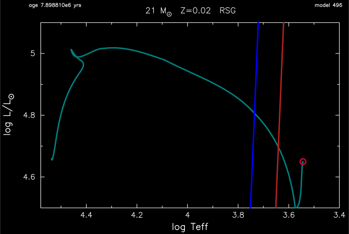

.. _gyre_in_mesa_rsg:

****************
gyre_in_mesa_rsg
****************

This test case checks the implementation of GYRE in MESA for a 21 Msun, Z=0.02 metallicity, model in the red supergiant regime.

This test case has 4 parts.

* Part 1 (``inlist_to_zams``) builds a 21.0 Msun, Z=0.02 metallicity, pre-main sequence model and evolves it to the main sequence.

* Part 2 (``inlist_to_near_pulses``) continues the evolution until effective temperature goes below log10(Teff/K) = 3.55.

* Part 3 (``inlist_to_pulse``) continues the evolution until luminosity exceeds log10(Lsun/L) = 5.04.

* Part 4 (``inlist_gyre_in_mesa_rsg``) continues the evolution for 20 timesteps. During the evolution the ``run_star_extras.f90`` calls GYRE, processes the GYRE output, and searches for a p-mode frequency of 2.323e-8 Hz (23.23 nanoHz). Close matches to this target frequency are reported in the terminal:

.. code-block:: console

   model   order           freq (Hz)             P (sec)             P (day)        growth (day)              growth    cycles to double
       2       1          0.2294E-07       43587742.2884            504.4878          13997.1188              0.0360             27.7452
 matched target frequency

 ...

   model   order           freq (Hz)             P (sec)             P (day)        growth (day)              growth    cycles to double
      20       1          0.2378E-07       42058426.0019            486.7873          14203.8864              0.0343             29.1788
 matched target frequency

Last-Updated: 11Jun2021 (MESA 5be9e57) by fxt.

