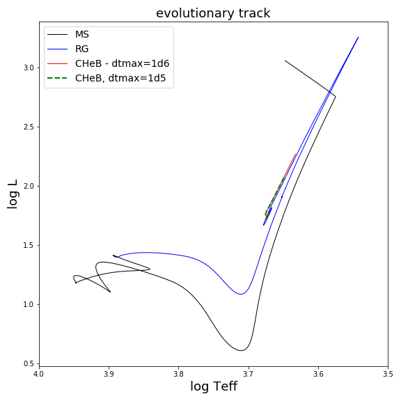
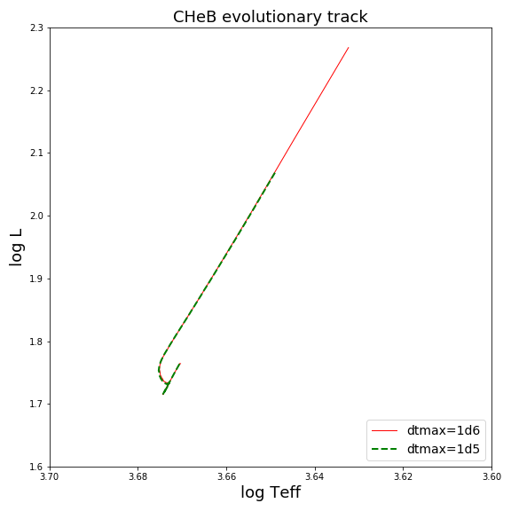
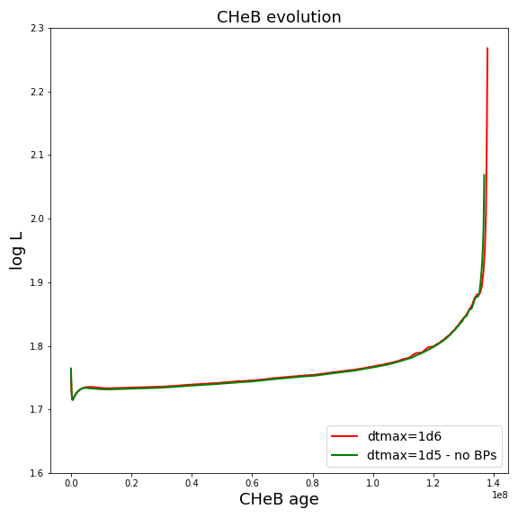
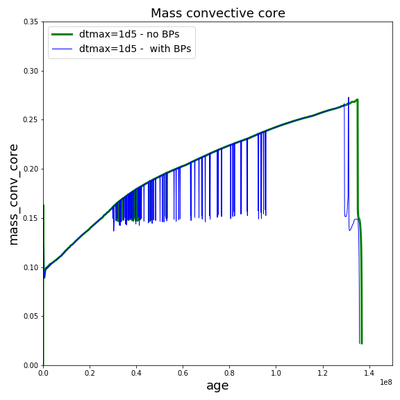
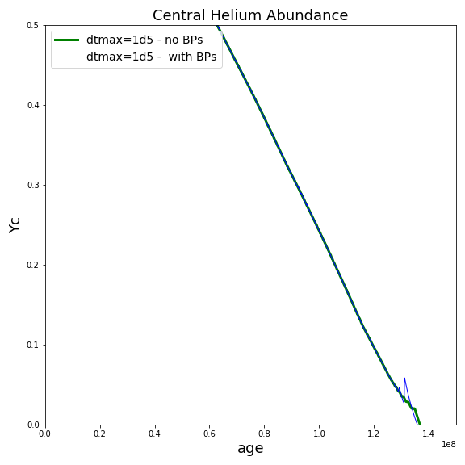

.. _hb_2M:

*****
hb_2M
*****

This test case shows a 2 solar mass stellar model evolving on the Horizontal Branch, from ZACHeB (Zero Age Core Helium Burning) to TACHeB (Terminal Age Core Helium Burning). The convective core boundary is determined using predictive mixing (see |MESA IV|). We also provide in this doc  figures comparing the results obtained using Predictive Mixing with results obtained using CPM (see |MESA V|) schemes (see section `Comparing results obtained with CPM and Predictive mixing`_ below).

Building the TAMS model
=======================

The initial model is created by evolving a model from the pre-main sequence to the end of the main sequence (TAMS) using the inlist ``ìnlist_to_TAMS`` , then from the TAMS to the ZACHeB using the inlist ``ìnlist_to_ZACHeB``.

Inlists for MESA are composed of three main sections labelled ``&star_job``, ``&controls``.
and ``&pgstar``. The ``&star_job`` section contains instructions about which MESA modules should be used, while the ``&controls`` section is where the star module options are specified.
The ``&pgstar`` section contains the commands for creating pgstar plots. See Josiah's doc for info on this section (TBD).

&star_job
---------

In the ``&star_job`` section of ``inlist_to_TAMS`` we start by specifying the starting model:
We do not start from a previously saved model; rather, we start the evolution from a pre-main sequence model, which is recommended. 

.. literalinclude:: ../../../star/test_suite/hb_2M/inlist_to_TAMS
   :start-after: &star_job
   :end-before: save_model

Then we specify the output. We save the final model, which will be the starting point of the next step, and call it ``2.0_tams.mod``. We also specify a ``history_columns_file`` different from the default one. The control  ``history_columns_file = 'history_columns.list'`` makes sure that the file ``history_columns.list`` sitting in the current work directory will be used instead of the default one.

.. literalinclude:: ../../../star/test_suite/hb_2M/inlist_to_TAMS
   :start-after: load_saved_model = .false.
   :end-before: initial_zfracs = 6 

Next, we specify the initial composition. There is no consensus yet on which is "the best" solar composition. By default, the initial composition in MESA is ``initial_zfracs = 3`` which corresponds to the `GS98 <https://link.springer.com/article/10.1023%2FA%3A1005161325181>`__ metal fraction. Here we want to use the more recent available solar composition given in `AGSS09 <https://www.annualreviews.org/doi/pdf/10.1146/annurev.astro.46.060407.145222>`__ , therefore we set ``initial_zfracs = 6``.
Since it is very important to use the opacity tables which are built using the solar composition we use, we also have to set the ``kappa_file_prefix`` to the 2009 solar composition (the default table corresponds to the gs98 composition).

.. literalinclude:: ../../../star/test_suite/hb_2M/inlist_to_TAMS
   :start-after: history_columns_file = 'history_columns.list' 
   :end-before: change_initial_net

We also have to choose a network of nuclear reactions. This network should be chosen according to the physics you want to study. Choosing a very comprehensive set of nuclear reactions when studying main sequence evolution is not necessary and will slow down the computation considerably. It would however be essential when studying advanced burning stages of evolution. The description of the available nuclear reactions networks in MESA is given in the README file in ``$MESA_DIR/data/net_data``. The default reactions network used by MESA is ``basic.net``.
Here we want to use a nuclear reactions network, called ``pp_and_cno_extras.net``, which provides a more complete coverage for hydrogen and helium burning.

.. literalinclude:: ../../../star/test_suite/hb_2M/inlist_to_TAMS
   :start-after:  kappa_file_prefix = 'a09'
   :end-before: /

We do not specify anything about the eos, which means we use the default one.

&controls
---------
The energy equation can be written in the dLdm or the dedt form in MESA (see `MESAV <https://arxiv.org/pdf/1903.01426.pdf>`__). As explained in `MESAV <https://arxiv.org/pdf/1903.01426.pdf>`__, using the dedt form leads to much better energy conservation. This is what we use here. Note that the default is dLdm. 

.. literalinclude:: ../../../star/test_suite/hb_2M/inlist_to_TAMS
   :start-after:  &controls
   :end-before: initial_mass

Next we specify the starting model, i.e., its initial mass, metallicity, and helium  mass fraction. Here we only specify M and Z; the helium content is by default 0.24 + 2Z. 

.. literalinclude:: ../../../star/test_suite/hb_2M/inlist_to_TAMS
   :start-after:  use_dedt
   :end-before: opacity

Because we will evolve the star through core helium burning, we want to use the Type2 opacities because they take into account extra C/O, important for this stage of stellar evolution. As explained in the controls_default file, when using Type 2 opacities you need to specify a base metallicity ``Z_base`` which gives the metal abundances previous to any CO enhancement. 

.. literalinclude:: ../../../star/test_suite/hb_2M/inlist_to_TAMS
   :start-after:  opacity controls
   :end-before: mixing

We now specify the non-default mixing parameters we want to use.
We will use the `Henyey theory of convection <http://articles.adsabs.harvard.edu/pdf/1965ApJ...142..841H>`__  with ``mixing_length_alpha=1.8``. We will use the Ledoux criterion and the "predictive mixing" scheme described in `MESAIV <https://arxiv.org/pdf/1710.08424.pdf>`__ to find the convective boundaries at the core and at the surface. 

.. literalinclude:: ../../../star/test_suite/hb_2M/inlist_to_TAMS
   :start-after:  mixing controls
   :end-before: num_cells_for_smooth_gradL_composition_term = 10

For all science projects, it is of the utmost importance to make sure that the stellar models calculated using MESA are numerically converged. See `Convergence study`_ section below.

.. warning:: Using the default timestep and grid size built in MESA does NOT guarantee that the models computed will be converged models. Similarly, using the timestep and grid size used in the test_suite cases does NOT guarantee that the models computed will be converged models, as the test_suite cases have to run fast to test MESA features, not to give science results.

For the purpose of this test_suite case we use a maximum limit on the timestep of 1d5 years, and we double the default number of grid points by using ``mesh_delta_coeff = 0.5``

.. literalinclude:: ../../../star/test_suite/hb_2M/inlist_to_TAMS
   :start-after:  timestep and grid
   :end-before: When to

In order to stop at the TAMS, which we here define as the time when the central hydrogen mass fraction drops below 1d-4, we use the following controls: 

.. literalinclude:: ../../../star/test_suite/hb_2M/inlist_to_TAMS
   :start-after:  When to stop
   :end-before: output controls

Finally we specify the output. We define a LOG directory for this part of the evolution, ``log_directory = 'LOGS_MS'``. We decide to save a photo every 100 steps (default is 50). We use 5 digits for the photo_name (default is 3). We write a profile every 10 steps (default is 50), and write a line in the history file every  step  (default is 5). We write info to the terminal every 10 steps (default is 1), and we output the log header to the terminal every 10 times we write step info (which is the default)

.. literalinclude:: ../../../star/test_suite/hb_2M/inlist_to_TAMS
   :start-after:  output controls
   :end-before: end of controls

Building the ZACHeB model
=========================

We now create a ZACHeB model which will be used as starting model for the CHeB evolution.

&star_job
---------

In the ``&star_job`` section of ``inlist_to_ZACHeB`` we start by specifying the starting model. We start from the TAMS model we created previously. We also specify the output.
We save the final model, which will be the starting point of the next step, and call it ``2.0_ZACHeB.mod``. Again we use our own ``history_columns_list`` file.

.. literalinclude:: ../../../star/test_suite/hb_2M/inlist_to_ZACHeB
   :start-after: &star_job
   :end-before: initial

We use the same metal fraction, opacity tables, and nuclear reactions network as in our PMS-to-TAMS evolution.

.. literalinclude:: ../../../star/test_suite/hb_2M/inlist_to_ZACHeB
   :start-after: history
   :end-before: end of star

&controls
---------

As before, we use the dedt form of the energy equation for good energy conservation.
In addition, our model will go through helium flash, which is very difficult to model. In order for MESA to pass the helium flash without going to extremely small timesteps, it is sometimes useful to relax some of the very strict convergence controls. This is in particular true when using the mixing controls we choose to use in this case. 

.. literalinclude:: ../../../star/test_suite/hb_2M/inlist_to_ZACHeB
   :start-after: &controls
   :end-before: initial_mass

The ``ìnitial_mass`` and ``ìnitial_z`` controls are not used when loading a saved model, but are reported in output as the inital values.
Again we specify that we use the Type 2 opacities with a base metallicity of 0.02. 
We use the same mixing controls as for the PMS-to-TAMS part of the evolution.

.. literalinclude:: ../../../star/test_suite/hb_2M/inlist_to_ZACHeB
   :start-after: flash
   :end-before: num_

We use the ``HB_limit`` control to find the beginning of the Horizontal Branch (our ZACheB model). 

.. literalinclude:: ../../../star/test_suite/hb_2M/inlist_to_ZACHeB
   :start-after: threshold_for_smooth_brunt_B = 0.1
   :end-before: max_

.. warning:: It is sometimes useful to specify a maximum number of models to avoid running out of space on your drive with runaway runs! Here we specify  ``max_model_number = 25000``

.. literalinclude:: ../../../star/test_suite/hb_2M/inlist_to_ZACHeB
   :start-after: HB
   :end-before: output

We specify the output. We define a LOG directory for this part of the evolution, ``log_directory = 'LOGS_POSTMS'``. We save a photo every 500 steps (default is 50). We use 5 digits for the photo_name (default is 3). We write a profile every 500 steps (default is 50), and write a line in the history file every step (default is 5). We write info to the terminal every 20 steps (default is 1), and we output the log header to the terminal every 100 times we write step info (which is the default)

.. literalinclude:: ../../../star/test_suite/hb_2M/inlist_to_ZACHeB
   :start-after: output controls
   :end-before: ! FOR DEBUGGING

Evolution along the CHeB
========================

The ``ìnlist_hb_2M`` inlist contains the controls to evolve the star from the ZACHeB (Zero Age Core Helium Burning) to the TACHeB (Terminal Age Core Helium Burning).

&star_job
---------

We start from the ZACHeB model calculated previously. We save the final model as ``final.mod``. We set the inital age to zero so that the age of the final model will give us the lifetime of the star on the CHeB. We also set the initial model number to zero.
Again, we use our own  ``history_columns_list`` file.
We use the same metal fraction, opacity tables, and nuclear reactions network as in our previous steps of evolution.

.. literalinclude:: ../../../star/test_suite/hb_2M/inlist_hb_2M
   :start-after: star_job
   :end-before: end of

&controls
---------

As before, we use the dedt form of the energy equation for good energy conservation.

We use the same mass, initial_z, opacities, and mixing controls as previously. Note that here, in order to prevent the occurence of breathing pulses at the end of the CHeB evolution, we use the control ``predictive_avoid_reversal(1)='he4'`` (see `MESAIV <https://arxiv.org/pdf/1710.08424.pdf>`__)..

.. literalinclude:: ../../../star/test_suite/hb_2M/inlist_hb_2M
   :start-after: controls
   :end-before: num_cells

We use timestep and grid controls that will ensure a fast run, but not necessarily convergence (see section `Convergence study`_ below).

.. literalinclude:: ../../../star/test_suite/hb_2M/inlist_hb_2M
   :start-after: threshold_for_smooth_brunt_B = 0.1
   :end-before: When to

We stop at the TACHeB which we define here as the time when the central helium abundance drops below 1d-4

.. literalinclude:: ../../../star/test_suite/hb_2M/inlist_hb_2M
   :start-after: When to
   :end-before: output controls

We specify the output. Here we use the default LOG directory, so we do not specify a name.

.. literalinclude:: ../../../star/test_suite/hb_2M/inlist_hb_2M
   :start-after: output controls
   :end-before: !num_trace_history_values = 2

Convergence study
=================

In this section we show results obtained using the controls of the test_suite inlist, as well as results obtained using a smaller allowed maximum timestep ``max_years_for_timestep=1d5``. We also show results obtained using the smaller timestep and allowing the breathing pulses to occur. We show that the timestep used in the test_case inlist does NOT produce converged results.

The following figures show the evolutionary track of the stellar model, from pre-main sequence to TACHeB, and a zoom on the CHeB evolutionary track, for two values for ``max_years_for_timestep``.

We also show the evolution of the luminosity as a function of time for those two cases. Even though the lifetime on the CHeB is almost identical in the two cases, the value of the luminosity at the TACHeB is clearly different, proving that using ``max_years_for_timestep=1d6`` does not produce converged results. In order to verify whether using ``max_years_for_timestep=1d5`` produces converged results, it is necessary to try with an even smaller timestep, but also using more mesh points by reducing "mesh_delta_coeff" and so on until nothing changes in the evolution. 

The following figures show the evolution of the convective core mass and central helium abundance using ``max_years_for_timestep=1d5``, with and without allowing the breathing pulses to occur. Allowing the breathing pulses to occur changes the element abundance profiles at the TACHeB and creates oscillations of the convective core mass.

Comparing results obtained with CPM and Predictive mixing
=========================================================

In the figure below we show the evolution of the convective core boundary and of the central helium abundance along the CHeB, using the CPM and the Predictive schemes.

