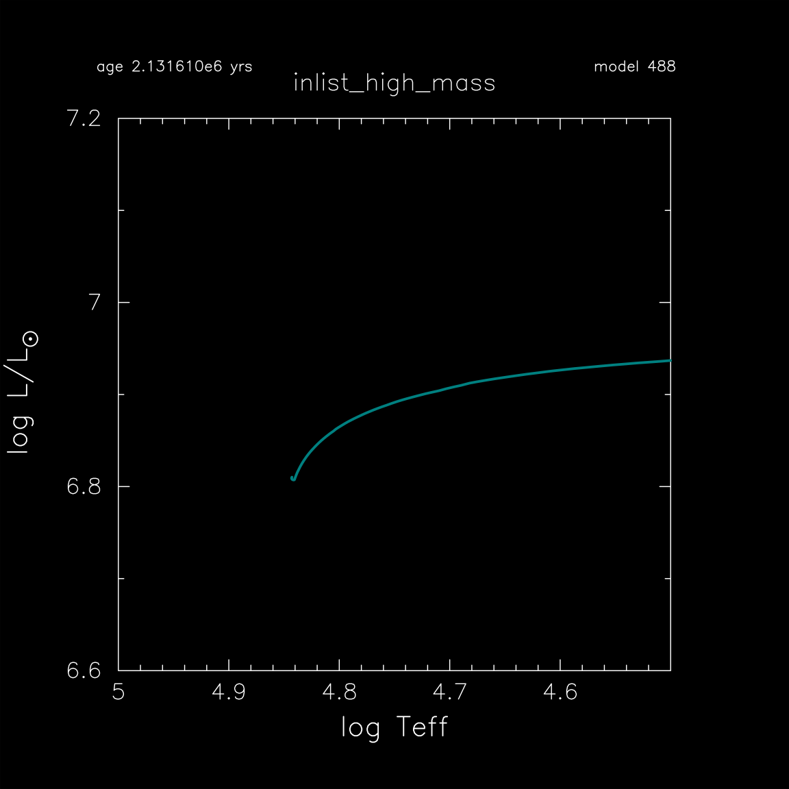

.. _high_mass:

*********
high_mass
*********

This test case checks the evolution of a 300 Msun, Z = 1e-4 metallicity, model through core hydrogen depletion.

This test case has 1 part. Click to see a larger version of a plot.

* Part 1 (``inlist_high_mass``) loads a 300 Msun, Z=1e-4 metallicity, zero-age main squence model and evolves it until the central hydrogen mass fraction drops belw 0.05:

.. image:: ../../../star/test_suite/high_mass/docs/abund_000488.svg
   :scale: 100%

pgstar commands used for the plots above:

.. code-block:: console

 &pgstar

  file_white_on_black_flag = .true. ! white_on_black flags -- true means white foreground color on black background
  !file_device = 'png'            ! png
  !file_extension = 'png'

  file_device = 'vcps'          ! postscript
  file_extension = 'ps'

   pgstar_interval = 10

  HR_win_flag = .true.
  HR_win_width = 12
  HR_win_aspect_ratio = 1.2 ! aspect_ratio = height/width
  HR_title = 'inlist_high_mass'

  HR_logT_min = 4.5
  HR_logT_max = 5.0
  HR_logL_min = 6.6
  HR_logL_max = 7.2

  HR_file_flag = .true.
  HR_file_dir = 'pgstar_out'
  HR_file_prefix = 'hr'
  HR_file_interval = 100 ! output when mod(model_number,HR_file_interval)==0
  HR_file_width = 15 ! negative means use same value as for window
  HR_file_aspect_ratio = -1 ! negative means use same value as for window

 Abundance_win_flag = .true.
 Abundance_win_width = 12
 Abundance_win_aspect_ratio = 1.2
 Abundance_title = 'inlist_high_mass'

 Abundance_num_isos_to_show = 7
 Abundance_which_isos_to_show(1)  = 'h1'
 Abundance_which_isos_to_show(2)  = 'he3'
 Abundance_which_isos_to_show(3)  = 'he4'
 Abundance_which_isos_to_show(4)  = 'c12'
 Abundance_which_isos_to_show(5)  = 'n14'
 Abundance_which_isos_to_show(6)  = 'o16'
 Abundance_which_isos_to_show(7)  = 'ne20'

 num_abundance_line_labels = 4
 Abundance_line_txt_scale_factor = 1.1
 Abundance_legend_max_cnt = 0
 Abundance_legend_txt_scale_factor = 1.0

 Abundance_xaxis_name = 'mass'
 Abundance_xaxis_reversed = .false.
 Abundance_xmin = 0.0
 Abundance_xmax = -101d0

 Abundance_log_mass_frac_min = -6.0
 Abundance_log_mass_frac_max =  0.3

 Abundance_file_flag = .true.
 Abundance_file_dir = 'pgstar_out'
 Abundance_file_prefix = 'abund_'
 Abundance_file_interval = 100 ! output when mod(model_number,HR_file_interval)==0
 Abundance_file_width = -1        ! (inches) negative means use same value as for window
 Abundance_file_aspect_ratio = -1 ! negative means use same value as for window

 / ! end of pgstar namelist

Last-Updated: 12Jun2021 (MESA 5be9e57) by fxt.

