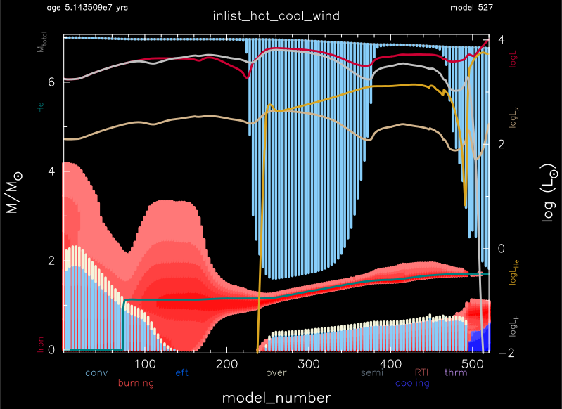
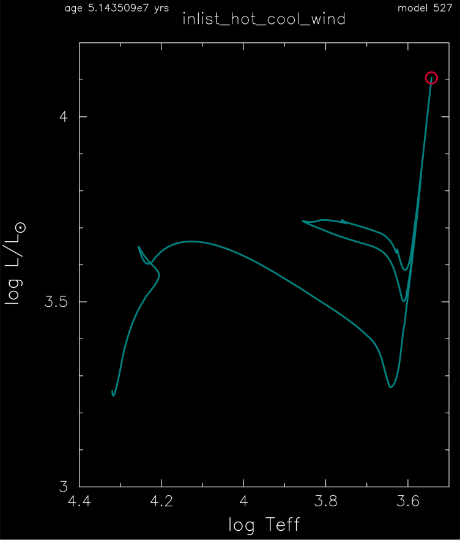

.. _hot_cool_wind:

*************
hot_cool_wind
*************

This test case checks the cool wind, hot wind capability by evolving a 7 Msun, Z=0.02 metallicity model from the zero-age main sequence to core helium depletion.

This test case has 1 parts. Click to see a larger version of a plot.

* Part 1 (``inlist_hot_cool_wind``) loads  a 7 Msun, Z=0.02 metallicity, main sequence model. A Reimers_scaling_factor = 1 cool wind above Teff = 8000 K and a Vink_scaling_factor = 1 hot wind above 12,000 K is enabled and the model evolves until the central helium mass fraction drops below 1e-6. At this point the mass is 6.75 Msun:

pgstar commands used for the plots above:

.. code-block:: console

 &pgstar

  file_white_on_black_flag = .true. ! white_on_black flags -- true means white foreground color on black background
  !file_device = 'png'            ! png
  !file_extension = 'png'

  file_device = 'vcps'          ! postscript
  file_extension = 'ps'

   pgstar_interval = 10

  HR_win_flag = .true.
  HR_win_width = 12
  HR_win_aspect_ratio = 1.2 ! aspect_ratio = height/width
  HR_title = 'inlist_hot_cool_wind'

  HR_logT_min = 3.5
  HR_logT_max = 4.4
  HR_logL_min = 3.0
  HR_logL_max = 4.2

  ! file output
  HR_file_flag = .true.
  HR_file_dir = 'pgstar_out'
  HR_file_prefix = 'hr'
  HR_file_interval = 100000 ! output when mod(model_number,HR_file_interval)==0
  HR_file_width = 12 ! negative means use same value as for window
  HR_file_aspect_ratio = -1 ! negative means use same value as for window

  Kipp_win_flag = .true.
  Kipp_win_width = 12
  Kipp_win_aspect_ratio = 0.75
  Kipp_txt_scale = 0.9
  Kipp_title = 'inlist_hot_cool_wind'      

  Kipp_mass_max = 7.0
  Kipp_mass_min = 0.0
  Kipp_show_mass_boundaries = .true.

  Kipp_xmax = -101              ! maximum step number.  negative means use default.
  Kipp_xmin = 0         ! minimum step number.  negative means use default.

  Kipp_show_mixing = .true.
  Kipp_show_burn = .true.
  Kipp_show_luminosities = .true.

  Kipp_file_flag = .true.
  Kipp_file_dir = 'pgstar_out'
  Kipp_file_prefix = 'kipp_'
  Kipp_file_interval = 100000     ! output when mod(model_number,file_interval)==0
  Kipp_file_width = 12        ! (inches) negative means use same value as for window
  Kipp_file_aspect_ratio = -1 ! negative means use same value as for window

 / ! end of pgstar namelist

Last-Updated: 13Jun2021 (MESA 5be9e57) by fxt.
