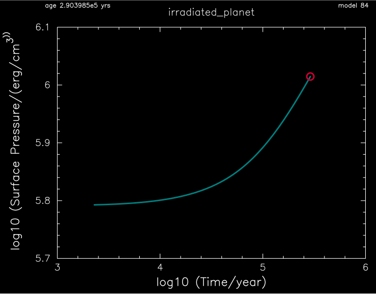
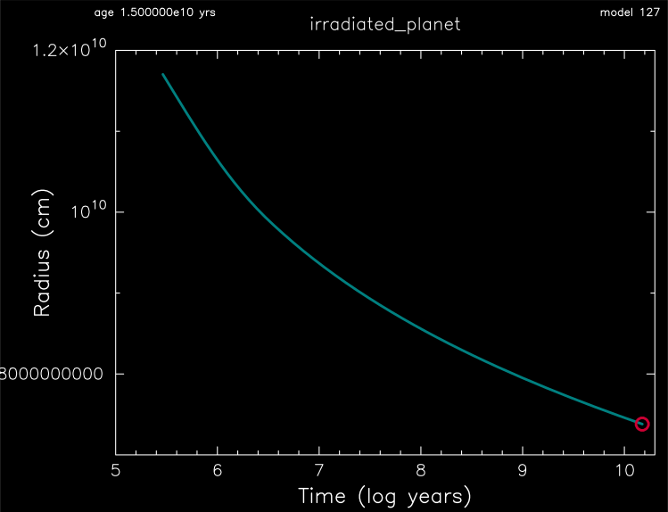

.. _irradiated_planet:

*****************
irradiated_planet
*****************

This test case checks the evolution of an ~1 Mjup model after the surface has been irradiated.

This test case has 2 parts. Click to see a larger version of a plot.

* Part 1 (``inlist_create``) loads a 1 Mjup model, relaxes the surface to an optical depth of 10, irradiates the surface with a flux of 1e7 erg cm :sup:`-2` s :sup:`-1` to a column depth of 1 g cm :sup:`-2`, and terminates when the inflated envelope reaches a surface pressure of log10 (P/(erg cm :sup:`-3`)) = 6.0  (about 1 bar):

* Part 2 (``inlist_evolves``) continues the evolution, without irradiation, for 15 Gyr. The irradiated planet model cools and shrinks with time:

pgstar commands used for the plots above:

.. code-block:: console

 &pgstar

  file_white_on_black_flag = .true. ! white_on_black flags -- true means white foreground color on black background
  !file_device = 'png'            ! png
  !file_extension = 'png'

  file_device = 'vcps'          ! postscript
  file_extension = 'ps'

   pgstar_interval = 10

    History_Track1_win_flag = .true.
    History_Track1_win_width = 12
    History_Track1_win_aspect_ratio = 0.75
    History_Track1_title = 'irradiated_planet'

    History_Track1_xname = 'log_star_age'
    History_Track1_yname = 'log_surf_cell_pressure'
    History_Track1_xaxis_label = 'log10 (Time/year) '
    History_Track1_yaxis_label = 'log10 (Surface Pressure/(erg/cm\u3\u))'
    History_Track1_reverse_xaxis = .false.
    History_Track1_reverse_yaxis = .false.
    History_Track1_log_xaxis = .false.
    History_Track1_log_yaxis = .false.

    History_Track1_xmin = 3.0
    History_Track1_xmax = 6.0
    History_Track1_ymin = 5.7
    History_Track1_ymax = 6.1

    History_Track1_file_flag = .true.
    History_Track1_file_dir = 'png'
    History_Track1_file_prefix = 'pres_'
    History_Track1_file_interval = 10000
    History_Track1_file_width = -1
    History_Track1_file_aspect_ratio = -1

    History_Track2_win_flag = .true.
    History_Track2_win_width = 12
    History_Track2_win_aspect_ratio = 0.75
    History_Track2_title = 'irradiated_planet'

    History_Track2_xname = 'log_star_age'
    History_Track2_yname = 'radius_cm'
    History_Track2_xaxis_label = 'Time (log years)'
    History_Track2_yaxis_label = 'Radius (cm)'
    History_Track2_reverse_xaxis = .false.
    History_Track2_reverse_yaxis = .false.
    History_Track2_log_xaxis = .false.
    History_Track2_log_yaxis = .false.

    History_Track2_xmin = 5.0
    History_Track2_xmax = 10.3
    History_Track2_ymin = 0.7e10
    History_Track2_ymax = 1.2e10

    History_Track2_file_flag = .true.
    History_Track2_file_dir = 'png'
    History_Track2_file_prefix = 'track1_'
    History_Track2_file_interval = 1000
    History_Track2_file_width = -1
    History_Track2_file_aspect_ratio = -1

 / ! end of pgstar namelist

Last-Updated: 14Jun2021 (MESA 5be9e57) by fxt.
