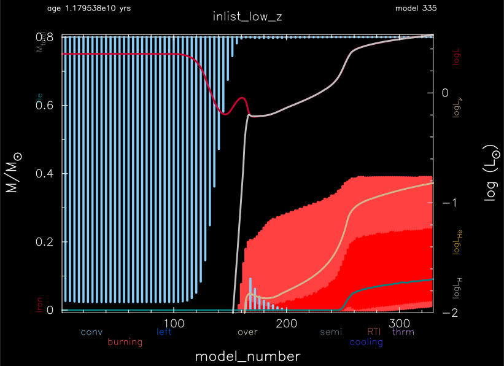
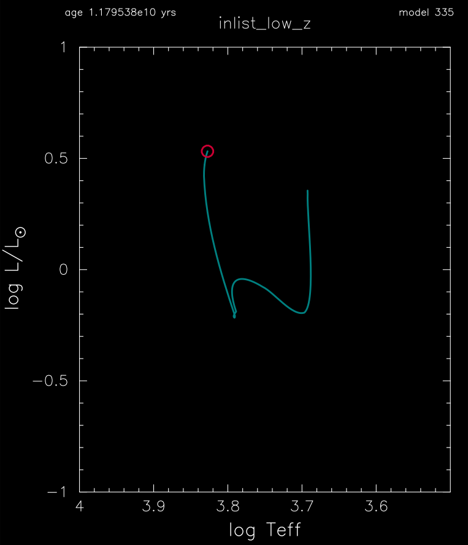

.. _low_z:

*****
low_z
*****

This test case checks the evolutions of a 0.8 Msun, Z=1e-4 metallicity model from the pre-main sequence to core hydrogen depletion.

This test case has 2 parts. Click to see a larger version of a plot.

* Part 1 (``inlist_zams``) creates a 0.8 Msun, Z=1e-4 metallicity model and evolves it to the main sequence.

* Part 2 (``inlist_low_z``) continues the evolution until the mass fraction of hydrogen is less than 1e-6. A novelty of this inlist is exercising the custom opacity table controls desscribed at :ref:`kap/defaults:kap module controls`.

pgstar commands used for the plots above:

.. code-block:: console

 &pgstar

  file_white_on_black_flag = .true. ! white_on_black flags -- true means white foreground color on black background
  !file_device = 'png'            ! png
  !file_extension = 'png'

  file_device = 'vcps'          ! postscript
  file_extension = 'ps'

   pgstar_interval = 10

  HR_win_flag = .true.
  HR_win_width = 12
  HR_win_aspect_ratio = 1.2 ! aspect_ratio = height/width
  HR_title = 'inlist_low_z'

  HR_logT_min = 3.5
  HR_logT_max = 4.0
  HR_logL_min = -1.0
  HR_logL_max = 1.0

  HR_file_flag = .true.
  HR_file_dir = 'pgstar_out'
  HR_file_prefix = 'hr'
  HR_file_interval = 100000 ! output when mod(model_number,HR_file_interval)==0
  HR_file_width = 12 ! negative means use same value as for window
  HR_file_aspect_ratio = -1 ! negative means use same value as for window

  Kipp_win_flag = .true.
  Kipp_win_width = 12
  Kipp_win_aspect_ratio = 0.75
  Kipp_txt_scale = 1.0
  Kipp_title = 'inlist_low_z'      

  Kipp_mass_max = 0.8
  Kipp_mass_min = 0.0
  Kipp_show_mass_boundaries = .true.

  Kipp_xmax = -101 
  Kipp_xmin = 0    

  Kipp_show_mixing = .true.
  Kipp_show_burn = .true.
  Kipp_show_luminosities = .true.

  Kipp_file_flag = .true.
  Kipp_file_dir = 'pgstar_out'
  Kipp_file_prefix = 'kip'
  Kipp_file_interval = 100000     ! output when mod(model_number,file_interval)==0
  Kipp_file_width = 12        ! (inches) negative means use same value as for window
  Kipp_file_aspect_ratio = -1 ! negative means use same value as for window

 / ! end of pgstar namelist

Last-Updated: 15Jun2021 (MESA 5be9e57) by fxt.
