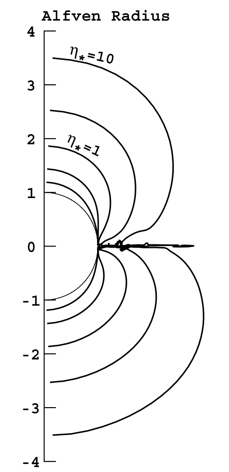
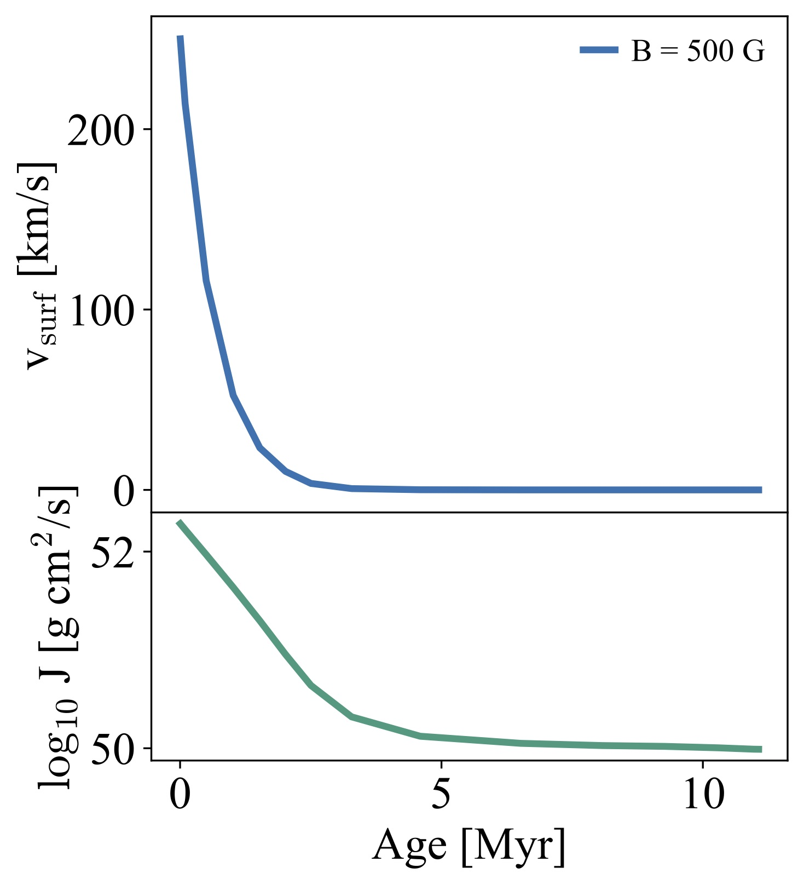

.. _magnetic_braking:

****************
magnetic_braking
****************

This test case involves the calculation of the spin down caused by a
large-scale magnetic field in a massive star model. The model has an
initial mass of 15\ :math:`M_\odot` and equatorial
rotational velocity of 250
:math:`\mathrm{km} \,\mathrm{s}^{-1}` on the
ZAMS. The angular momentum loss due to magnetic braking is calculated
under simplifying assumptions (see below), resulting in a spin down of
the model during its main sequence evolution. The amplitude of the
poloidal component of the magnetic field at the surface is 500 G (this
is set by ``x_ctrl(1)`` in ``inlist_braking``). With such magnetic
field, the timescale for magnetic spindown is shorter than the main
sequence lifetime of the model, which is expected to be slowly rotating
when the core hydrogen fraction reaches 0.01 (stopping criterion). The
test checks that the surface rotational velocity of the model is
:math:`< 1 \mathrm{km} \,\mathrm{s}^{-1}`.
More details about the physics and the implementation below.

Implementation of Magnetic Braking
==================================

In the presence of mass-loss, angular momentum is removed by the
material in the stellar wind, resulting in a spin-down effect. This is
quite important in massive stars, that are known to be rapidly rotating
and have strong stellar winds. Some of these stars have also been found
to have large scale magnetic fields, with amplitudes between hundreds up
to thousands of Gauss.

In stars with surface magnetic fields, the presence of such field will
interplay with the mass-loss. In particular, if the kinetic energy
density in the wind is smaller than the magnetic energy density at the
surface of the star, then the wind flow has to follow the magnetic field
lines. This increases the co-rotation radius of the wind, so that the
material will leave the stellar surface with a higher specific angular
momentum (larger lever arm). The co-rotation radius roughly corresponds
to the Alfvén radius :math:`R_A`, that in this problem corresponds to
the location where the radial components of the field and the flow have
equal energy density.

The angular momentum loss was first calculated, under simplified
assumptions, by Weber & Davis
(`1967 <http://adsabs.harvard.edu/abs/1967ApJ...148..217W>`__) to study
the angular momentum loss of the solar wind. In their seminal work they
found that the angular momentum lost by a magnetic rotator is:

.. math::
   :label: jdot-eqn

   \dot J= \frac {2}{3} \dot M \Omega R_A^2

where :math:`\Omega` is the surface angular velocity and :math:`\dot M`
is the mass-loss rate. Detailed MHD calculations of this process have
been performed, leading to more precise formulations (see e.g. ud-Doula
& Owocki `2002 <http://adsabs.harvard.edu/abs/2002ApJ...576..413U>`__,
ud-Doula et al.
(`2008 <http://adsabs.harvard.edu/abs/2008MNRAS.385...97U>`__,\ `2009 <http://adsabs.harvard.edu/abs/2009MNRAS.392.1022U>`__)).
However the scaling shown in Eq. :eq:`jdot-eqn` appears
quite robust, and is therefore a good starting point to implement
magnetic-braking in MESA.

It is useful to define the wind-confinement parameter :math:`\eta`, the
energy density ratio between radial magnetic field and flow

.. math::
   :label: eta-eqn

   \eta(r) \equiv \frac{B_{r}^{2}/8\pi}{\rho v_{r}^{2}/2}

This quantity can be rewritten at the stellar surface as
:math:`\eta_* = R_*^2\,B^2/\dot M\,v_\infty`, where :math:`v_\infty` is
the terminal velocity of the stellar wind. The line-driven winds of
massive OB stars have terminal velocities that scale with the
photospheric escape velocity
(:math:`v_\infty\simeq 1.92v_{\mathrm{esc}}`, see e.g. Lamers &
Cassinelli 2000), and are therefore of the order
:math:`\sim 1000-4000\,\mathrm{km} \,\mathrm{s}^{-1}`
or so. Using the wind confinement parameter, it is possible to re-write
Eq. :eq:`jdot-eqn` in a form that mostly only depends on
values already calculated in MESA:

.. math::
   :label: jdot-eqn2

   \dot J \approx \frac {2}{3} \dot M \Omega R_*^2 \eta_*

The quantities :math:`\Omega`, :math:`\dot M`, :math:`R_*` can be
directly extracted from the ``Star_info`` data structure. :math:`B` is a
parameter and is set by ``x_ctrl(1)`` in ``inlist_braking`` (we will
assume the magnetic field is constant during the evolution).
:math:`v_\infty` can also be calculated self-consistently, using the
definition of the escape velocity:

.. math::
   :label: vinf

   v_\infty \simeq 1.92\,v_{\mathrm{esc}} = 1.92 \times 618 \,\bigg(\frac{R_{\odot}}{R_*}\,\frac{M_*}{M_\odot}\bigg)^{1/2} \,\mathrm{km} \,\mathrm{s}^{-1}.

Improvements to Eq. :eq:`jdot-eqn2` can be found in the
series of paper of ud-Doula et al.
(`2008 <http://adsabs.harvard.edu/abs/2008MNRAS.385...97U>`__,\ `2009 <http://adsabs.harvard.edu/abs/2009MNRAS.392.1022U>`__)
or in Matt et al.
`2012 <http://adsabs.harvard.edu/abs/2012ApJ...754L..26M>`__. But for
this test we use this simpler approach.

The test case makes use of the ``other_torque`` routine and the
``extra_jdot`` hook to extract the :math:`\dot J` associated with the
magnetic braking from the stellar structure. More details are provided
in the comments of ``src/run_star_extras.f90``.

The evolution of the surface rotational velocity and total angular
momentum of the model in the test case ``magnetic_braking`` is shown in
Fig. ?. If you are keen, run the main sequence
evolution of this rotating :math:`15\,M_\odot` including the
magnetic torque for fields [B = 10 , 50, 100, 1000 G]. Plot the time
evolution of total angular momentum and surface rotation velocity for
the 4 cases. Try to compare with results in Meynet et al.
`2011 <http://adsabs.harvard.edu/abs/2011A%26A...525L..11M>`__ (for
example their Fig.3).

