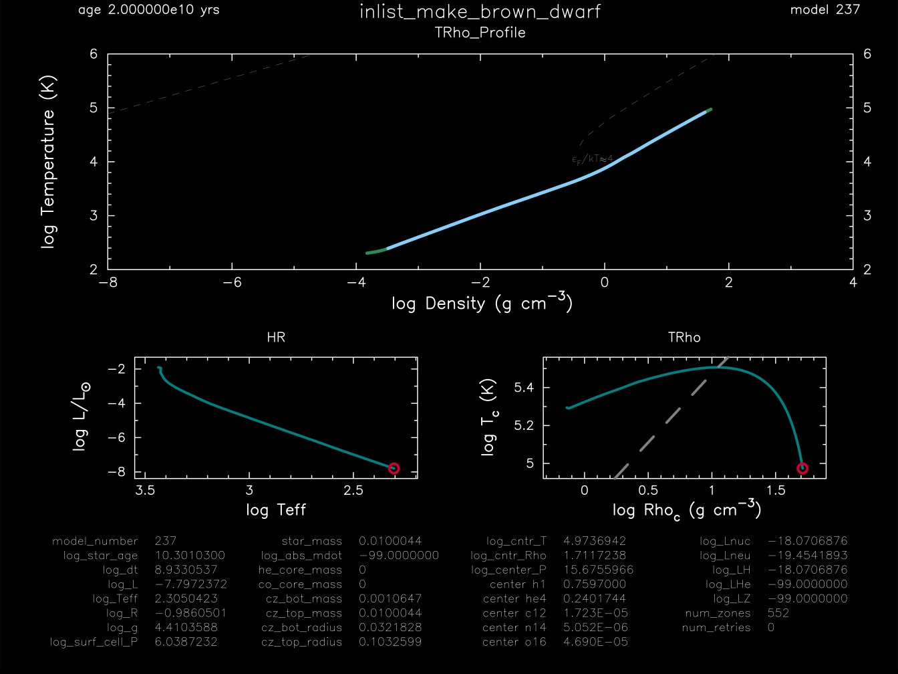

.. _make_brown_dwarf:

****************
make_brown_dwarf
****************

This test case checks the creation of a 1.05 Mjup, Z=1e-4 metallicity model and its subsequent evolution for 20 billion years.

This test case has 1 part. Click to see a larger version of a plot.

* Part 1 (``inlist_make_brown_dwarf``) creates a 1.05 Mjup, Z=1e-4 metallicity model, using the less frequently deployed ``create_initial_model`` capability, and evolves the brown drawf model for 20 billion years.

pgstar commands used for the plots above:

.. code-block:: console

 &pgstar

  file_white_on_black_flag = .true. ! white_on_black flags -- true means white foreground color on black background
  !file_device = 'png'            ! png
  !file_extension = 'png'

  file_device = 'vcps'          ! postscript
  file_extension = 'ps'

   pgstar_interval = 10

  Grid1_win_flag = .true.
  Grid1_win_width = 14
  Grid1_win_aspect_ratio = 0.75
  Grid1_title = 'inlist_make_brown_dwarf' 
      
  TRho_Profile_xmin = -8
  TRho_Profile_xmax = 4
  TRho_Profile_ymin = 2
  TRho_Profile_ymax = 6

  Grid1_file_flag = .true.
  Grid1_file_dir = 'png'
  Grid1_file_prefix = 'grid1_'
  Grid1_file_interval = 10000 ! output when mod(model_number,file_interval)==0
  Grid1_file_width = 14        ! (inches) negative means use same value as for window
  Grid1_file_aspect_ratio = -1 ! negative means use same value as for window

 / ! end of pgstar namelist

Last-Updated: 17Jun2021 (MESA e2acbc2) by fxt.
