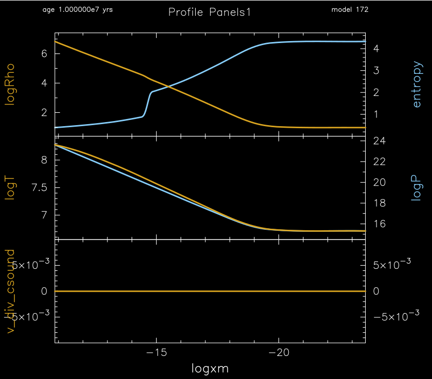

.. _make_env:

********
make_env
********

This test case checks the creation and stability of a pure iron neutron star envelope.

This test case has 1 part. Click to see a larger version of a plot.

* Part 1 (``inlist_env_header``) first creates an initial neutron star envelope through its significant ``run_star_extras.f90`` and saves the result as ``start.mod``.  This initial model is then loaded and the evolution begins. The envelope should remain stable - no changes in the thermodynamic or structure profiles - over the 10 million year evolution.

pgstar commands used for the plots above:

.. code-block:: console

 &pgstar

  file_white_on_black_flag = .true. ! white_on_black flags -- true means white foreground color on black background
  !file_device = 'png'            ! png
  !file_extension = 'png'

  file_device = 'vcps'          ! postscript
  file_extension = 'ps'

   pgstar_interval = 10

        Profile_Panels1_win_flag = .true.
        Profile_Panels1_win_width = 12
        Profile_Panels1_win_aspect_ratio = 1.0
        Profile_Panels1_txt_scale = 0.8

        Profile_Panels1_xaxis_name = 'logxm' ! 'log_q' ! 'logR_cm'
        Profile_Panels1_xmin = -101d0
        Profile_Panels1_xmax = -101d0
        Profile_Panels1_xaxis_reversed = .true.

        Profile_Panels1_num_panels = 3

        Profile_Panels1_yaxis_name(1) = 'logRho'
           Profile_Panels1_ymin(1) = -101d0
           Profile_Panels1_ymax(1) = -101d0
           Profile_Panels1_ymargin(1) = 0.1

        Profile_Panels1_other_yaxis_name(1) = 'entropy'
           Profile_Panels1_other_ymin(1) = -101d0
           Profile_Panels1_other_ymax(1) = -101d0
           Profile_Panels1_other_ymargin(1) = 0.1

        Profile_Panels1_yaxis_name(2) = 'logT'
           Profile_Panels1_ymin(2) = -101d0
           Profile_Panels1_ymax(2) = -101d0
           Profile_Panels1_ymargin(2) = 0.1

        Profile_Panels1_yaxis_name(3) = 'v_div_csound'
           Profile_Panels1_ymin(3) = -0.01
           Profile_Panels1_ymax(3) = 0.01
           Profile_Panels1_ymargin(3) = 0.1

   Profile_Panels1_file_flag = .true.
   Profile_Panels1_file_dir = 'pgstar_out'
   Profile_Panels1_file_prefix = 'profile1_'
   Profile_Panels1_file_interval = 1000
   Profile_Panels1_file_width = -1     
   Profile_Panels1_file_aspect_ratio = -1

 / ! end of pgstar namelist

Last-Updated: 17Jun2021 (MESA e2acbc2) by fxt.
