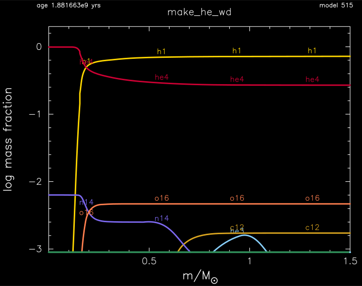
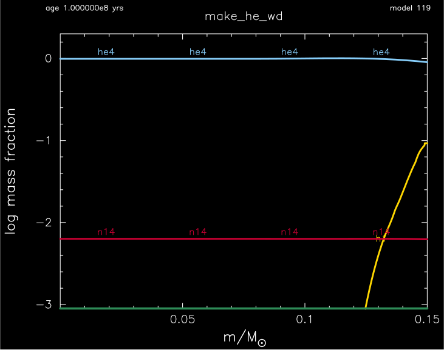
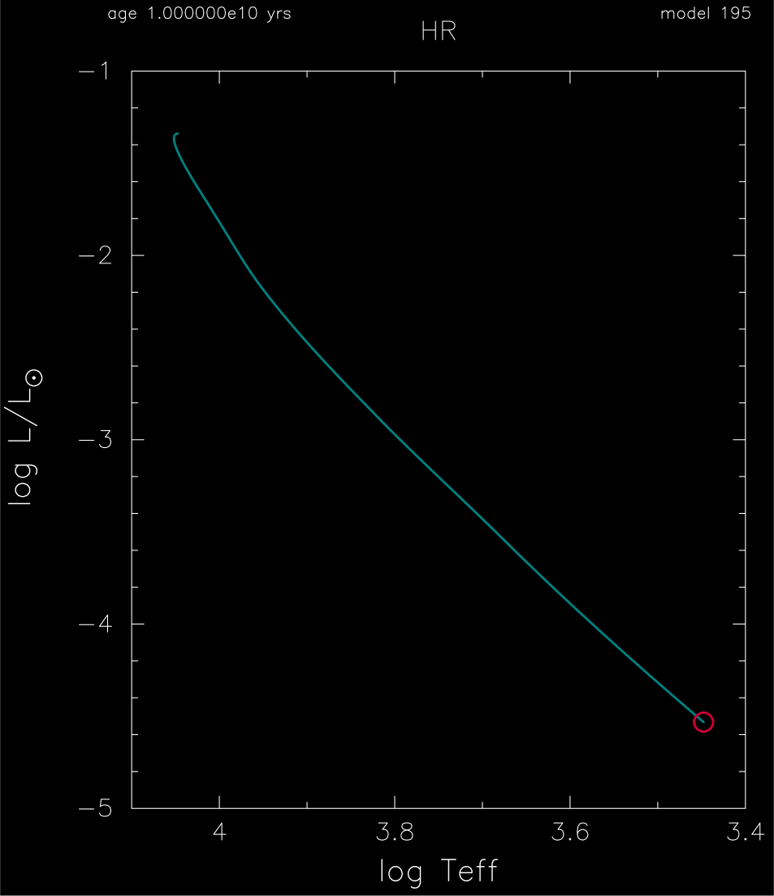

.. _make_he_wd:

**********
make_he_wd
**********

This test case checks the creation and evolution of a 0.15 Msun helium white dwarf.

This test case has 3 parts. Click to see a larger version of a plot.

* Part 1 (``inlist_to_he_core``) creates a 1.5 Msun, Z=0.01 metallicity, pre-main sequence model and evolves the model until the helium core reaches 0.15 Msun:

* Part 2 (``inlist_remove_envelope``) relaxes the model to a new mass of 0.15 Msun, sheddind the outer 1.35 Msun with a wind whose maximum mass loss rate is 1e-5 Msun/yr, and then evolving the hot He white dwarf for 100 million years:

* Part 3 (``inlist_evolve``) continues the evolution as the 0.15 Msun helium white dwarf model slides down a white dwarf cooling track for 10 billion years:

pgstar commands used for the plots above:

.. code-block:: console

 &pgstar

  file_white_on_black_flag = .true. ! white_on_black flags -- true means white foreground color on black background
  !file_device = 'png'            ! png
  !file_extension = 'png'

  file_device = 'vcps'          ! postscript
  file_extension = 'ps'

   pgstar_interval = 10

  Abundance_win_flag = .true.
  Abundance_win_width = 12
  Abundance_win_aspect_ratio = 0.75
         
  Abundance_txt_scale = 1.0
  Abundance_title = 'make_he_wd'

  Abundance_num_isos_to_show = 6
  Abundance_which_isos_to_show(1)  = 'h1'
  Abundance_which_isos_to_show(2)  = 'he3'
  Abundance_which_isos_to_show(3)  = 'he4'
  Abundance_which_isos_to_show(4)  = 'c12'
  Abundance_which_isos_to_show(5)  = 'n14'
  Abundance_which_isos_to_show(6)  = 'o16'

  num_abundance_line_labels = 4
  Abundance_line_txt_scale_factor = 1.0
  Abundance_legend_max_cnt = 0

  Abundance_xaxis_name = 'mass' 
  Abundance_xaxis_reversed = .false.
  Abundance_xmin = -101d0
  Abundance_xmax = -101d0

  Abundance_log_mass_frac_min = -3.0 
  Abundance_log_mass_frac_max =  0.3

  Abundance_file_flag = .true.
  Abundance_file_dir = 'pgstar_out'
  Abundance_file_prefix = 'abund_'
  Abundance_file_interval = 10000     

  HR_win_flag = .true.
  HR_win_width = 12
  HR_win_aspect_ratio = 1.2 ! aspect_ratio = height/width

  HR_logT_min = 3.4
  HR_logT_max = 4.1
  HR_logL_min = -5.0
  HR_logL_max = -1

  ! file output
  HR_file_flag = .true.
  HR_file_dir = 'pgstar_out'
  HR_file_prefix = 'hr'
  HR_file_interval = 100 ! output when mod(model_number,HR_file_interval)==0
  HR_file_width = 15 ! negative means use same value as for window
  HR_file_aspect_ratio = -1 ! negative means use same value as for window

 / ! end of pgstar namelist

Last-Updated: 18Jun2021 (MESA e2acbc2) by fxt.
