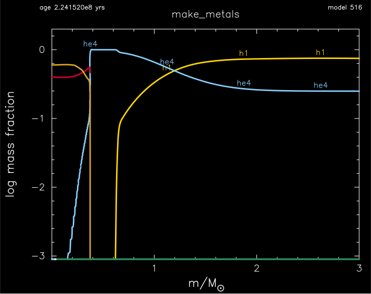
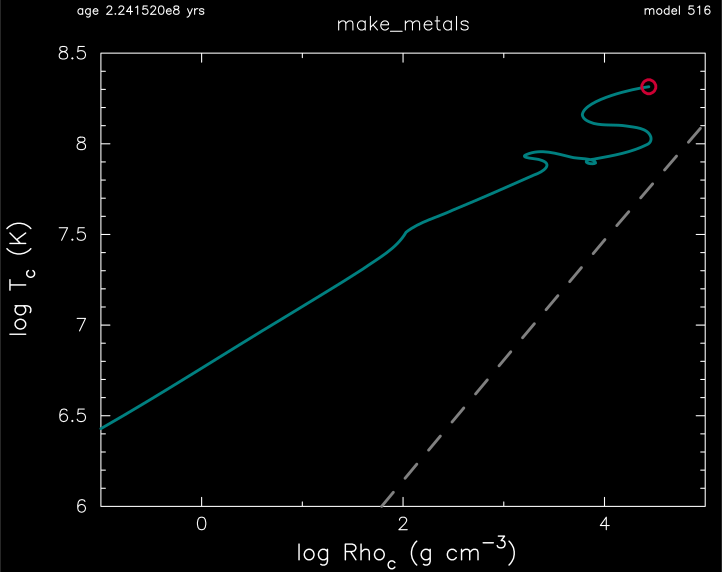
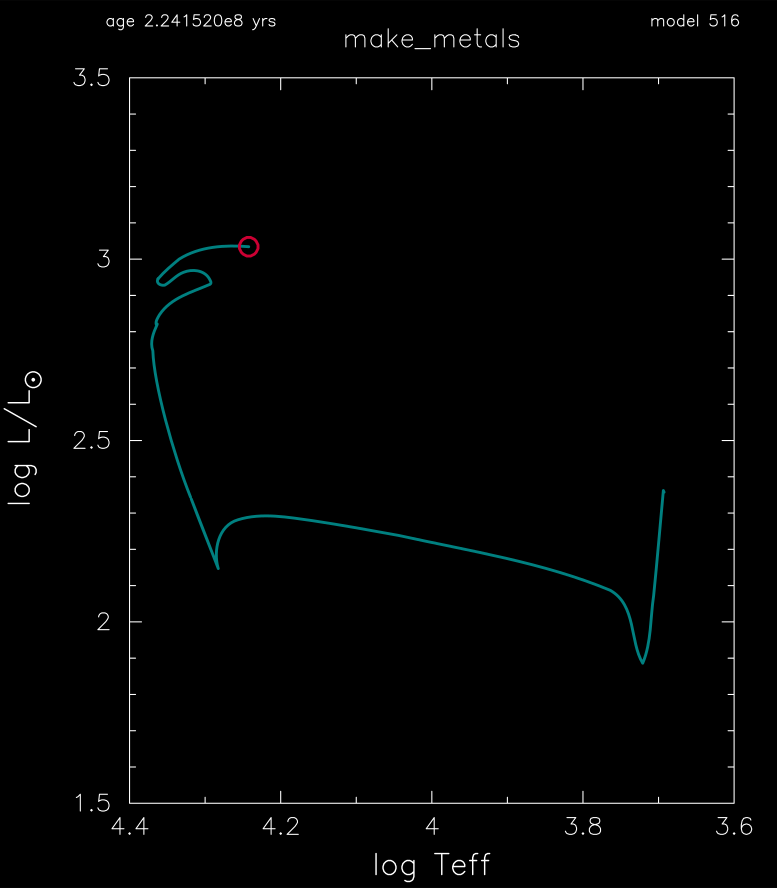

.. _make_metals:

***********
make_metals
***********

This test case demonstrates the creation and evolution of 3 Msun model whose initial metallicity is Z = 0.

This test case has 1 part. Click to see a larger version of a plot.

* Part 1 (``inlist_make_metals_header``) creates a metal-free 3 Msun pre-main sequence model, and evolves the initial pure hydrogen + helium model until the central helium mass fraction drops below 1e-4 :

The core gets hot enough to make its own carbon from the triple-alpha reaction:

Which makes for an interesting journey in the HR diagram:

pgstar commands used for the plots above:

.. code-block:: console

 &pgstar

  file_white_on_black_flag = .true. ! white_on_black flags -- true means white foreground color on black background
  !file_device = 'png'            ! png
  !file_extension = 'png'

  file_device = 'vcps'          ! postscript
  file_extension = 'ps'

  pgstar_interval = 10

  HR_win_flag = .true.
  HR_win_width = 12
  HR_win_aspect_ratio = 1.2 ! aspect_ratio = height/width
  HR_title = 'make_metals'

  HR_logT_min = 3.6
  HR_logT_max = 4.4
  HR_logL_min = 1.5
  HR_logL_max = 3.5

  ! file output
  HR_file_flag = .true.
  HR_file_dir = 'pgstar_out'
  HR_file_prefix = 'hr_'
  HR_file_interval = 1000 ! output when mod(model_number,HR_file_interval)==0
  HR_file_width = 12 ! negative means use same value as for window

  Abundance_win_flag = .true.
  Abundance_win_width = 12
  Abundance_win_aspect_ratio = 0.75

  Abundance_txt_scale = 1.0
  Abundance_title = 'make_metals'

  Abundance_num_isos_to_show = 6
  Abundance_which_isos_to_show(1)  = 'h1'
  Abundance_which_isos_to_show(2)  = 'he3'
  Abundance_which_isos_to_show(3)  = 'he4'
  Abundance_which_isos_to_show(4)  = 'c12'
  Abundance_which_isos_to_show(5)  = 'n14'
  Abundance_which_isos_to_show(6)  = 'o16'

  num_abundance_line_labels = 4
  Abundance_line_txt_scale_factor = 1.0
  Abundance_legend_max_cnt = 0

  Abundance_xaxis_name = 'mass'
  Abundance_xaxis_reversed = .false.
  Abundance_xmin = -101d0
  Abundance_xmax = -101d0

  Abundance_log_mass_frac_min = -3.0
  Abundance_log_mass_frac_max =  0.3

  Abundance_file_flag = .true.
  Abundance_file_dir = 'pgstar_out'
  Abundance_file_prefix = 'abund_'
  Abundance_file_interval = 10000
      
  TRho_win_flag = .true.
  TRho_win_width = 12
  TRho_win_aspect_ratio = 0.75 ! aspect_ratio = height/width
         
  TRho_txt_scale = 1.0
  TRho_title = 'make_metals'      

  TRho_logT_min = 6.0 
  TRho_logT_max = 8.5 
  TRho_logRho_min = -1.0 
  TRho_logRho_max = 5.0 

  show_TRho_degeneracy_line = .true.

  TRho_file_flag = .true.
  TRho_file_dir = 'pgstar_out'
  TRho_file_prefix = 'trhoc_'
  TRho_file_interval = 1000

 / ! end of pgstar namelist

Last-Updated: 18Jun2021 (MESA e2acbc2) by fxt.
